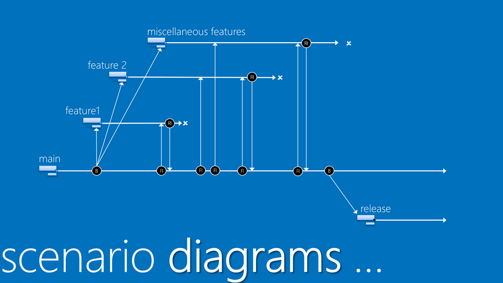
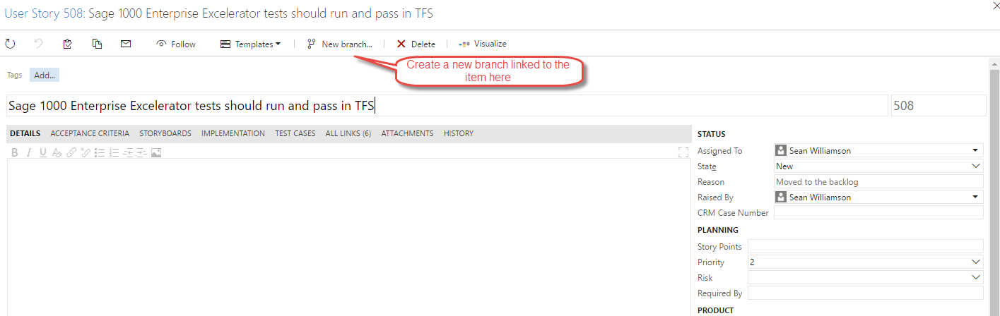

**This page describes the procedures to be followed be developers as their part of the Application Lifecycle** 

## Version Control

Codis use the Microsoft TFS implementation of GITversion control. [GIT overview](https://git-scm.com/book/en/v2/Getting-Started-Git-Basics)

[TFS and GIT](https://www.visualstudio.com/en-us/docs/git/overview)

GIT allows development to be separated into different areas called repositories. At Codis, must code is held in a single repository called CodisDevelopment. GIT is also used to implement a branching strategy. 

## Branching Strategy

We use Feature branching at Codis.  

Feature branching(Image above taken from [here](https://blogs.msdn.microsoft.com/visualstudioalm/2012/08/24/alm-rangers-branching-and-merging-guide-for-visual-studio-2012-is-available/)) 

As seen in the diagram, this involves having a single main (master) branch that builds are created from. 

Each new feature or bug will have its own branch off the master branch, named after the work item type and DevOps item number e.g. Bug55, UserStory56\.  It should be created from the work item to create a link in DevOps between the branch and the work item.  This branch will exist both on the origin (the DevOps server) and locally on the developer's PC. Local changes mush be pushed to the origin repositry. A pull request has to be issued to merge the changes into the main (master) branch. 

Having a single merged branch (the main branch) reduces the testing overhead as generally only that one branch needs to be tested, and removes the need for a separate merge of changes into a release branch. 

Hotfixes may have to be applied to release branches (not shown in the diagram). These are bug fixes that cannot wait until the next release. These will merged into a hotfix branch from the release branch. 

## Procedures

The following procedures will be followed by developers when making a change to the code: 

1. Pull a work item from the Refinement/Done column into the Development column. (The process by which items get refined is described [here](ALM - Requirements Management.md))
2. Assign the work item to themselves (if TFS doesn't do this automatically).
3. Create a branch at the origin and locally and link to the work item. This is best done by creating the branch from the work item. Image title

 

1. Checkout the local branch and make the coding changes.
2. Commit the coding changes regularly locally and sync to the origin branch to ensure an offsite copy is kept and the changes are the available to others.
3. When the code is completed and the work item is done\-done, issue a pull request. (see below)
4. The pull request is approved the changes will be merged into the master branch and a build will take place.
5. Move the work item into the Resolved column.

## Pull Requests

\< video\="" needed\=""\> A pull request (PR) asks for changes to be merged into the master branch. The following approval stages are required before a pull request can be subject to approval. These check are carried out automatically by TFS. 

- Verify a work item is associated with the change.
- When the pull request is created a test build of "Sage 1000 Build" will run. This will validate that the Sage 1000 code compiles and that will run a number of units and integration tests. (Note \- this is a bit of hassle if you are just changing S200 code, but we haven't been able to separate these yet.)

An approver or approvers should be assigned to the PR. We do not have approvers formally assigned. Please choose based on the functionality being updated and the availability of the reviewer. A code review should then take place by approver. Note that code reviews are one of the most efficient ways of reducing bugs in code. 

Once the request is approved, the changes are merged into the master, which in turn kicks off a build process on the master branch.
