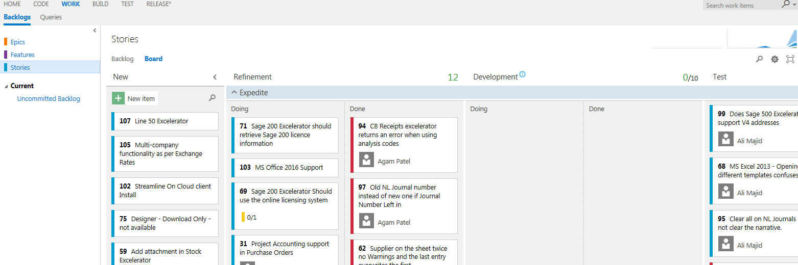

**This page describes how requirements are managed in the Application Management systems and procedures at Codis, using** [**TFS**](https://www.visualstudio.com/en-us/products/tfs-overview-vs.aspx) 

## Overview

[From Wiki](https://en.wikipedia.org/wiki/Requirements_management): *Requirements management is the process of documenting, analyzing, tracing, prioritizing and agreeing on requirements and then controlling change and communicating to relevant stakeholders. It is a continuous process throughout a project.* 

## Work Items

In Dev Ops, requirements are tracked using Work Item Tracking. Items are logged as either: - Epics (not used by us yet)
- Features (not used by us yet)
- [User Stories](ALM - User Stories.md) \- these are enhancements into how the software is expected to work.
- Bugs [ALM \- Bugs.aspx](ALM - Bugs.md) \- these are defects in either completed or current development.

It is appreciated that the distinction between what is an enhancment and what is a defect is not always clear.  There is a grey area that missing functionality can fall into.  But it usually is pretty clear.  Note that it is possible to convert between types of work items so the decision is not final.

Work Items are entered into Dev Ops either in the "Queries" screen under the "Work" tab, or directly into the Kanban Board(see below). 

Codis has some field added to the user story and bug forms.  These should be completed if possible.  

- Product Group and Product.  The Products available in the drop down depend on the Product Group selected.   Some products need to be added.
- CRM Case Number \- If there is a CRM case relating to this issue, please enter it here.  It can be really helpful in tracking fixes.

## Kanban Board

Work Items are assigned priorities and progress through different states. This is managed using a Kanban Board in TFS. [Kanban](http://kanbanblog.com/explained/) is an Agile methodology. "Kanban is incredibly simple, but at the same time incredibly powerful." It provides a highly visible way to manage the state of the work items. 

The Kanban board can be accessed from the "Work Tab", then under "Backlogs" \> "Stories" \> "Board". Avoid selecting the "Board" option under the Iterations. 

 

 ### Kanban States

## 

The Kanban board has the following states: 

| **State** | **Description** |
| --- | --- |
| New | New items. By default, new items are created in this state |
| Refinement | Approval and analysis of requirements |
| Development | Coding, Unit and automatic tests |
| Testing | Review and QA |
| Closed | Story implementation or bug fix in released to customers version |

Work Items can be pulled from one state to the next, but should only do so when they meet a set of criteria \- called the "Definition of Done". ("Sometimes called "Definition of Ready for the Refinement state.). The "Definition of Done" will be defined against each column in TFS.    

 This definition will be subject to frequent review, as will the whole process. The states are split into two sub\-columns, "Doing" and "Done". "Done" holds items that have fulfilled the criteria and are ready to be pulled to the next state. 

The priority of each item is indicated by its height in the column, with the highest priority being the highest. 

The number of items allowed in each state is limited. This is known as WIP (Work In Progress) limits. 

When items are pulled to the next state, they are automatically assigned to the user pulling. 

### New

The default state for new items. This column acts as a triage area for new work items. Items can only be pulled from this area into the Refinement area by the Refinement team, who also determine the priority of backlog items. ### Backlog Refinement

For items in this state, the Refinement team tries to: - Identify and resolve internal and external dependencies.
- Clarify descriptions of changes or bugs.
- Estimate the work and effort required to fulfil the completion of the User Stories.
- Prioritize the items. This process will take place in Refinement meetings. Done items (they meet the Definition of Done) are placed in the Done sub\-column.

### Development

Items in this state are with the developer. When the item meets the Definition of Done then the item can be placed in the Done sub\-column and can be pulled by a tester. Developers need to follow the procedure documented in [ALM \- Developers Procedures](ALM - Developers Procedures.md) ### Testing

The testing can pull items from the Done column in Development. At this status, there should be a Release with the work item logged as fixed against it.
