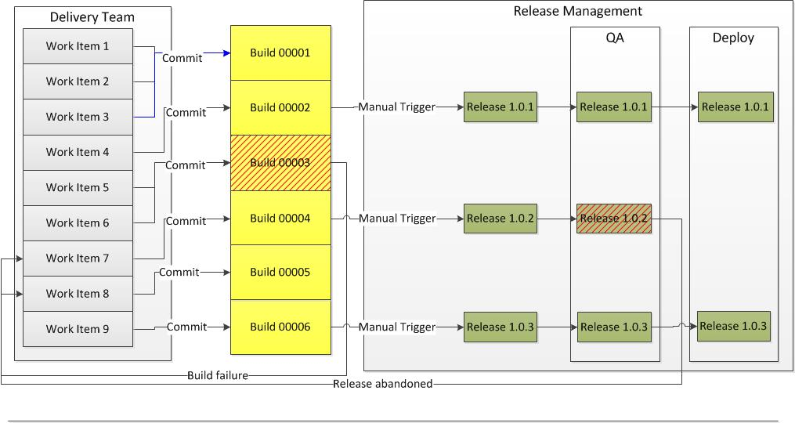

**This page describes the procedures and processes followed in progressing a change to Sage 200 and 1000 V3 from development to release into production.**

**This document covers the process from the point an issue or enhancement is raised until its release.**

**See [Sage 200 Software Release Overview.aspx](Software Release Overview.md) for a more focussed overview of the Sage 200 Release processes following a build.**

[ALM \- Requirements Management](ALM - Requirements Management.md)

# The Release Pipeline

### 

## Overview

The release pipeline is the process by which a software build is deployed to test environments, tested, approved and deployed so that it is available for customers to use. Every change to our software goes through a complex process on its way to being released to users. That process involves building the software, followed by the progress of these builds through multiple stages of testing and deployment. This, in turn, requires collaboration between many individuals and teams. The release pipeline models this process. 

For the purpose of this document, we will consider the following steps and consider their role in relation to the release pipeline. 

Prior to release: 

- Pull Request
- Build

The Release Pipeline: 

- Package
- QA
- Deploy
- Inform

The processes chosen for the release pipeline have the following aims: 

- Efficiency \- changes must move as quickly as possible to place value in customers' hands, whilst using minimum resources.
- Quality \- software still needs to be adequately tested.
- Traceability \- the status of all releases and what fixes they contain must be visible.

Codis use TFS to manage the entire ALM cycle and the Release Management part of TFS to manage the release cycle post\-build. The diagram below describes the processes from requirements, delivery to build, and then release. 

 The Excelerator Release Pipeline## Requirements and Delivery

Work items hold requirements (see [Requirements Management).](ALM - Requirements Management.md)  Developers will work on a requirement until they are ready to commit their changes to the main product using a pull request. (see [Developers' Procedures](ALM - Developers Procedures.md))

### Pull Requests

This is the stage at which the delivery team commits a piece of work as being completed. The processes prior to this are covered in [ALM \- Developers Procedures](ALM - Developers Procedures.md). As part of the development process prior to committing acceptance tests should be completed by the developer in local (not integrated) environments, and functionality reviewed by stakeholders. Also, as part of the pull request process, a code review will take place, providing another layer of QA and providing the possibility of feedback. The pull request stage is not part of the release pipeline, but it is included here to illustrate how it feeds into the pipeline. ## Builds

Builds are not the same as a release. At Codis, Builds are created automatically each time a change is submitted via a pull request and this can happen frequently.  A build is not always released.  Each build has a build number assigned to it and is tracked in the system.  There is then a manual process to choose which build go to release. Each release goes through a QA process and is then deployed to areas to be available to end users. Each step is described in more detail below. 

As part of the build process, a suite of fully automated tests may be run. (S1000 Build has \> 1600 tests. So far S200 has none. However, some S1000 tests will test general functionality around spreadsheet interactions that also apply to S200\.) The aims of these tests will be to ensure that the build is of as high a quality as can be determined without impacting significantly on testing resources, and to pick up on any issues as early as possible, which makes diagnostics easier. 

In the above diagram Builds 00001, 00002, 00004, 000005 and 00006 all succeed, including any automated tests. 00003 fails which produce a work item to track the failure. 

From this point management of the build is passed on releasing management. Some builds will be manually selected to become releases at the discretion of the Release Manager. ## The Release Process

The release process governs and records the decision to submit a build for release, including the creation of the release artefacts, their testing and then finally, their deployment.

### Release Definitions

A release definition defines and for the most part automates the processes required for a release of the software to take place.  Release definitions are stored in TFS.

Details of active release definitions can be found [here.](ALM - Releases.md)

### Packaging of artefacts

For S1000 Standard and S200 we create a single installer each. ### Selection of builds for release

The release process will include Quality Assurance, which will inevitably involve some manual testing. As such should the process should only be embarked on selectively. The following factors should be considered when choosing a build for release: 1. What work items will likely be resolved by the build and demand for those changes?
2. Are there any Priority 1 Bugs still outstanding for the product? Normally, all Priority bugs should be resolved.
3. Availability of testing resources.

Conversely, testing as early as possible will allow feedback to be given as early as possible.  A balance must be struck.

Releases can fail QA, wherein a work item for the failed test should be validated and resolved before a new release is attempted. Releases can also be abandoned for other reasons. 

### Fixes, Hotfixes and Urgent Main Branch Releases

Development takes place in different branches of code. Each branch has its own copy of the code. Having branches means that development can be isolated and changes introduced selectively. As seen in [ALM \- Developers Procedures](ALM - Developers Procedures.md), Codis will have a main release branch and use feature branching. A branch will be created following a release, meaning that the code used for the release is preserved. Development will continue and be merged into the main branch when ready. 

Generally, all fixes made after a release will go into the main release branch. If a fix is required urgently, a decision has to be made as to whether that fix is to be made to both the main branch and to the last release branch or just to the main branch. 

The advantage of applying a fix to a release branch (forming a new branch) is that the release code should be stable having been through a testing cycle and released to end users. The disadvantage is that it will require a special release and create yet another branch that needs to be managed. 

Having releases made frequently in an Agile fashion makes fixing only the main branch the simpler option. 

In deciding which to do, it should be considered how unstable the main branch is. This will depend on which features have been merged into it. Generally, the longer the time that a fix is made after the last release, the more likely that fix will have to be applied to the release branch (if that fix is urgent). 

### QA

**Smoke Tests** \- ensure basic functionality works 

**Regression Tests** \- ensure changes haven't broken any previously tested functionality still works 

**UAT** \- ensures that newly introduced functionality works as per the users' requirements. 

A full test cycle of a new version of a Codis product can be a significant overhead and will be the biggest bottleneck in the release pipeline. Processes must be chosen and decisions made to minimise this impact. 

To this end, it is important to draw a distinction between two types of tests: 

1\. Fully automated tests – tests that require no resources other than a brief demand period on machine resources. These will be mostly unit tests may be referred to as unit tests. As mentioned above, these can be run as part of the build process. 

2\. Manual (or partially automated) tests – tests that require the use of manual resources. These tests can incur significant overhead, so they should only be run when required. 

### Deployment

See [ALM \- Excelerator Release to Customers Deployment](ALM - Excelerator Release to Customers Deployment.md)
