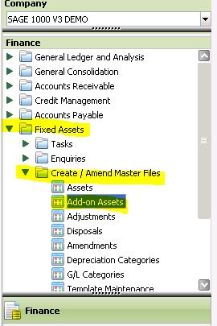
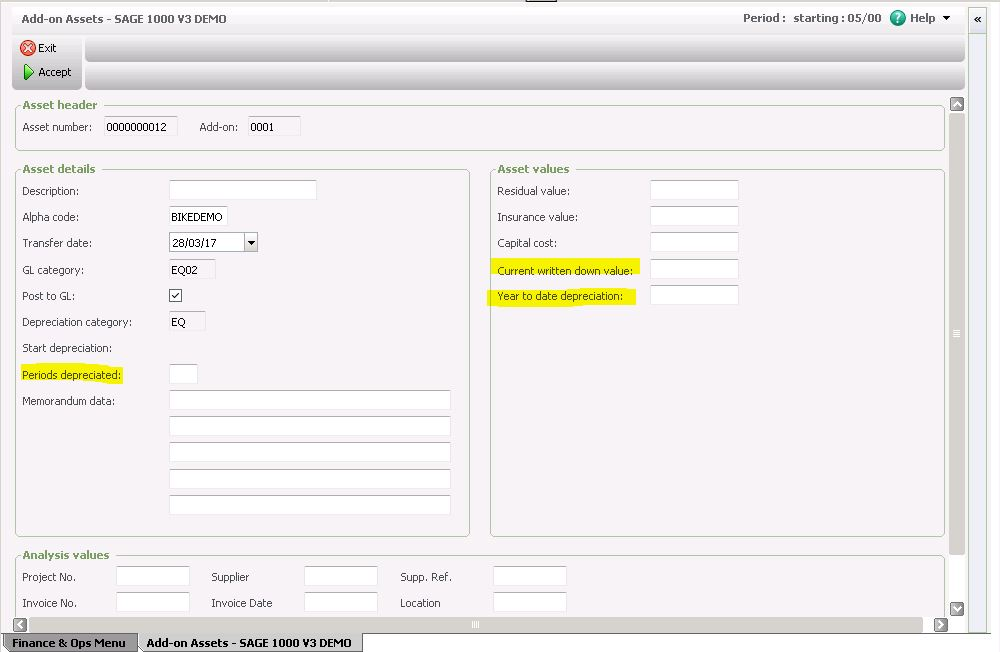

When you add an asset in Sage you get the fields show highlighted below. You can enter previous depreciation.  Once you start Depreciation you can't amend these. I recommend that you test it out in your demo company first.  

 

