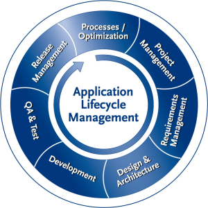

**This page describes the Application Lifecycle Management (ALM) systems and procedures in the development, testing and release management teams at Codis** 

[From Wiki](https://en.wikipedia.org/wiki/Application_lifecycle_management) 

*Application lifecycle management (ALM) is the product lifecycle management (governance, development, and maintenance) of computer programs. It encompasses requirements management, software architecture, computer programming, software testing, software maintenance, change management, continuous integration, project management, and release management* 

 

The Application Lifecycle is managed at Codis using the [Azure DevOps](https://azure.microsoft.com/en-gb/services/devops/) SAAS at [https://codislimited.visualstudio.com](https://codislimited.visualstudio.com/). 

*Visual Studio Team Foundation Server 2015 is a source\-code\-control, project\-management, and team\-collaboration platform at the core of the Microsoft suite of Application Lifecycle Management (ALM) tools, which help teams be more agile, collaborate more effectively, and deliver quality software more consistently.* 

[Requirements Management](ALM - Requirements Management.md) describes how requirements are collected from Stakeholders and managed.

[Developers Procedures](ALM - Developers Procedures.md) describes the processes and procedures associated with design and development.

[Software Release Procedures](ALM - Software Release Procedures.md) covers QA and Testing and Release Management.

[Excelerator Release to Customers Deployment](ALM - Excelerator Release to Customers Deployment.md)
