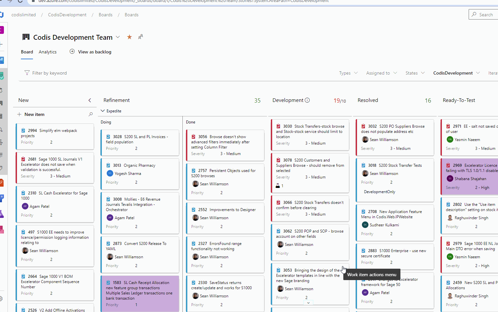

## Work Item Inline Tests

DevOps Work items can have tests added and those tests run directly from the work item.  This can be a quick, easy way to maintain tests against a work item.  

This shows how to add an inline work item.  When items are added this way, they appear directly below the work item on the Kanban board, and be run directly from there.  Tests can also be linked to work items from the work item.  A test should be added with link type "Tested by", which will result in the Test having a link type "Tests" back to the work item.  

This shows how to add an inline test to a work item.  Note that in order to run the test, you have to refresh the board page, otherwise an error occurs.  

  

