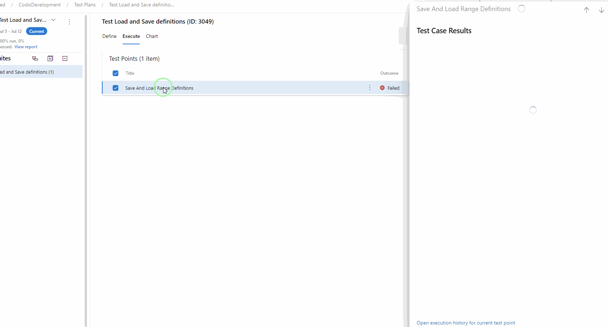

# Overview

Tests can be entered and run outside of the hub using [w](Azure Devops Testing.md)ork item inline tests.  These are described in [Azure Devops Inline Tests.aspx](Azure Devops Inline Tests.md).

See https://docs.microsoft.com/en\-us/azure/devops/test/overview?view\=azure\-devops  

The Devops Test Hub provides functionality for documenting manual and automated tests, planning test runs with those tests, and recording the results.  

- Integrates with Devops:
- Test plans can be linked to builds.
- Tests can be linked to work items.
- Bugs can be created immediately for test step failures.
- Tests can be assigned to dev ops resources.

- Tests can have screenshots, videos and attachments embedded, which can help describe test steps and expected results.
- Includes a desktop test runner that runs on the side of the screen and allows quick ticking of test steps that pass, commenting on tests that fail, and provides screen capture and video tools that are then embedded in the test run.

The Azure Devops test hub has test cases, test suites and test plans.  These are described below.  
  
## Test Cases

These are a test that can be run. The test is described as a series of steps the user (or automated test) has to follow,  and the expected results when they do follow it.   The tester can run through the test, following the steps, recording whether the software being tested gives the expected results.    
Test cases can serve as a description of the software development being made.  They should not be considered immutable as the design of the software development may need to be changed, and the need for that change becomes clear during testing.  

## Test Suites

Test Suites are a collection of test cases in a test plan.  

  
## Test Plans

Test plans are a plan for a test.  The test plan could be, for instance, a plan to test a release.  The plan starts and ends.  Tests may be repeated but the idea would be that the sequence would end with, for instance, the release passing or failing tests.  When a test plan is finished, it can be marked as inactive.  

Test plans consist of one or more test suites or test cases.  Existing test suites or test cases can be added to a test plan, allowing test definitions to be reused.  

Test plans can be associated with a build and release stage.  

Each test case in a plan must have one or more configurations associated with it.   A configuration would be a test environment.  By default, the test case in a test plan will have all configurations associated with it.  These should be removed with only the correct configuration left.  

# Running Tests

The Test Runner allows you to step through a test, indicating the result.  It allows you to record or screenshot or testing experience and will automatically embed the screenshot or recording against the step you were testing.  

https://docs.microsoft.com/en\-us/azure/devops/test/run\-manual\-tests?view\=azure\-devops  

This shows how to run tests from a test plan using the Test Runner.  This involves downloading the Test Runner client once.  

  

# TestRunner.gif

# Viewing Test Runs

  

  

  

##
