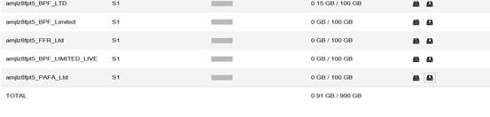
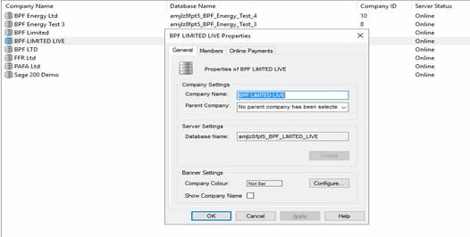
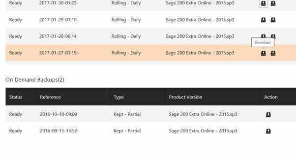

You can do your own backups before you run the yearend. When you start the backup it can take 10\-15 minutes for the backup to be done, so we recommend setting the backup and leaving it overnight then run the year end in the morning. 

Use this link to login to your online administration window. 

[https://www.sageerponlineservices.com/Site/Support/a90b5cc8\-fd10\-c4c0\-0cf7\-08d33d23848f](https://www.sageerponlineservices.com/Site/Support/a90b5cc8-fd10-c4c0-0cf7-08d33d23848f)

 

Having logged in you will see a list of your companies, as shown above. The two icons on the right are restore and backup. 

If you don't know the database names you can check these in the system administration screen shown below. 

 

When you click on restore, you get the screen shown below, you can see scheduled backups and "On Demand" backups. ( these are the ones that you do manually like the yearend.) 

 

Note there is also an "Action" button on the right, this allows you to download the backup and save it where you want to save it, as an extra copy to the one stored online.
