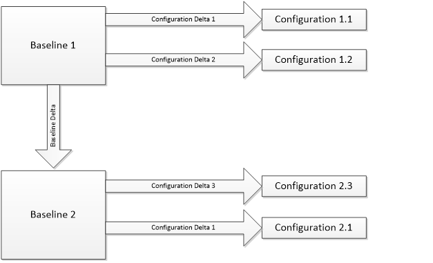

**Baseline testing** is a type of software testing used in Codis. 

By keeping several pre\-defined (Base Line) datasets with relevant data ensures that the tester can start testing more quickly. 

## Aims

To increase test coverage whilst minimising maintenance. 

From 13th December 2016 the definitive versions of the active test baseline and delta databases are held in the TestingDatabases repository in TFS. This will allow version control. 

Note:\-Kew Green is a customer with no cost centres and we have a baseline for their data. (added as Kew Green at this level) 

[Testing Database Catalogue](https://codislimited.sharepoint.com/sites/Wiki/_layouts/15/guestaccess.aspx?guestaccesstoken=hDwJRpVnjgw19FoFizqrK%2bRkwD6PZmG6BE4MKot8wHs%3d&docid=2_1e565d5c69bf04e1d99b36bdf33d3a68e&rev=1) details the databases including some that are no longer active. The TestingDatabases repository only holds copies of active databases. Apart from the Kew database, only SQL backup versions of the databases are kept in the repository. These back ups must be taken in a version of SQL 2008 so that they can be restored in all versions of SQL. 

There is an SQL script \= RestoreDatabases.sql in the repository. This script will drop and restore 4 of the key database used in testing. They assume that the backups are held in a folder c:\\TestingDatabases, local to the SQL instance. The database files are created in c:\\TestingDatabases\\Data. (This last folder is not included in the repository.). 

There is also a script CorrectSchemeUser.sql that can be used to fix the scheme user, so that the databases can be used from Sage. 

The projects are added in Sage front end as they are held in the csmaster database rather than the company databases.   
After switching on the projects you run the Sage option "Application Conversions" (to create extension tables.) then load the data. 

## New test plans

Test plans are now entered in TFS. Old old default test plan template is located in the below link. 

## Sage 1000 testing

Issues are now tracked in TFS. The old issue list is:   
[Sage 1000 Module Issues](file://///cd01sr16104/Testing/Sage%201000Testing/Sage1000Modules%20Issues.xlsx) 

There is a log viewer within V3 Excelerator and this can be run as a standalone program as well as from Excel. 

## 

## Sage 200 testing

[Sage 200 all modules](file://///cd01sr16104/Testing/Sage200Testing/2011/all%20modules.xlsx) There will also be folders for 2013 and 2015 versions of Sage 200\. 

The log viewer is also available in Sage 200 Excelerator 

## Backups

Backups should be done without appending and they can be stored as copies of the zipped backup file. Large backups are a big problem for remote workers to copy. They are created by appending to previous backups. 

When you do use the Append option it retains a history of backups, but is not very useful as we don't know what each backup is for. We should keep a separate history of backups in the relevant folder and document changes in the spreadsheet. 

Note:\-Appending is an option on the option tab of the backup screen in SQL. 

## Background

### Sage Versions

Differences in functionality between Sage versions is not very significant.   
The recent difference found between Sage 7\.1 and Sage 1000 V3 is the first one we've found.   
Whilst it should be possible to script a conversion of a baseline database to a different version, this could be quite time consuming to do though. 

### Projects

Projects can have a significant effect on Sage functionality.   
There is little interaction between project sensitive code, so there is little need to test combinations of projects other than 'all on' and 'all off'.   
Changing project settings for Sage cannot be scripted. However, manually changing them is not a big task.   
Changing project settings for Excelerator and API tests can be scripted. 

### System Keys

Changing system keys has a significant impact on functionality.   
There are a large number of system keys.There is little interaction between system key sensitive codes, so there is little need to test combination of settings. Attempting to do would lead to an impossible large test matrix.   
Changing system key values can be scripting for both Sage and Excelerator/APIs. 

### Exchange Rates

Setting up Exchange rates seems to involve a fair bit of time.   
Different exchange rate data can be compounded to get the test coverage we need. In other words, generally, we just need to add new data to increase coverage, not remove or change them. 

There are no or few differences between exchange rate static data for different Sage versions, or projects settings.   
There is an Exchange Rate Excelerator that may be usable for adding exchange rate data.Exchange rate data addition can be scripted. 

## Methodology

The following concepts are being introduced. 

### Baseline Database

A master database that only differs from other baseline databases in ways that cannot be easily propagated. There should be as few baseline databases as possible. It is hoped that these databases, after an initial period where our understanding of what data goes in them evolves, will be mostly static. 

Production and updates to baselines are subject to change control. 

### Active baselines

Within the "Testing Database Catalogue" there are details of the Sage version and projects included in each baseline. Baselines are marked as active or not. The active baselines were chosen as a good spread across versions of Sage, so the latest version of Sage is included with all projects switched on that Codis currently support. The oldest version without any projects is also active and is based on the Kew Green setup as they are a customer we still support on this system. Some of the interim versions are not active to avoid duplication of testing, where we consider there to be little differences. 

Current active baseline databases are:   
1\.       Sage 500 V7\.1 No projects activated   
2\.       Sage 1000 V4 Mandatory and Codis projects activated   
3\.       Sage 500 V7\.1 No Projects and no cost centres These details are maintained in the catalogue [Testing Database catalogue](https://codislimited.sharepoint.com/sites/Wiki/_layouts/15/guestaccess.aspx?guestaccesstoken=hDwJRpVnjgw19FoFizqrK%2bRkwD6PZmG6BE4MKot8wHs%3d&docid=2_1e565d5c69bf04e1d99b36bdf33d3a68e&rev=1)

#### Configuration

A baseline or amended baseline database that matches a desired configuration to maximise testing coverage or to replicate customer's environments. Different configuration can be used on an ad\-hoc basis in test scripts, or individuals testing locally on PCs 

#### Configuration Deltas

A set up changes that have to be made to a baseline in order to produce a Configuration. To be of practical use, a configuration delta must be easily applied via a script, probably an SQL Script. 

#### Baseline Delta

A more complex set of changes that will allow baselines to be created or updated. Their use is subject to change control. 

The plan is to have the minimum number of baseline databases, and produce configurations using the deltas. Configurations can be produced to maximise testing coverage or to replicate customer's environments. Deltas can be applied to different baselines to produce new configurations. 

 

Testing is done on the Delta that is created from a baseline, as it contains the batches, customers, suppliers, exchange rates etc... required for testing.
