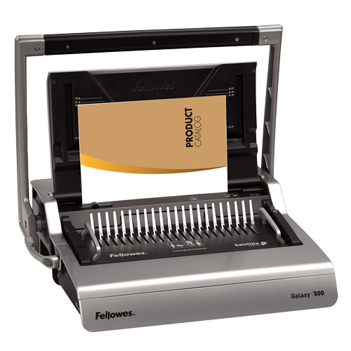
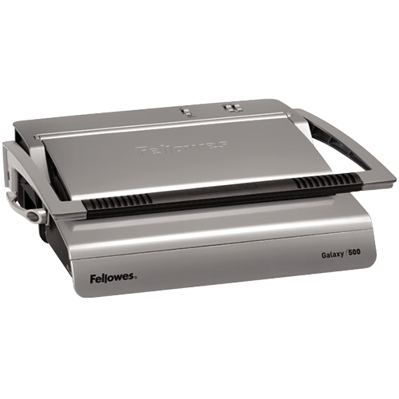
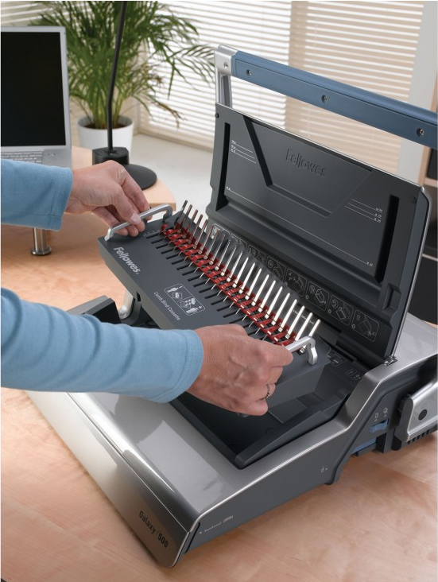
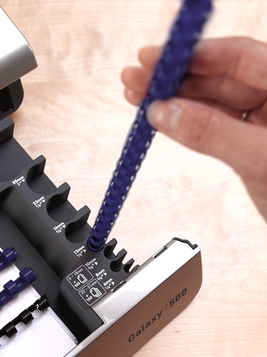

The **Fellowes Premium Comb Binder Galaxy 500** is used to bind together papers to form a booklet. It is located in the main office. 

## Demonstration Video

## Manual

Click [Here](https://codislimited.sharepoint.com/sites/Wiki/General/General%20Wiki/Documents/Binding%20Machine/Galaxy_500_18L_402894_083007.pdf) to access the product guide/manual.

## Features

- Satellite System \- A removable binding platform which allows simultaneous punching and binding of documents
- 28 sheet punch capacity, 500 sheet binding capacity with a maximum comb size of 50mm
- Full width handle reduces punching effort
- Punch selection for A4 \& A5 sized documents
- Back margin adjustment selector for thicker documents
- Front access full size storage tray with patented comb \& document measure for quick selection of the correct size supplies
- Includes starter kit for binding 20 documents

## Specification

| Auto Shutoff | N/A |
| --- | --- |
| Beep at the End of Binding Cycle | N/A |
| Binding Capacity | 500 |
| Binding Element Selector | Yes |
| Binding Type | Plastic Comb |
| Colour | Grey |
| Item H x W x D (cm) | 53\.00 x 45\.00 x 16\.50 |
| Item Number | 5622001 |
| Item Weight (kgs) | 10\.50 |
| Units per Master Carton | 1 |
| Material Type | Plastic |
| Manual or Electric Punching | Manual |
| Punching Capacity | N/T |
| Qty Per Pack | 1 |
| Ready Light/Binding Light | N/A |
| Removable Binding System | Yes |
| Retail Pack Dimensions H x W x D (cm) | 21\.50 x 53\.00 x 62\.00 |
| Retail Pack Weight (kg) | 13\.00 |
| Reverse Function | No |
| Three\-hole Punch | N/A |
| UPC Code | 043859522255 |
| Usage | Heavy |
| Vertical Punching | Yes |
| Warranty | 2 Yr |

## Images

                                               
