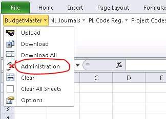
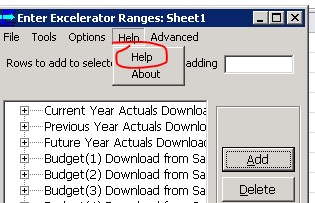
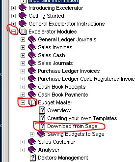

Step by step instructions with screenshots on how to use budget master below:

1\.       In Excel, select Administration from Budget Master tab  (See below)

 

2\.       Once you see window below click on Help option (see screenshot below)

 

3\.       Once you are in Excelerator help page, expand Excelerator Modules option and select Budget Master then Download from Sage (see below)

