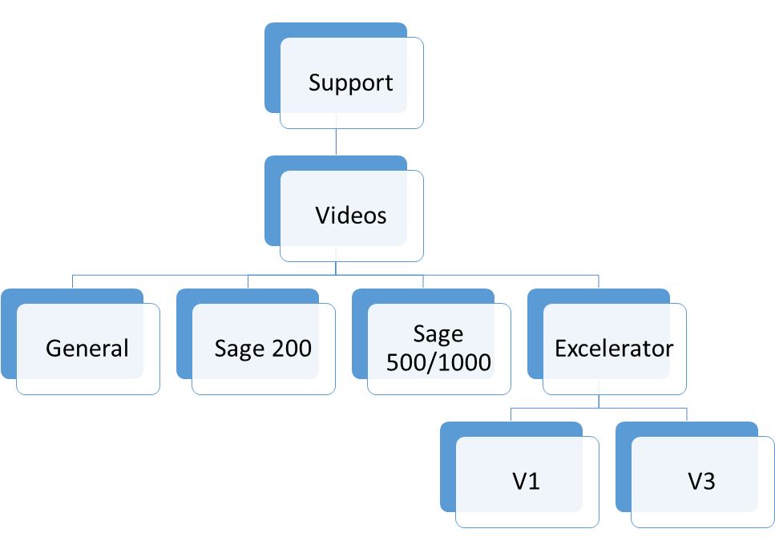

The **CRM Solutions Videos Project** is a project which aims to add videos into the solutions section of CRM, used by the support department. This page discusses the proposal of the project. 

Short videos in Gif format, linked to the solutions section of CRM, will prove to be very effective in managing support cases. Having a visual representation of a solution will make dealing with support calls easier, as well as efficient in terms of time and effectiveness. This will also prove to be a useful tool that can be utilised in providing training to new support staff in the future. 

## Background and business case

The support team already has several videos that have been recorded for different scenarios. These videos will be placed on the network at [**this location.**](https://codislimited.sharepoint.com/sites/Wiki/Support/Support%20Wiki/Videos)

The solutions screen in CRM already has a Video URL field. 

### In certain scenarios – Video Solutions will prove to be more effective

Videos will enable the support team to implement the desired solution swiftly and effectively, not only saving time for the Support team but also for the customer. 

This is simpler, easier, more effective and efficient than following steps described in the form of text. 

Cases where video solutions would serve as a better alternative would be scenarios where actual steps have to be followed in order to resolve a particular problem. 

Example of this could be, changing periods within Sage 500 and or 1000, attaching licences to companies in sage 500/1000 (in case of licence renewals etc.), and giving admin rights to a user that the support team has logged on with. 

### Training

Having video solutions in place will also serve as an effective and efficient training tool for new support staff joining Codis in the future. 

A new team member will be able to utilise these solutions to come to grips with different scenarios. 

This could also save time and effort in the future while also serving an additional, and very useful purpose. 

## Proposed Structure of the Videos Folder

 

Proposed Structure of the Videos Folder

The videos folder will be divided into 4 further sub\-folders. At this initial stage, it is proposed that the "Excelerator" sub folder is the only one that is further divided into additional folders. The "Excelerator" Folder will categorised further into V1 and V3 folders to separate solutions according to versions. 

### Naming of files:

The naming of the actual Gif files will take the following form: 

1. Start with a letter to signify the product. So, a solution relating to Excelerator issues will start with the letter "E". Sage related solutions will begin with the letter "S".
2. The version of the product will come next. This will be in the form of a number, for example "200" or "1000" to highlight that the solution relates to either Sage 200 or an Excelerator for Sage 200 etc..
3. If the solution relates to a particular module of an Excelertaor, then enter the acronym for that module before the number (step 2\). For example, a problem relating to the NL Journals Excelartor for Sage 1000 will be take the form of "ENL1000…". If the solution is not specific to a module then do not enter the module acronym.
4. Finally, enter the short form name for the error that the solution relates to.

For example, a file relating to a solution for the "Located assembly manifest does not match …." error \- will take the form of "E Located assembly manifest.gif". 

The reason that there is no version number placed after the Letter "E" in the file name is because this error can occur for both the "200" as well as "1000" products. 

## Workplan

With the provision of the project being cleared and the initial Videos folder structured finalised – the initial phase of the project will take some time in the region of half a day to complete. 

## 1st Draft

The 1st draft of this document will be presented to Support Team Management for suggestions / amendments etc.
