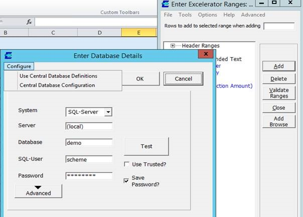

This is a link to help on your website :\- [http://www.codis.co.uk/excelerator\-help/quick\-installation\-instructions/sage\-500\-1000\-specific\-issues/multicompany\-\-central\-database\-definitions/install\-configure\-multicompany\-utility](http://www.codis.co.uk/excelerator-help/quick-installation-instructions/sage-500-1000-specific-issues/multicompany--central-database-definitions/install-configure-multicompany-utility)

There are two alternative ways of entering the connection details. You are using the single connection, the second way is to use the central database.

With this second connection you must first setup the database then enter the connection details in the second connection screen. This is accessed by clicking on "Configure" as shown in the screen below. First tick the "Use Central Database Definitions" then click on the "Central Database Configuration" and enter 

The details in the screen that pops up. Remove the details from the first screen.

 

There is a small executable that will create the table for you and a link to it from the PC ( or terminal server) on which you install it, so the user can maintain the table from their PC. ( or terminal server)

The executable is on our FTP site :\- <ftp://codisftp.codis.co.uk/Prerelease>

Username: CodisFtpUser

Password: C0di$FtpUs3r

the file is called "CentralDBConfigSetup.zip"

You will be able to enter the server names and the user name and password into this table, created which is called Excelcompanies.

The users can then select the companies from a drop down list or add the filed " sage Company" to their template. They will then be able to browse the companies in that cell. One this is set on a worksheet it will stay where it is set, so you can use separate sheets for each company.
