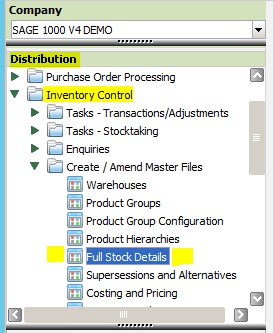
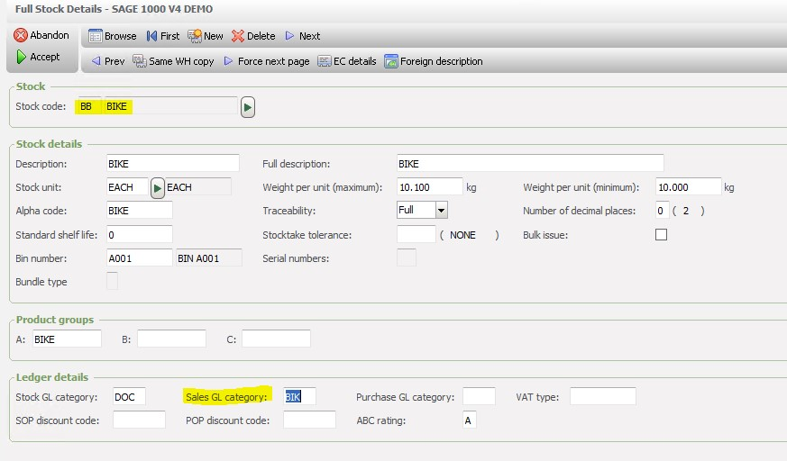

You have a field called Sales G/L Category. This is set in Sage. Go into the product Item and change it.

 

 

Or fix by Excelerator, add that field to your template, download that record and then change it to a valid data , you can browse.
