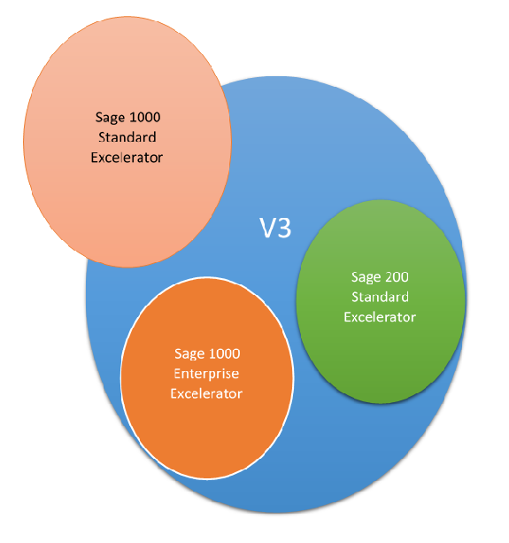
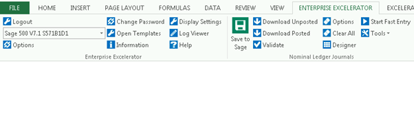

Codis have undertaken a **major re\-development** of the Excelerator modules.   
This re\-development was brought about by the necessity to have Excelerator using the latest features and benefits of Microsoft Excel.   
Codis have taken this opportunity to revamp User interface, enhancing the user experience. 

## What V3 Covers

The new method of development effects all of Codis products in general and specifically Codis Excelerator. Excelerator is divided by Sage product (Sage 200 or Sage 1000\) and Excelerator Range (Standard or [Enterprise](http://intranet/wiki/5095/excelerator-entreprise)).   
V3 development is an on\-going process and the current situation is presented in the diagrams below. 

 

The above Venn Diagram depicts the coverage of V3 development against the coverage of the older V1 development.   
To see which modules are available the below links are helpful. 

Sage 1000 Supported Platforms   
[http://www.codis.co.uk/docs/default\-source/support\-documents/sage\-1000\-excelerator\-platforms.htm?sfvrsn\=24](http://www.codis.co.uk/docs/default-source/support-documents/sage-1000-excelerator-platforms.htm?sfvrsn=24) 

Sage 200 Supported Platforms   
[http://www.codis.co.uk/docs/default\-source/support\-documents/sage\-200\-excelerator\-platforms.htm?sfvrsn\=24](http://www.codis.co.uk/docs/default-source/support-documents/sage-200-excelerator-platforms.htm?sfvrsn=24) 

## Benefits of V3

### Compatibility with the latest technologies

Microsoft release a new version of Microsoft Office every three years.   
Over the last four years, releases include Microsoft Office 2010 (two version 32 and 64 bit)  
 Microsoft Office 2013 (two version 32 and 64 bit)   
Microsoft Office 365 (two versions 32 bit and 64 bit).  
**Microsoft has released 6 new versions of Excel in the last four years.**   
  
Each release add significantly to the features and functions of the various applications.   
None more so than the Excel application.   
Features like spark lines, slicers and power view are now almost indispensable functionality with Microsoft Excel.   
64 bit technology allows MS Excel to handle ever greater volumes of data at ever greater speeds.   
  
In order for Codis to keep Excelerator abreast of these changes it requires a major rewriting of the underlying Excelerator core.   
Codis designed and developed Excelerator V3 for this purpose.   
  
Codis Excelerator V3 (both standard and Enterprise ranges) support Microsoft Excel 2010 (both 32 and 64 bit),   
Microsoft Excel 2013 (32 and 64 bit) and Microsoft Excel 365 (32 and 64 bit) 

Please click on the following link to get details about Platform Supported. 

Sage 1000 Supported Platforms   
[http://www.codis.co.uk/docs/default\-source/support\-documents/sage\-1000\-excelerator\-platforms.htm?sfvrsn\=24](http://www.codis.co.uk/docs/default-source/support-documents/sage-1000-excelerator-platforms.htm?sfvrsn=24) 

Sage 200 Supported Platforms   
[http://www.codis.co.uk/docs/default\-source/support\-documents/sage\-200\-excelerator\-platforms.htm?sfvrsn\=24](http://www.codis.co.uk/docs/default-source/support-documents/sage-200-excelerator-platforms.htm?sfvrsn=24) 

### Improved User Experience

Codis Excelerator V3 has greatly improved the user experience when working in Excelerator.   
After much research into best practice of software user friendliness Codis Excelerator V3 has made significant changes.   
Codis Excelerator is a product within which MS Excel users are comfortable.   
Following are the major changes in regards to User Experience:\- 

**The Ribbon** – Codis Excelerator now makes full use of the Microsoft Excel Ribbon.   
User Interface with new icons brings simpler and faster access to Excelerator features.   
Consistent with standard Excel ribbons this bring a more familiar feel to the product.   
Faster access, familiar look and feel **improves the user experience**. 

 

After login into Sage 500

**Fast Entry** – One of the strong features of Codis Excelerator is the ability to look up Sage data from within Excel.   
Historically right click and Browse allowed users to search for and return Sage codes.   
Listening to user feedback Codis developed the Fast Entry feature.   
This feature searches for a code when the user tabs off a cell.   
The search box opens with textual search of both codes and descriptions.   
Within the search box arrow keys and enter allows selection, and returns the code, without ever using the mouse.   
**Searching and selecting codes is now much more user friendly arguably better than available within Sage**. 

**The designer** – has been re developed working in line with other Excel functions –   
Excelerator has gone a step further in reporting possible issues while working on the designer.   
Less clicks are required to add or remove ranges – changing the sequence of the range is more user friendly – range size is better controlled and the necessity of the Add Browse is relegated to the tools menu.  
More intuitive and requiring less clicks the new designer makes it easier to design new templates. 

### 

### New Enterprise Features

Enterprise Excelerator has now enabled much improved flexibility.   
Enterprise offers much more than Standard version of the software – **V3 enhances this functionality**. 

**Policies** – user policies can now be configured within Enterprise.   
Options normally accessed with Excelerator can be controlled by the Codis IP administrator.   
New policies can be added and these can be controlled at the default, role or user level. 

**Databases** – Enterprise V3 enables the database feature available in Sage 1000\.   
This allows the different companies share the same Ledger (e.g. Nominal Ledger).   
When posting Cash Receipts the Cash Book is selected by the company while the Nominal Ledger may be in a different central shared company. 

**Field Level access** \- one of the powerful features of Enterprise is to restrict access for a role at the field level.   
An example would be the Purchase ledger where the user can see most data – but any sensitive Bank details can be restricted.   
It is possible to hide these fields from the user or allow users to view the data but not update. 

### New Exciting Modules

All future Codis development for new modules will be added to the V3 version.   
This already includes modules for:  

1. **Exchange Rates** – allowing users to easily oversee and maintain exchange rates for different pre\-defined currencies.
2. **Cost of Sales Codes** – allows users to update and create different cost of sales codes and their related Nominal Codes.
3. **Multi Company Cash Book** – is a very exciting module. It not only allows transactions for different companies in the same spread sheet –   
but transactions for different bank accounts and transaction types (payments and receipts) can all be uploaded with the click of a button.

The V3 range of products will be continuously enhanced and improved.   
These modules along with the reworked new modules is making Enterprise V3 a platform of choice. 

### Licensing

With Codis Excelerator V3 we have improved and streamlined the Licensing process.   
Whereas this is only a first step to completely automating the process (the end goal is that license automatically gets renewed one the Invoice is paid). 

This step in itself simplifies the process License Renewal **requests are sent by e\-mail and activations are returned by e\-mail**. 

Ultimately Excelerator product will be re\-licensed automatically when the invoice is paid.   
Historically the user had to put a phone call to our office, call out a sequence of numbers and would then have to type in another number sequence, supplied by the operator. 

  
Now, the user copies a License Renewal Request on to an e\-mail and Codis returns a new e\-mail with the activation codes.   
The activation codes are then copied into the Activation and the License is renewed. 

### New Online Manual

Codis have developed a new on\-line help which is accessed from within Excelerator.   
**Speed Reading, Links, Videos** Sample Page [Request a Demo Licence](http://www.codis.co.uk/excelerator-help/quick-installation-instructions/licensing/generate-a-demo-licence-request) 

## Advantages of Excelerator V3

1. The tool bar options are more spread out with bigger icons.
2. The tool bar is on a separate tab to any other addins and is called " **Enterprise Excelerator**"
3. You can change the order of the modules on the toolbar easily.   
You can use the Sage company field, on the template rather than selecting the company each time you save to Sage.
4. When you **"Save to Sage"** the popup window confirms which company you are porting to.   
There is an option called **"Start Fast Entry"** it auto fills the cells if the text has one match or it opens the browse window showing the filtered data based on your text.   
It searches on every filed in the browse window simultaneously. ( it is an optional extra and can be switched off if you don't want it.)
5. The error messages are clearer and show in text for rather than a picture so you can cut and paste the detail, to pass on.
6. The designer is easier to use, there is an auto shift function so it is quicker to add ranges.   
It defaults some fields to the full length of the template.   
It warns you when fields do not match in length.
7. The licensing is now more automated, it is consolidated into one system generated request HTML statement.   
This is sent by email and it time restriction in now 7 days rather than 10 minutes.

## Marketing Material

[Benefits of V3](https://codislimited.sharepoint.com/sites/Wiki/Sales/Sales%20Wiki/Documents/Excelerator/Codis%20Excelerator%20V3%20Benefits.docx)
