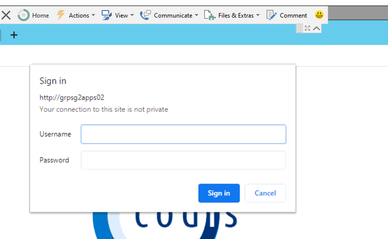

## Overview

For a description of the Codis PPS solution, see [Codis Payment Practices Statistics.aspx](Codis Payment Practices Statistics.md).

The solution is a web\-based solution based around the Codis IP Solutions platform.

## Supported Platforms and Prerequisites

Sage 1000 SQL Server Only and Sage 200\.  

[Codis IP prerequites](https://codislimited.sharepoint.com/sites/Wiki/Support/Support%20Wiki/Documents/CodisIP%20Prerequisites%20Template%20v3.2.doc)

IIS 8 

Also:

1. Enable Web Socket Protocol: [https://docs.microsoft.com/en\-us/iis/configuration/system.webserver/websocket](https://docs.microsoft.com/en-us/iis/configuration/system.webserver/websocket)
2. Install IIS URL Rewrite: [https://www.iis.net/downloads/microsoft/url\-rewrite](https://www.iis.net/downloads/microsoft/url-rewrite)
3. Install dotnethosting 2\.1\.xx: [Download .NET Core 2\.1 (Linux, macOS, and Windows) (microsoft.com)](https://dotnet.microsoft.com/download/dotnet/2.1)
4. Codis System Settings and Codis IP need to be installed first.  See [Implementation of Codis IP V3\.aspx](Implementation of Codis IP V3.md).
5. The web server must be able to access [https://fonts.googleapis.com/css?family\=Ubuntu\+Condensed\|Ubuntu\+Mono:400,700\|Ubuntu:300,400,700](https://fonts.googleapis.com/css?family=Ubuntu+Condensed%7cUbuntu+Mono:400%2c700%7cUbuntu:300%2c400%2c700 "https://fonts.googleapis.com/css?family=ubuntu+condensed|ubuntu+mono:400,700|ubuntu:300,400,700")

## Installation

1. The PPS artifact zip file can be found under PPS in the Codis Build release area under PPSSolution: [https://codislimited.sharepoint.com/sites/builds/Shared%20Documents/Forms/AllItems.aspx?viewid\=136b23c9%2D2d50%2D43d6%2Da045%2Db7190ece9fb6\&id\=%2Fsites%2Fbuilds%2FShared%20Documents%2FRelease%2FPPSSolution](/sites/builds/Shared%20Documents/Forms/AllItems.aspx?viewid=136b23c9-2d50-43d6-a045-b7190ece9fb6&id=/sites/builds/Shared%20Documents/Release/PPSSolution)
2. Extract the zip PPS artifact anywhere on the server. Rename PPSWebApp folder as PPS amd move it to C:\\Program Files (x86\)\\Codis Excelerator.
3. Create an application in IIS. Fill up the alias field eg: PPS and in physical path specify the extracted PPS path. Create a new PPS application pool.
4. Add forward slash to the end of URL and browse. eg localhost/PPS/ or \<PPSServername\>/PPS/. **Note:** This URL is not accessible through Internet Explorer(IE).
5. Run the PPSTables.sql script (from the zip file) in SQL Management against the CodisMaster database to create the PPS tables.
6. Run the PPSScript.sql script (from the zip file) in SQL Management against the master database to create the PPS database and tables.

## New Policies

The following policies need to be configured in Codis IP.   


| Policy Key | Description | Example value | Notes |
| --- | --- | --- | --- |
| DRPPConnectionString | A connection string to the PPS database | Data Source\=\<PPS SQL Server\>;Integrated Security\=False;User ID\=\<SQL Username \-full access to PPS database\>;Password\=\<SQL User's Password\>;Initial Catalog\=PPS;Connect Timeout\=30; | It is recommended that a dedicated sql user be set up with access just to the PPS database |
| PPSKeyName | The key of the policy key that holds the table/column mappings | PPSSage1000 | This allows default mapping configurations to be included in the default deployment,, and for one to be picked as the mapping in use. |
| PPSSage1000 | Holds sample mappings for Sage1000 | See [Codis PPS \- Mappings.aspx](Codis PPS - Mappings.md) | This holds a combination of per application (Sage 1000/200\) configuration and per customer configuration.  If upgrading an existing site then this key should be checked carefully. |
| PPSSage200 | Holds sample mappings for Sage200 | See [Codis PPS \- Mappings.aspx](Codis PPS - Mappings.md) |  |

## Users

Users of the software have to be set up in Codis IP.   [Adding a Codis IP User instructions.](Codis IP - Add - Activate New User.md)  The user will access the PPS database using the credentials in the connection string, but it will access the CodisIP tables in the usual way for an IP user.

## Licensing

The product needs to be licensed as other Codis IP modules are licenced, using the System Administrator tool [Enterprise Licensing Training notes.](How customers use the new Licencing system.md)

## 

## Upgrades

The mappings are key to PPS functionality.   Upgrades to the functionality might be contained in the mapping configuration.  As it will be most like desirable to preserve data in the CodisMaster and PPS databases any upgrades to the mappings must be carried out manually using sql queries.

### CodisMaster Database

As of March 2020, there are changes to allow the mapping policy used to be selected by the user.  This requires changes to the data:  


```
Insert into SystemCategory values('PPSMappingPolicies','PPS Mapping Policies')
go
update MasterPolicy
set CategoryID='PPSMappingPolicies' 
where [Key] in ('PPSSage1000','PPSSage200')
go

```

  
  

### PPS Database

Any existing PPS database should be preserved as it may contain historical data.  

Older implementations created the PPS database with the incorrect default collation Latin1\_General\_CI\_AS.  The collation should be Latin1\_General\_CS\_AS and the CI collation is Case Insensitive.  Sage 1000 is case sensitive meaning there is a possibility that items might appear duplicated to the case insensitive database.  This can be corrected by applying the correct default collation to the PPS database.

There was also an issue with older installation where the LogFile column on the history table was named LogFIle.  This wasn't noticed until the collation was changed.

As of March 2020, there are changes to allow the mapping policy used to be selected by the user.  The selected policy is recorded in the History table.  
  

```
ALTER TABLE History 
ADD [MappingPolicy] [varchar](200) NULL
go

```
  
  
## Troubleshooting

The following can occur.  If you click "Cancel" you will see more details of the actual error behind it.  Typically, it is because the product isn't licenced.  



