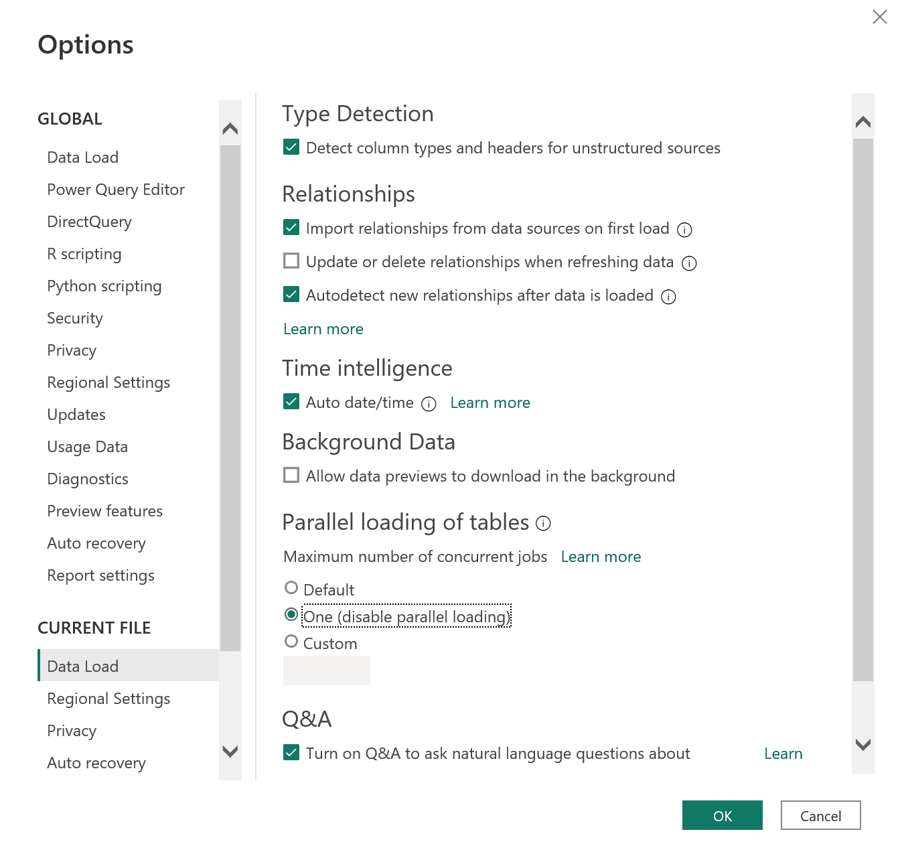

1. Disable Parallel Loading.
1. Go to Power BI Desktop.
2. Go to File \> Options \> Current FIle \> Data Load
3. Then Select **"One (Disable Parallel Loading)"** and then click on "Ok".  

3. **Create Folders** in Power Query listed below:
1. Core
2. Source Tables
3. Intermediatory Tables
4. Final Tables

5. Use as **Simple names** as they can be for tables in Power Query.
6. Use **Proper Capitalizations** *e.g. Orders and Returns Lines*
7. Use **Plural names** for tables *e.g. Orders, Products etc*
8. If source table has the same name as of another folder tables then its ok to put source in bracket for source tables. *e.g. Orders and Retunrs **(Source)***
9. **Use** **simple column names** **for Final tables with proper Capitalizations.** Their Data types must be correctly assigned.
10. Make **Composite keys** by combining "Compnay ID" with "Primary Key" and as well as with "Foreign Key", whenever there is difference in values of a table *(e.g. Order Return Line)* from different companies.  
An example for same values is of table *"OrderStatus"*, as status will have either value open or close, for all the companies.
11. Use **Star Schema** for Modeling in power BI. you can use snowflake in some cases if needed.
12. If having more than one **Fact table** in the model, then you can split the dashboard.
13. **Hide unwanted tables** from the report view.
14. **Disable Load** for the tables which are not required to be loaded in the report.  
*(You can see this option by right clicking on table name in Power Query)*
15. Use **Auto Calender** in your Reports for Date Dimension.
