**Codis Website User Guide****by Kashif Maqbool**

---

**Contents**  

[Introduction](#introduction)  
[Website Framework](#website_framework)  
[Accessing Website for Editing](#website_editing)  
[Content Basics](#content_basics)  
[Updating Webinar Form](#webinar_form)  
[Creating Download Links](#download_links)  
[Redirects](#redirects)  
[Creating a Tutorial Page](#creating_tutorials)  
[Creating a Blog](#creating_blog)  
[Excelerator Help](#excelerator_help)  
[Custom Coding \& Workarounds](#custom_coding) 

---

 
 
 **[Introduction](Codis Website User Guide.md)**

The new Codis website is built on the 
 **SquareSpace** platform, an all\-in\-one content management system. SquareSpace offers many different templates to build websites on. The Codis website is built on the 
 **Five** template. \-\> 
  
[SquareSpace Five Template](https://support.squarespace.com/hc/en-us/articles/206544937-Five-template)  

  

**[Website Framework](Codis Website User Guide.md)**

Most of the website pages consist of a Banner at the top, followed by content at the bottom. The banners are hard\-coded on the website. The Homepage is an exception in that it doesn't have a banner at the top, but a 
 **Gallery Slideshow**. The Homepage also features a 
 **Gallery Carousel** displaying company logos of our customers.  
\-\> 
 [SquareSpace: Gallery Blocks](https://support.squarespace.com/hc/en-us/articles/206543407-Gallery-Blocks)  

  

[**Accessing Website for Editing**](Codis Website User Guide.md)

- Go to 
[login.squarespace.com](https://login.squarespace.com/)
- **Log in** using your credentials.
- Click on the Codis Website:  
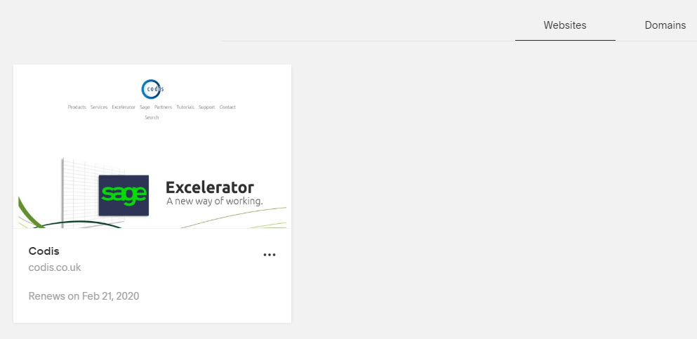
- Click on 
 **Pages** in the top\-left:  
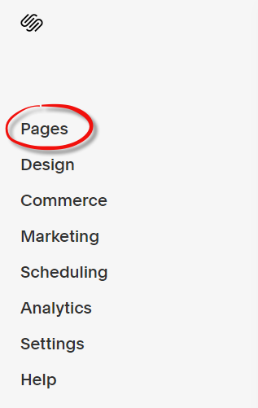
- A list of all webite pages will now appear. They are divided by 
 **Linked** and 
 **Unlinked** pages. Linked pages are those that appear in the top navigation, unlinked are those that do not. Click on the page you wish to edit.

**Content Basics**

***Adding a New Page***

- If your page is going to be part of the top navigation menu, click on the 
 **\+** sign under 
 **Main Navigation**.
- If you page is not going to be part of the top navigation menu, click on the 
 **\+** sign under 
 **Not Linked**.
- Choose your type of page from the pop\-up menu. In most cases, it will be a 
 **blank** page.
- Once your page is created, click on its settings and under 
 **General**, set the page so it is 
 **not enabled**. This will hide it from visitors while you work on it.
- [SquareSpace: Layout Pages](https://support.squarespace.com/hc/en-us/articles/206543687)

***Editing Text***  

- Point the mouse cursor to where you want to edit and wait for the Page Content menu to appear.
- Click 
 **Edit**.
- The page is now enabled for editing.
- If you are copying and pasting text from another source, you MUST paste as plain text.

 
***Adding a Space Block***

  
Use Spacer Blocks to add an adjustable amount of empty space between blocks. Spacer Blocks are a great way to create padding and white space on pages and blog posts. Spacer Blocks can also help resize images and other blocks.- Edit a page or post, click an insert point, and select Spacer from the menu.
- If neccessary, click and drag the block to its new location on the page.

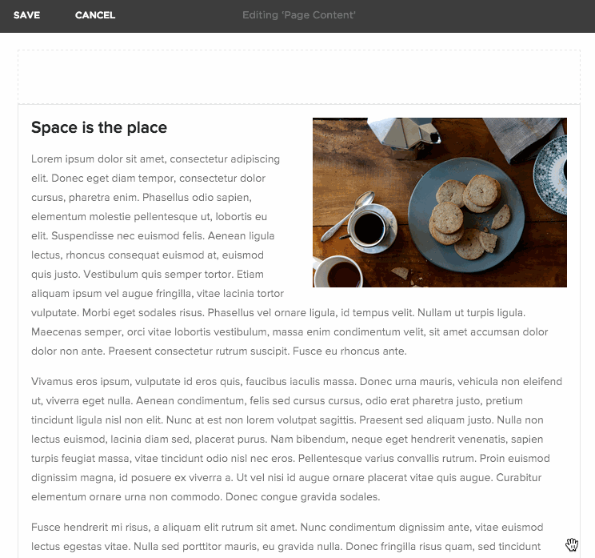   

- [SquareSpace: Space Blocks](https://support.squarespace.com/hc/en-us/articles/206566717-Spacer-Blocks)

 ***Creating a Link***  
- Highlight the text you want to link.
- Click the Link button from the text toolbar.
- If linking to an internal page, then type "/" to bring up a list of all pages on the website. Select the page you want to link to. Click Apply, then click Bold, then click Save. If you want to link to an anchor, you must include \#anchor\-id at the end of the URL. E.g. www.codis.co.uk/excelerator\-help/start\-using\-excelerator\#before\-you\-begin
- If linking to an external page, then type the URL you want the page to link to. Click Apply, then click Bold, then Save.
- [SquareSpace: Creating text links](https://support.squarespace.com/hc/en-us/articles/206543827-Creating-text-links)

  

***Adding an Image***  

Use an Image Block to add images. Each Image Block displays one image.  

- Ensure you have the image you want to add saved somewhere on youre PC.
- Edit a page or post, click an insert point, and select Image.
- Click Upload an Image or drag the image into the image uploader.  
  
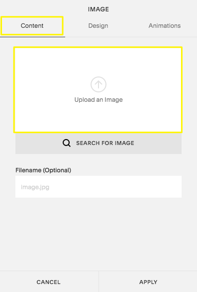
- Click 
 
**Apply****.**
- [SquareSpace: Image Blocks](https://support.squarespace.com/hc/en-us/articles/205814528-Image-Blocks)

 

**4\.3 Adding a Video**

- Videos needs to be hosted elsewhere and embedded on SquareSpace rather than uploaded directly.
- If the video is for public consumption, it can be uploaded normally. If it is for Support customers only, then it should be uploaded as a private video.
- Copy the URL of the video once uploaded.
- Select 
 **Video Content Block**
- **Paste** the URL.
- **\-\>** 
[SquareSpace: Adding videos to your site](https://support.squarespace.com/hc/en-us/articles/206544187)

  

[**Updating the Webinar Form**](Codis Website User Guide.md)
- Go to **Pages \> Webinar**.
- Hover over the form and click 
 **Edit**.
- Scroll down to 
 **Select Webinar** field and click 
 **Edit**.
- In the drop down space, remove dates you no longer want to show and type new dates you want to add.
- Ensure you do not accidentally remove '**Please Select**' at the top.
- Click 
 **Save.**

   
[**Creating Download Links**](Codis Website User Guide.md)All files that we offer as downloads to a customer are uploaded to 
 **Microsoft Azure**. We then generate a link to add to the website. The uploading of files to Azure is managed by our IT Manager. Once the file is uplaoded to Azure, the links will look in the form of: *https://downloads.codis.co.uk/Excelerators/Sage200/StandardSage200vSPE2019ExceleratorSuite.exe*.

  
**[Redirects](Codis Website User Guide.md)**Website redirects are stored in **Settings \> Advanced \> URL Mappings**. 

To create a redirect, you add a new line in the following format:

*/old\-no\-longer\-existing\-URL \-\> /new\-existing\-URL 301*

The format of the URL is written as everything after the domain and first slash.   

The following is a list of redirects of **vanity URLs**:

- <https://www.codis.co.uk/wiki> \-\> [https://codislimited.sharepoint.com/sites/wiki](/sites/Wiki)
- <https://www.codis.co.uk/email> \-\> [https://outlook.office365\.com/owa/?realm\=CODIS.CO.UK](https://outlook.office365.com/owa/?realm=CODIS.CO.UK)
- <https://www.codis.co.uk/crm> \-\> <https://crm.codis.co.uk/crm>
- <https://www.codis.co.uk/selfservice> \-\> <https://crm.codis.co.uk/crmselfservice>

**[Creating a Blog](Codis Website User Guide.md)**Blogs in Squarespace are organized in two parts: Blog Pages and individual blog posts. Blog posts are sub\-pages of a Blog Page. Each blog post has its own page and dedicated URL.  

 ***Add a new Blog***  

- Click 
 **Pages**, then click the **\+** icon.
- Choose 
 **Blog** from the pages menu.
- Enter a page title, then press 
 **Enter**. You can change this later.
- If you already have a Blog Page, click its title in the 
 **Pages** panel.

 ***Add a Blog Post***

  

In the **Blog Page** panel, click the **\+** icon:

  

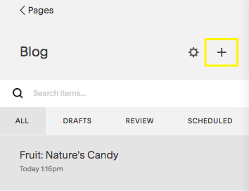
  

- To add a title for your post, click in the Enter a post title... box. Titles must be 200 characters or fewer.
- Your new post includes a Text Block to help you get started. To add more blocks to the post, click the \+ icon or an insert point.
- You must add SEO to the blog page and blog posts.
- \-\> [Blogging with SquareSpace.](https://support.squarespace.com/hc/en-us/articles/206543727-Blogging-with-Squarespace)

  

[**Creating a Tutorial Page**](Codis Website User Guide.md)The Tutorials section is a blog page and each tutorial is a blog post. The two blog pages are:- Excel to Sage 200 Tutorials.
- Excel to Sage 1000 Tutorials.

To add a new tutorial, simply create a new blog post and add content using the guide from 
 [Content Basics](#content_basics). The layout for a tutorial consists of a video of the tutorial at the top, followed by text and screenshots. Tutorial pages should be only be created after the video has been produced. 
 - \-\> [Blogging with SquareSpace.](https://support.squarespace.com/hc/en-us/articles/206543727-Blogging-with-Squarespace)

[**Excelerator Help**](Codis Website User Guide.md)

**Overview**  
  
The 
 [Excelerator Help](https://www.codis.co.uk/excelerator-help) section is built on a blog framework. Blogs in Squarespace are organised in two parts \- blog pages and individual blog posts. On our website, Excelerator Help is the blog page and the following Help sections are blog posts on the blog page:

- Install, License \& Configure
- Start Using Excelerator
- Customise Excelerator
- Troubleshoot Excelerator

  

**Key Differences from SiteFinity**  

- The URL structure is slightly different. There are redirects in place so that anyone who accesses the former URL structure, they will automatically be taken to the relevant page on the new wesbite.
- On SiteFinity, each section and sub\-section was a unique page. On the new website, a blog post contains the entire content for that section. So, pages are longer and customer’s will conduct “scrolling” behaviour.
- On SiteFinity, the navigation menu was located in the top\-left. On the new website, the navigation menu sits at the top of each section. It lists the four different main sections and corresponding sub\-sections.

   
**Excelerator Help V1**  

- The V1 version of Help sits on a separate blog page and follows the same behaviour as Excelerator Help above.

**Further Planned Developments**

- A comprehensive editorial review of the Help content, with the aim to keep up\-to\-date and reduce verbiage.

  
 

**Page Layout**  

  

***Search Bar***  
The search bar at the top of each section it limited to searching the help section only, reducing noise from non\-Help pages appearing in the search results.   

  

***Contents Menu***  
Each section has a manually\-created contents menu. Menu links "jumps" the user directly to that section. This occurs because 
 each section and sub\-section has a HTML coded headline, which allows us to insert an anchor ID. Therefore, the links in the menu include the anchor ID in the URL structure. 
  

***Content***The entire help content, plus images and videos.
  
 The content area has a specific structure between each sub\-section that must be adhered to:  

  
 
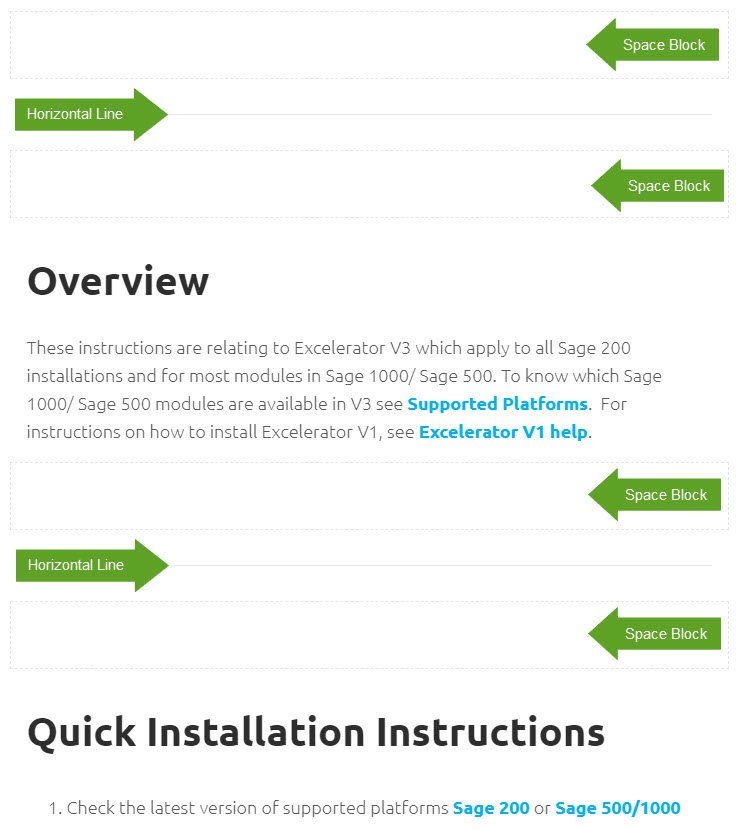
  
   

 **Accessing Excelerator Help for Editing**
- Log in to SquareSpace using your credentials.
- Navigate to Pages on the top\-left.  

- Scroll down until you find Excelerator Help, then click on this. This will open up the four different sections.  

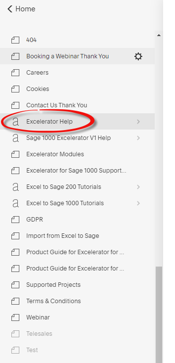
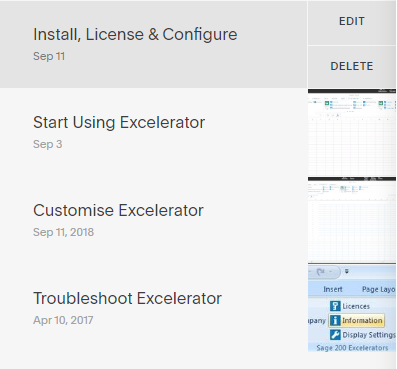
- You can either click Edit and edit the page via an interface or click the section name to access the page and click Edit on the page.  
  
NOTE: Multiple contributors making simultaneous content edits can cause changes to overwrite each other. Please coordinate your contributions to avoid issues.

 

**Adding/Editing Content**  

  

Please refer to the 
[Content Basics](https://codislimited.sharepoint.com/sites/Wiki/Pages/content_basics) section at the top of this guide for information on how to add text, images and videos.

  
   

***Text Style***  
  

There are three different text styles used on the Help pages. These are preset on the website: :   

- **Normal** for the Help copy, sections within sub\-sections and hyperlinks.
- **H3** for sub\-section headlings.
- **H1** for section headings.

If you add text, it defaults to normal. If you want to style it as a sub\-section headline, then you need to add the H3 style.

  
 

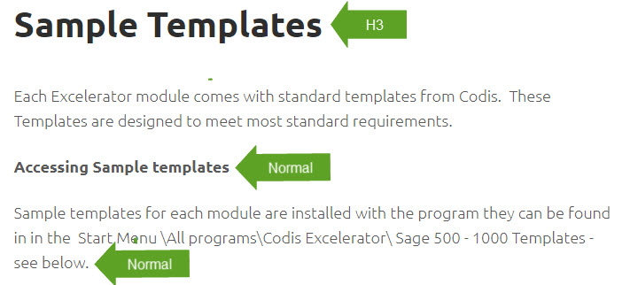
  
 

  
 
To style in the appropriate format, highlight the text and select from the drop\-down menu from the text toolbar:  

  
 

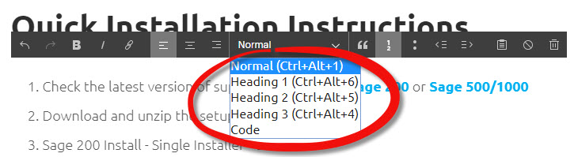   

  

***Inserting an Anchor into a Headline***

  
An anchor link (or "page jump") is a special URL that takes you to a specific place on a page. If you want to create a section that you would like customers to jump to from another location, you need to insert an anchor link into the text. Instead of inserting text in the usual fashion, you need to insert a code block:  

  
 

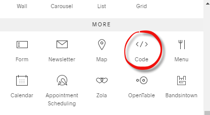  

Then, insert the following code into the block:  
\<**\[TEXT STYLE]** ID\="**anchor\-id**"\>  
  \<p\>  
    \&nbsp;  
  \</p\>  
**Heading**  

\</\[TEXT STYLE]\>

  
The items in green are variables and need to change in accordance with what you are trying to achieve.  

- **\[TEXT STYLE]** would be **\<H3\>\</H3\>** for major headings and **\<P\>\</P\>** for sub\-headings.
- **anchor\-id** should be the same name as the heading or sub\-heading, with hyphens between words, e.g "**start\-using\-excelerator**". IDs are case sensitive. If your HTML says id\="Codis", but your link lists the ID as \#codis, the link won't work.
- **Heading** is the title of the section..

Once you have amended the code to what you desire. Click 
 **Apply**.  

  

The unique ID becomes part of the URL after clicking the anchor link. When a visitor clicks an anchor link, the unique ID shows up at the end of the site’s URL.

  
   

***Creating an Anchor Link in the Contents Menu***  

- Highlight the text you want to link.
- Click the 
  **Link** button from the text toolbar.
- Type "/" to bring up a list of all pages on the website. Select 
 **excelerator\-help**, then at the end of the URL add the section it you are adding the link (e.g. 
 **start\-using\-excelerator**) and the anchor ID you created earlier proceeded by a hashtag. The final URL should look something like this:

**www.codis.co.uk/excelerator\-help/start\-using\-excelerator****\#before\-you\-begin.**
- Click 
  **Apply**, then click 
  **Bold**, then click 
  **Save**.

  

  

***Sending Customers a Direct Link***  

- Land on the specific part of the the page you want to send by clicking the link from the top menu.
- Copy and paste the URL from the Address Bar. This will include the Anchor ID, e.g. [https://codis.co.uk/excelerator\-help/install\-license\-configure\-excelerator/**\#download\-setups**](https://codis.co.uk/excelerator-help/install-license-configure-excelerator/#download-setups).

  
 

***Creating a New Section***
- If the need arises to create a brand\-new section in Help, you need to create a new blog post.   
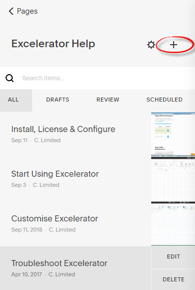
- On your new page, add the title of the new section at the top, e.g. "Troubleshoot Excelerator" is the name of one of the current sections. You can then add the content in the space below, following the same style guides as the other sections:  
  
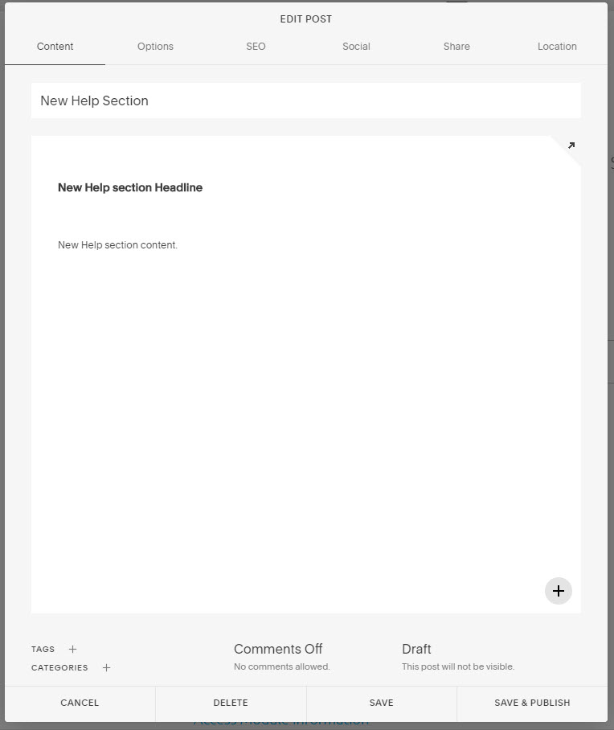
- Before publishing your new section, click on the **SEO** 
tab at the top and add the name of the Help section under 
**SEO Title** and a brief description of this new section under 
**SEO Description**:  
  
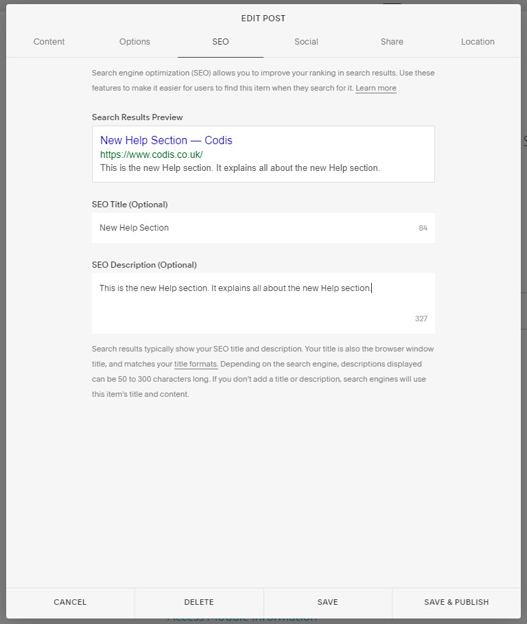
- Once that is complete, click 
**Save \& Publish**. You new section is now live. You must now add the contents menu at the top (contaning anchor links) and include a link to the new section in the contents menu on the other pages.

 **[Custom Coding \& Workarounds](Codis Website User Guide.md)**  
   

The following is a list of all the custom coding and workarounds currently implemented on the website:  

  
 

***Banners***  
 **ISSUE**: With the FIVE template, you can either choose to show banners across the site or hide them. We wanted to display banners across the site, but this mean't the banner space would also appear on the internal 
 **/search** page. This takes a lot of space above the fold and pushes the search bar down. Our workaround for this is to keep our settings as wanting banners across the site, but hard coding to hide them across the site. We then place another piece of code on each individual page to show a banner: 

  
 
1\. Ensure that banners are set to display across the site in 
 **Design \> Site Styles \> Banner Content \> Page Title Description**.  

2\. Place the code to hide banners across the website in 
 **Advanced \> Code Injection \> Header**.  

*\<style\>*

*\#banner\-area\-wrapper {display: none}*

*}*  
*\</style\>*  

3\. Add the following code to each individual page where you want to show the banner in 
 **Page Settings \> Advanced \> Page Header Code Injection**:

*\<style\>* 
  

*\#banner\-area\-wrapper  {display: block; !important; }*  
*\#banner\-area\-wrapper { background\-image: url(URL\-HERE;) }*  
*\#banner\-area\-wrapper { background\-position: center; }*  
*\#banner\-area\-wrapper { background\-repeat: no\-repeat; }*  
*\#banner\-area\-wrapper { background\-size: 100%; }*  
*\#banner\-area\-wrapper { background\-color: white; }*  
*\</style\>*  

4\. The banner needs to be in 
 **SVG format** and can be uploaded to SqaureSpace by creating a link to it on the Test page. Then copy and paste the entire URL into 
 \#banner\-area\-wrapper { background\-image: url(**URL\-HERE**;) }

  

***Mobile Text***  
 **ISSUE:** Text is too large on mobile site causing words to be jumbled. In addition, the spacing between H3 heading and H2 tagline is insufficient, causing them to merge. We have implemented some CSS to reduce the size of text and also increase the gap between H3 heading and H2 tagline. The following is placed in 
 **Design \> Custom CSS**.

  
 

*@media only screen and (max\-width: 845px) {    h1 {  font\-size: 40px !important; }}*

*@media only screen and (max\-width: 845px) {    h2 {   font\-size: 15\.50px !important; }}*

*@media only screen and (max\-width: 845px) {    h3 {  font\-size: 20px !important; }}*

*@media only screen and (max\-width: 845px) {  p { font\-weight:300; font\-size: 13\.5px !important; }}*

  
 

***Carousel***  
  
**ISSUE 1:**In order to create a reasonable amount of space between each logo, blank images are placed between each logo when uploading to the carousel. The blank image can be found in the Digital Marketing folder:  
  
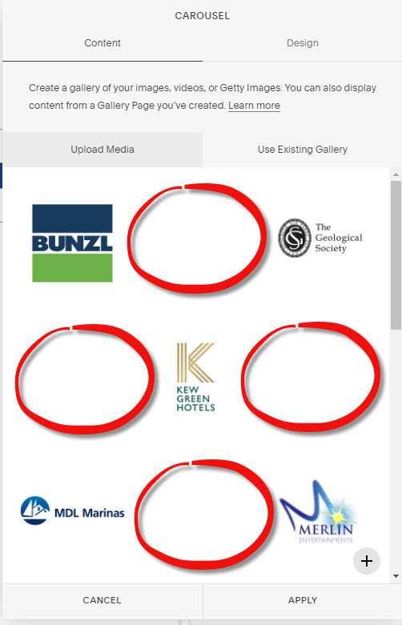  

**ISSUE 2:** Carousel logos appear too small on mobile. A piece of CSS code under 
 **Design \> Custom CSS** increase the sizes of these images in the Carousel:

  
 

*@media screen and (max\-width:845px) {*  
*.sqs\-gallery\-design\-strip {*  
*height: 80px;*  
*}*  
*}*
  
 
 ***Excelerator Setups***  
 **ISSUE:** SquareSpace have a 20Mb limit on files that can be uploaded to their file manager. All the individual Sage 1000 module setups exceed 20Mb. To overcome this, we have uploaded these setups to Google Drive and created links to each file using the following URL: 
https://docs.google.com/uc?export\=download\&id\=YourIndividualID
The individual ID is obtained by right clicking on the file in Google Drive and selecting “Get Shareable Link” and then copying the ID.

  

***Files***  
 **ISSUE:** There is no proper file manager in SquareSpace. I have had to create a definitive list saved on the Wiki of all URLs.
