[Sage X3](Sage X3.md) contains **companies** and **sites**. 

A company is a business organization which associates or collects of individual real persons and/or other companies, who each provide some form of capital. This group has a common purpose or focus and an aim of gaining profits. This used as data consolidation processes and for legal reports. 

The Site is the central unit for carrying all the management operations. The operational management actions are carried out from within a site and site is the central concept to the organization of data for sites and companies. 

To create these, you must take these steps: 

1. Create the Charts of accounts
2. Create the Ledgers
3. Assign the Ledgers \& COAs to Account core model.

## Folders

A folder contains many companies. 

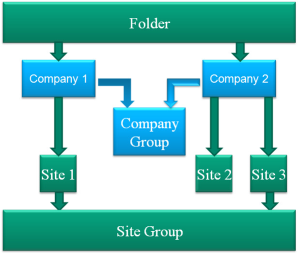Graph

## Creation of Company

**Transaction Code: GESCPY       Description: Creation of Company** 

A company is a business organization which associates or collects of individual real persons and/or other companies, who each provide some form of capital. This group has a common purpose or focus and an aim of gaining profits. This used as data consolidation processes and for legal reports. 

**Fields explanation:** 

Company – We need to enter a short code and description to identify our company. It cannot be more than FIVE characters. 

Legal Company – Need to select the 'Legal company' check box to indicate the company is legal according to specific accounting guidelines. Only legal companies can have account postings and balances. A non\-legal company can be used for simulations and analytical groupings. 

Legislation – It is mandatory to assign. The individual legislation has set of accounting principles and tax setups. 

Registered Capital – This field defines the currency in which the company capital is expressed. 

Main Site \- For a given company, it is necessary to have a single site proposed by default for accounting transactions. 

Country – The country code is used to identify the country associated with the site. 

**Path: Parameters \-\> Organisational Structure \-\> Companies** 

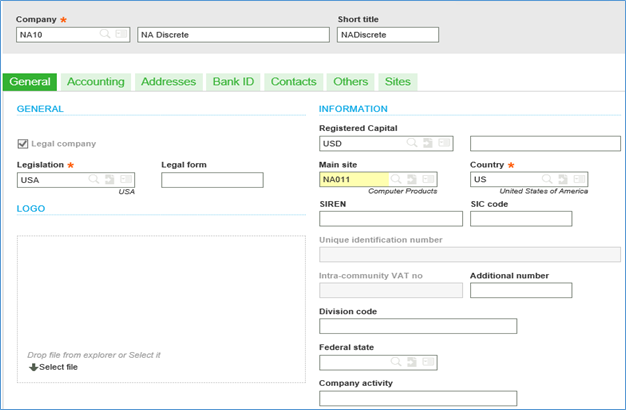General

Account core model – It is mandatory for a legal company and this is created before the legal company creation. It is linked with the chart of accounts. 

First fiscal year – This field identifies the fiscal year where the business starts initially. It is important that we enter the first day of the first period and year for which we will be importing or entering transactional history. 

Accounting currency – This currency is the currency code used for accounting transactions. 

Accounting Code – This is a default value used in the setting up of accounting journals. It refers to a table listing a certain number of elements (collectives, accounts or parts of accounts) that can be used to determine the accounting journals that will be posted. 

Dimension types/dimension – We can assign the dimensions/departments at company level. We can define a default dimension determine if a selection for the dimension is mandatory for tasks requiring dimension entry, and select whether upstream entry is allowed. 

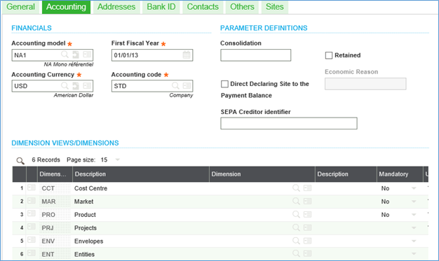Accounting

This code is used to identify the different addresses associated with the record. It is compulsory to enter an address for each record and one of these should be set as default address via the corresponding box. 

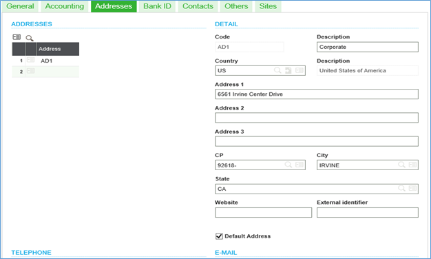Address

We can use the Bank ID number tab to associate a bank with the company. Bank information will already be defined in the Bank (counter) function. 

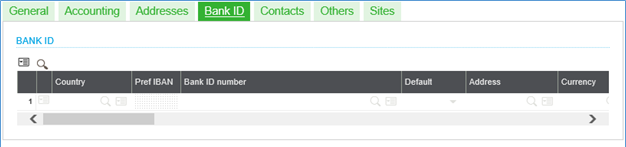Bank ID

The Contacts tab is to define contact information within the company. For each contact, we can identify such information as the function, department, language, birth data, and company address where they work. 

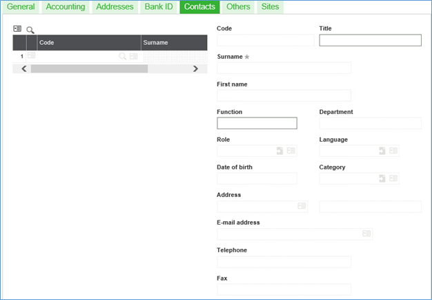Contacts

It is to define the company address for 1099s and a default price structure to use for generating prices. The address information entered includes the company registration or tax ID number. 

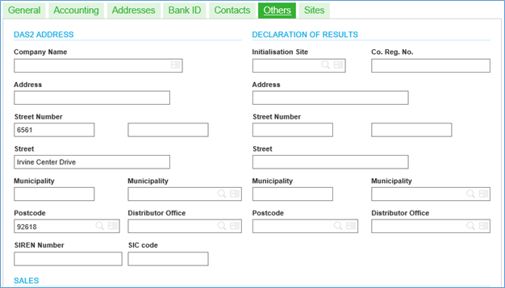Others

The Sites tab is to view the site pyramid which shows how sites are associated with the selected company. 

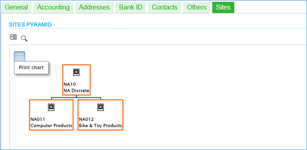Sites

## Creation of Site

Transaction Code: GESFCY Description: Sites creation 

The Site is the central unit for carrying all the management operations, there can be multiple sites linked to the company. The operational management actions are carried out from within a site and site is the central concept to the organization of data for sites and companies. 

**Fields explanation:** 

Site – We need to enter a short code and description to identify our site. It cannot be more than FIVE characters. 

Legal Company – It determines the company associated with site. 

Country – This code is used to identify the country associated with the site. 

**Path: Parameters \-\> Organisational Structure \-\> Sites** 

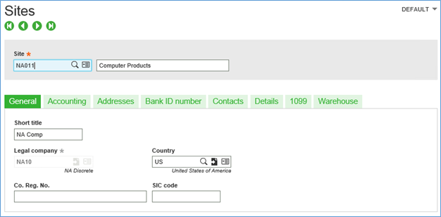General

Financial Site – This tick box is used to specify whether this site is an accounting site. We need to assign the site in the field to allow tracking financial reports. If the Financial site check box is cleared, the site is only used to track stock movements (e.g. warehouses) and not financial transactions. 

Accounting Code – The accounting code is a default value used in the setting up of accounting journals. It refers to a table listing a certain number of elements (collectives, accounts or parts of accounts) that can be used to determine the accounting journals that will be posted. 

Count – If we select 'Yes' this site is to be considered a stock site. If No is selected, we must select a stock count site to associate with the one we are creating and the selection is mandatory. 

Dimensions – The dimensions are used to define defaults at the site level for dimension types defined. The defaults defined here take precedence over the ones defined for the company. 

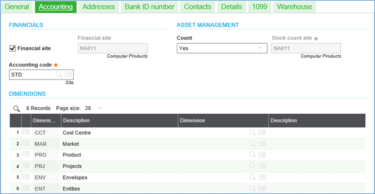Accounting

Address Bank ID number and Contacts information – This information will be as same as discussed while creating the company. 

Type of Site \- A Single site can be manufacturing, sales, purchasing, stock (Inventory) and also single site can be financial site or can be assigned only one department. In this case, we cannot create any transactions related to other sectors if the above sectors are not checked and it is only a financial site. 

Default work days \- As per the above screenshot, If one of the day is not checked and it means we cannot create journal entries/invoices on that calendar day. 

DAS2 site – If this is checked, 1099 invoices are entered for this site. If we won't enter the site, we cannot enter 1099 invoices and are not tracked at this site; however, we can enter a 1099 site at the DAS2 site field to extract any necessary line items to the other site as needed for 1099 information. 

Unavailable \- If we select an Unavailable schedule and that defines what days the site is closed for such events as holidays. \- This information is defined through the Unavailable Periods task on the Common data \> BP tables menu. 

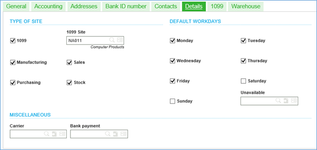Details
