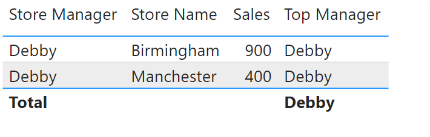

This is an explanation to the Top Sales Manager 2 [DAX Puzzle](DAX Puzzles.md).  


  


Lets take the row "Barbara, Luton" as an example and have a look at the previous DAX measure:


```
CALCULATE (
    SELECTEDVALUE ( Stores[Store Manager] ),
    TOPN ( 1, VALUES ( Stores[Store Manager] ), [Total Sales] )
)
```
   


The Stores table is currently filtered to one row, "Barabara, Luton". The TOPN function is returning a table to act as a filter, so within this function the filter context applies. So VALUES(...) is just one value: Barbara, and \[Total Sales] is all of Barbara's sales. To fix this, we want to remove the filters for TOPN, so we wrap TOPN in CALCULATETABLE:


```
CALCULATE (
    SELECTEDVALUE ( Stores[Store Manager] ),
    CALCULATETABLE (
        TOPN ( 1,   VALUES(Stores[Store Manager]) , [Total Sales] ),
        ALL ( Stores )
    )
)
```
Now TOPN returns the correct result: a table containing 1 row which is the top salesperson, Debby. This table acts as a filter to the Stores table. However there is already a filter on the Stores table provided by the table visual \- we are in the Barbara, Luton row. Applying both of these filers results in an empty Stores table, so SELECTEDVALUE returns nothing. So if we keep the measure like this then the table looks like this: 

  


Power bi is hiding the rows that returned BLANK for the top manager. Only the Debby rows work as for these rows the two filters together don't return the empty stores table (they both filter for Debby). To fix this, we first remove the filter provided by the table visual before applying the filter provided by our CALCULATETABLE function: 


```
CALCULATE (
    SELECTEDVALUE ( Stores[Store Manager] ),
    ALL(Stores),
    CALCULATETABLE (
        TOPN ( 1,   VALUES(Stores[Store Manager]) , [Total Sales] ),
        ALL ( Stores )
    )
)
```
