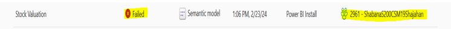
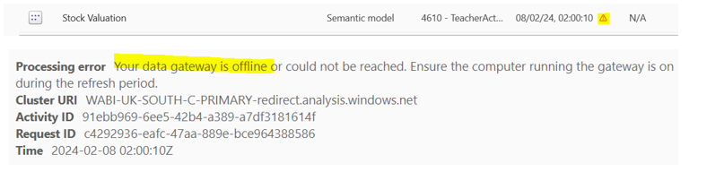
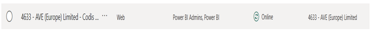
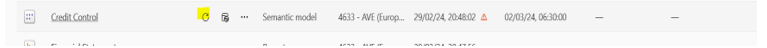

**Error:\- Refresh failed: Stock Valuation has failed to refresh**

One email will be triggered with above subject Line. 

Step 1: \- Login to Power BI Portal.   

Link:\-  [https://app.powerbi.com/monitoringhub?ctid\=b45363d0\-8aae\-43ca\-9e1f\-ddb6097861ce\&experience\=power\-bi](https://app.powerbi.com/monitoringhub?ctid=b45363d0-8aae-43ca-9e1f-ddb6097861ce&experience=power-bi)

Email to Login: \- [PowerBI.install@codis.co.uk](mailto:PowerBI.install@codis.co.uk)

Step 2: \- Click on Monitor Hub. 

Step 3: \- Check for failed Module with company Name 

*\[image: clip\_image002\.jpg not found]*Step 4: \- Click on Workspaces and search for company name which is failing and open Production.

Click on below symbol and See details.  

  

*\[image: clip\_image004\.jpg not found]*Step 5: \- Need to check if On\-Premises Data Gateway and connections are online for this company or not.1. Settings\>Manage Connections \& Gateway\>Connections/ On\-Premises Data Gateways  
 Select company and click on refresh to check if it is online or not.

  
  
If it is online, we are good to refresh the dashboards manually. 

Step 6: \- Open same company workspace again ( Click on Workspaces, Search for company name and select Production)

On Semantic model of Modules, click refresh and wait to complete.  

  

*\[image: clip\_image010\.jpg not found]*It will refresh the dashboard.
