# Power BI Installation Troubleshooting Steps/Checks

*(W**hen a customer is having an error with the dashboard install/refresh.*

## Go through each prerequisite.

> Form need to be filled by Support: [Codis BI Form](/:x:/r/sites/Wiki/_layouts/15/Doc.aspx?sourcedoc=%7bF144F723-6C63-4DF8-8849-186B2CECBD24%7d&file=Codis%20BI%20Form.xlsx&wdLOR=cBFD75299-510C-442E-8F70-C4D8224560BC&action=default&mobileredirect=true)

## On the Cutomer's Server

1. #### Gateway is running.

> 1\) Perform a search on start menu for "Data Gateway", open the app On\-premise data gateway.  
> 2\) Check if this app is present and says running.
> > 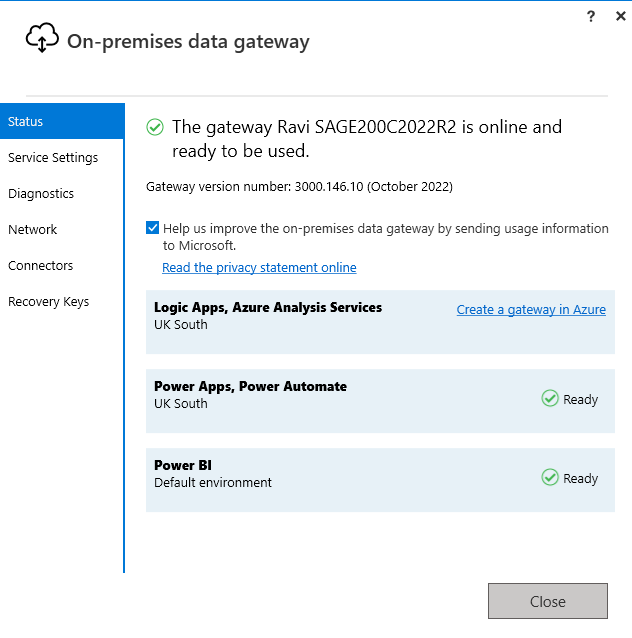
2. #### Licence is valid.

> 1\) Go to this path on the PC.  
>     "C:\\Program Files\\Codis BI\\Licences"  
> 2\) Open "Licenses.exe"  
> 3\) And look for PBI License with valid expiry. If the licence has expired, email accounts to let them know. Do not amend the licence.
> > 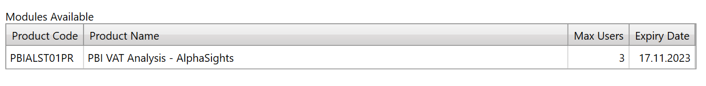
> 
>  4\) You may also get error like this (below) on licence window. This comes if there is any changes on server(The licensing software looks  
>  at properties of the server to identify it, eg hard disk serial number, motherboard, etc ) due to which licensing software takes same server as different server.  Solution is to re\-licence the server afte confirming with customer.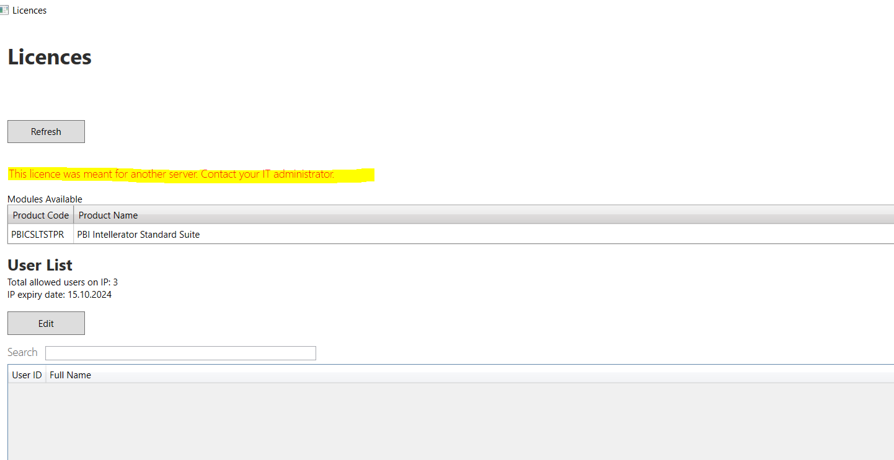
3. #### Loopback service is running.

> 1\) Run this URL: [localhost:26061](http://localhost:26061/)  
> 
> 
> 
> > 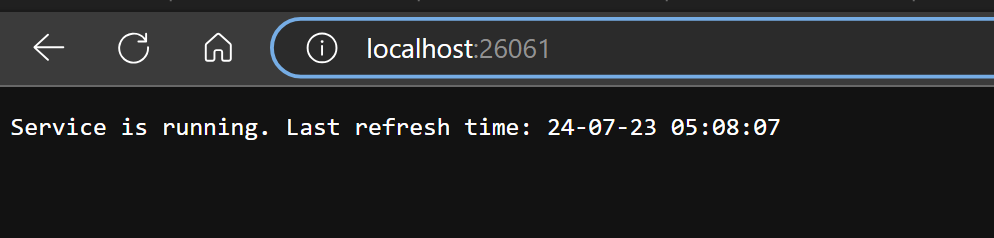
4. #### Codis BI user have SQL server permissions.

> 1\) Look for user NT SERVICE\\CODIS BI in Database user list.
> 
> 
> > 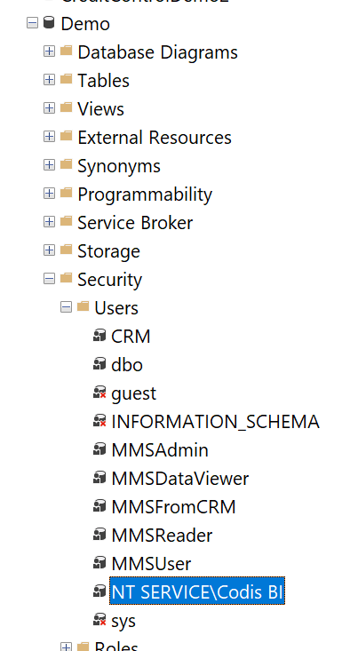
> 
> 2\) Look for user NT SERVICE\\CODIS BI in SQL Sever Security
> 
> 
> > 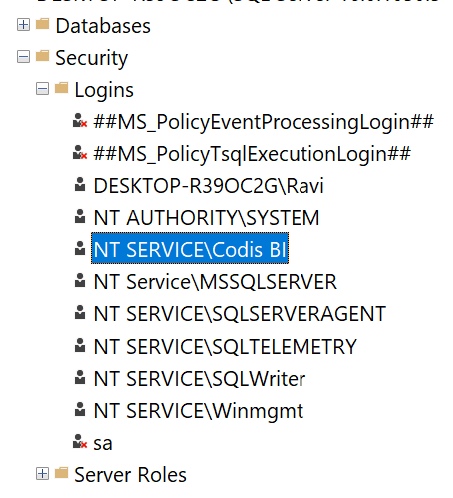

                   3\) Look for user NT SERVICE\\CODIS BI in Sage200Configuration database.  
                                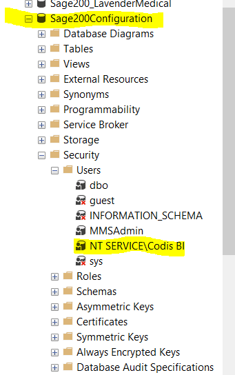  
1. #### Running localhost URL for accessing SQL tables and databases.

> 1\) Run the URL with correct database name in place of "Demo":   
> 
> 
> 
> > [localhost:26061/table?tableName\=NLDepartment\&Databases\=Demo](http://localhost:26061/table?tableName=NLDepartment&Databases=Demo)
> 
>   
> 2\) It should provide the JSON Result with closed brackets:  
> 
> 
> 
> > 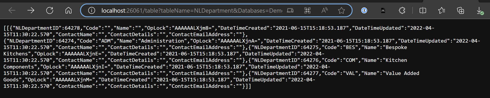
2. #### .net framework version is atleast 4\.8\.

> 1\) Go to this path on the PC:  
> 
> 
> 
> > C:\\Windows\\Microsoft.NET\\Framework\\v4\.0\.30319
> 
> 2\) Open the latest version folder.  
> 
> 
> 
> > 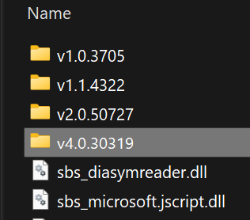
> 
> 3\) Right click on any .dll file and go to properties.  
> 
> 
> 
> > 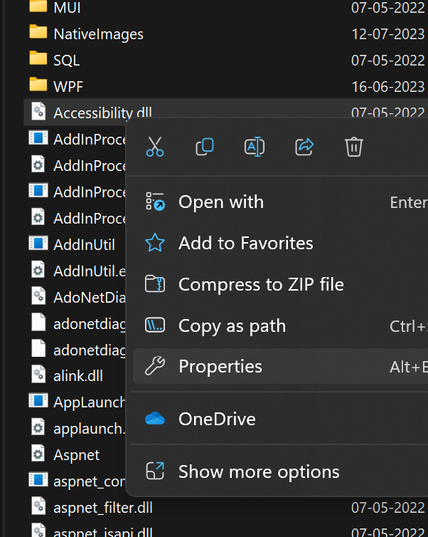
> 
> 4\) Go to details and check the version. It should be atleast 4\.8  
> 
> 
> 
> > 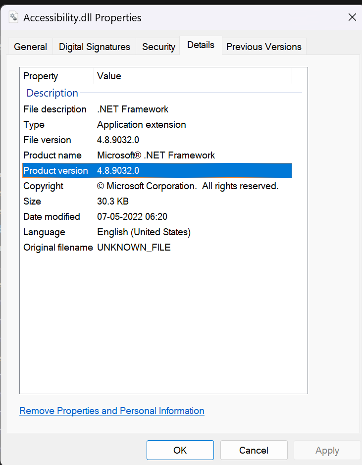
3. #### SQL Sever 2017 or above.

> 1\) Open SQL Server Management Studio.  
> 2\) Connect to the instance of SQL Server, and then run the following query:  
> 
> 
> 
> > Select @@version  
> > 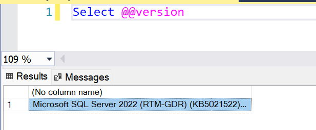
> 
> 3\) It should be Microsoft SQL Sever 2017 or more.
4. #### Database compatibility level is at least 130\.

> 1\) Right click on database and select properties.  
> 
> 
> 
> > 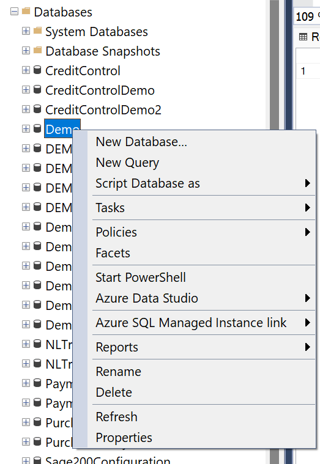
> 
> 2\) Select Options and look for compatibility level 130 or more.

> > 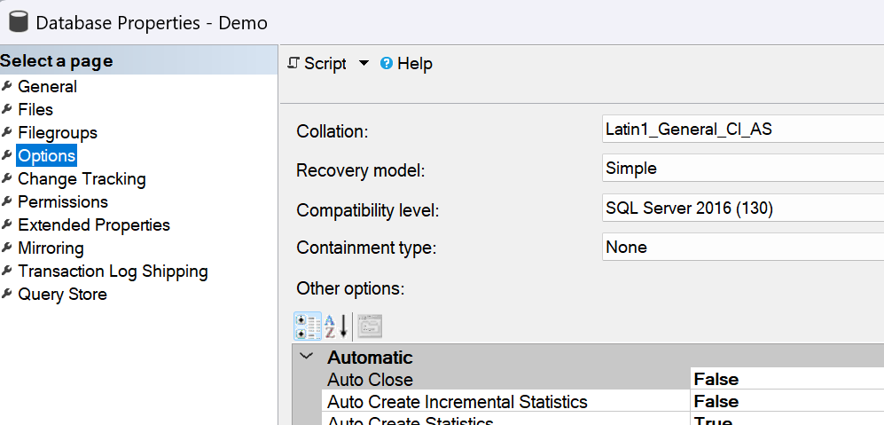

## On powerbi.com

1. #### Report parameters are correct.

> 1\) Go to the company's production workspace on powerbi.com.  
> 2\) Click on 3 dots next to dataset related to the dashboard which is having the problem. and then open settings.  
> 
> 
> 
> > 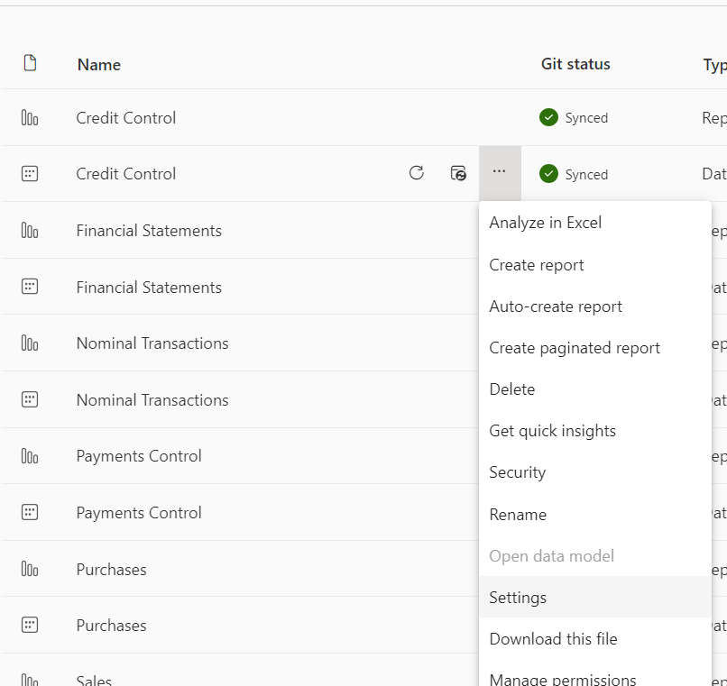
> 
> 3\) Open Parameters and check if they are correct. But if you want to amend these parameters then follow further steps.  
> 
> 
> 
> > 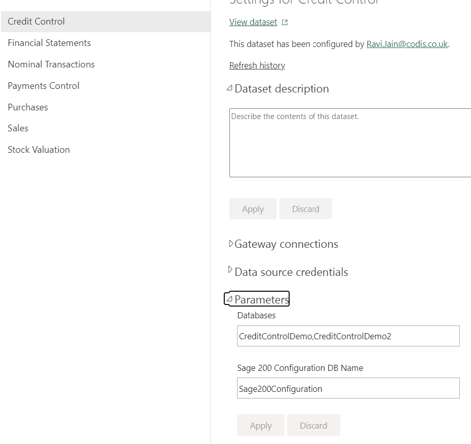
> 
> 4\) Go to workspace and click on View Deployment pipelines  
> 
> > 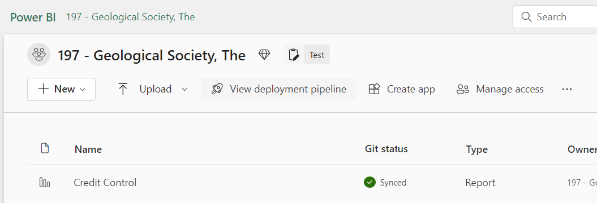
> 
> 5\) Click on Parameter rules icon on production workspace side.  
> 
> > 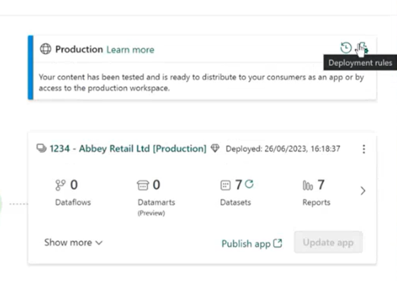
> 
> 6\) Click on the desired dashboard and open parameter. There you can edit the parameters and save it.  
> 
> > 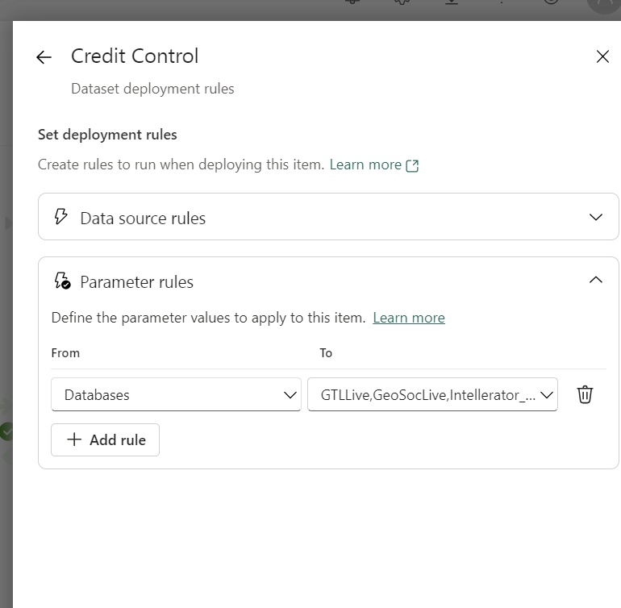
2. #### Dataset is configured to use the correct gateway connection.

> 1\) Open the production workspace of the company.  
> 2\) Click on 3 dots next to the desired dataset.  
> 3\) Click on settings.  
> 4\) Open Gateway Connections. And check if gateway is mapped correctly with the respective company connection.  
> 
> 
> 
> > 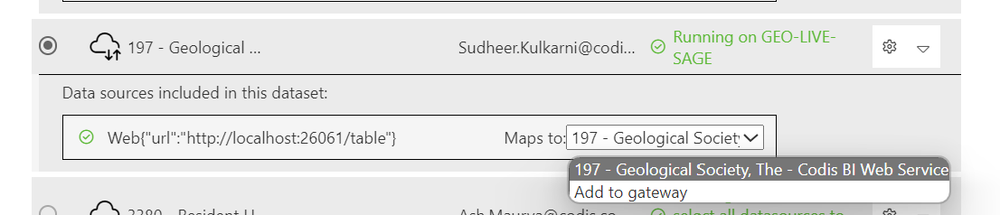
3. #### "test connection" on the gateway connection works.

> 1\) Open "Manage gateways and connections" by clicking on setings gear icon on top right corner on powerbi.com  
> 
> 
> 
> > 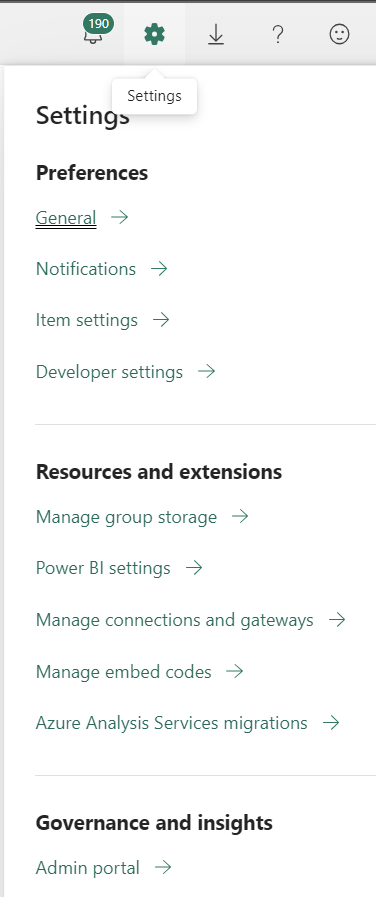
> 
> 2\) Go to "On\-premise data gateway" and click on the refresh icon in status column. and repeat this for "connections" as well.  
> 
> 
> 
> > 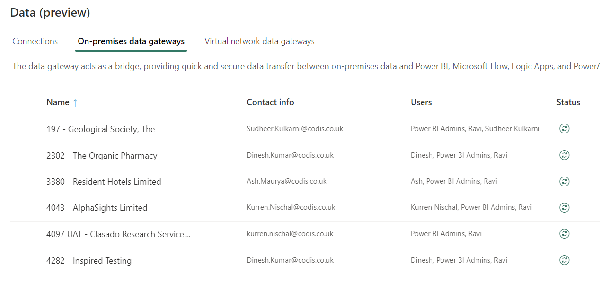

#### 

####
