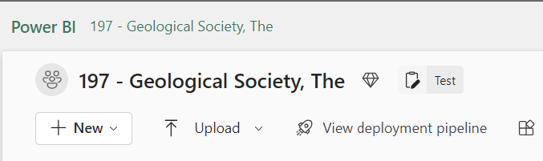
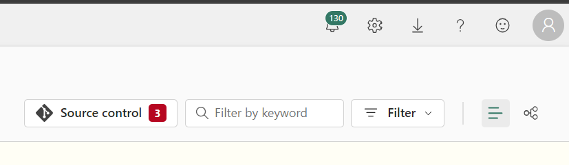
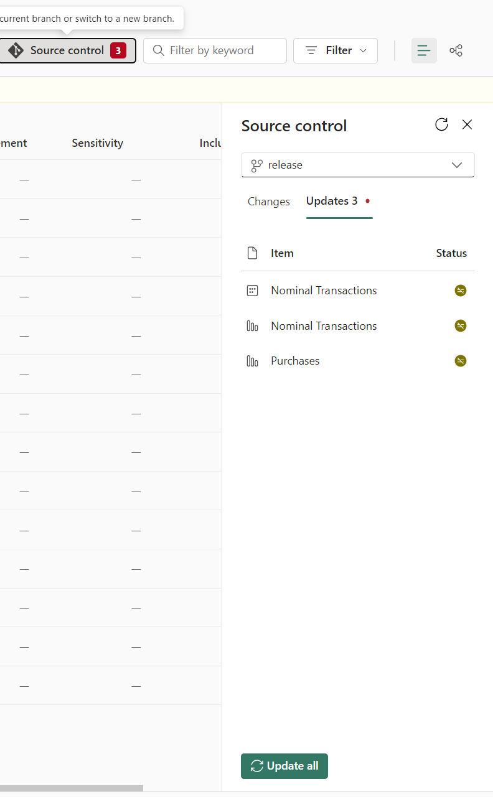
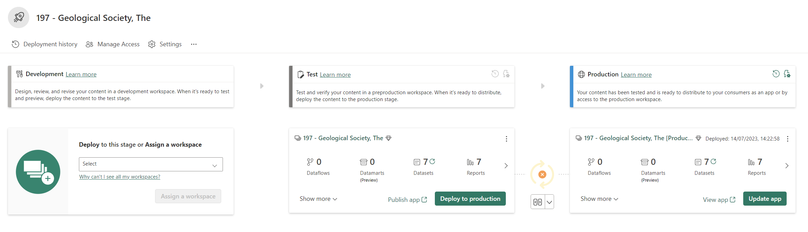
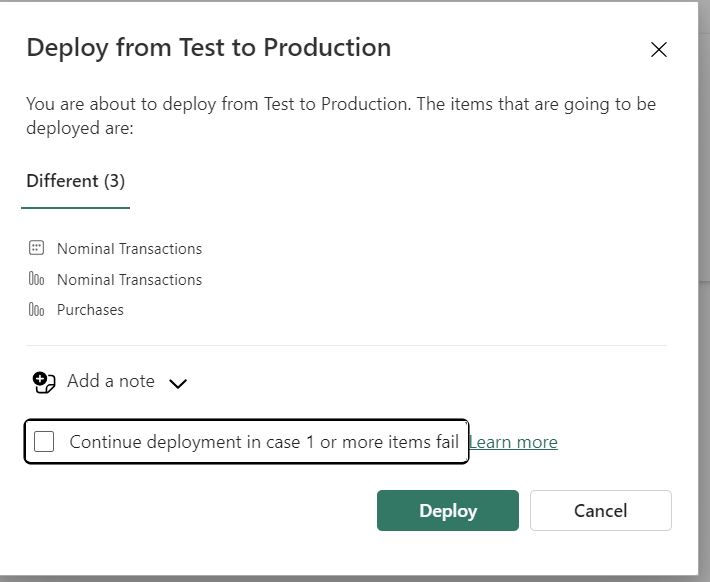
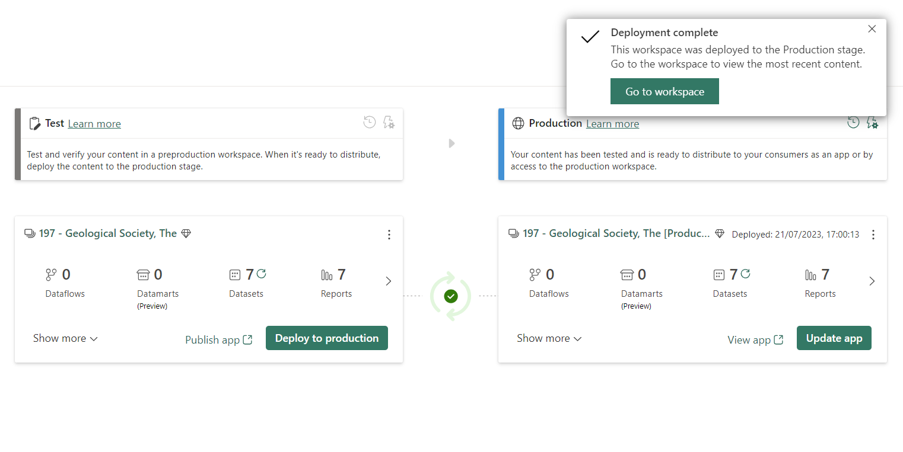
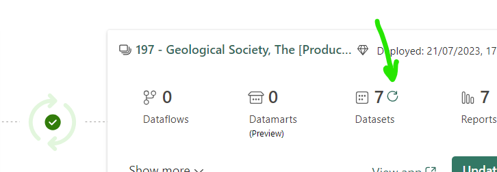

# How to update the dashboards on Power BI workspace

1. There are two workspaces for every Live Customer/Tester. One of them is "Test" another is "Production".   
Go to the Test workspace.  

2. Click on Source Control.  
  
Wait until it loads.
3. You will see two sections:  
1\)Changes: If you found anything in it. press "Undo All"  
2\)Updates: If you see there some things. press "Update All"  
  
Let it complete, it may take couple of minutes.
4. Go to "View Deployment Pipeline"  

5. Press "Deploy to Production" on Test Workspace Section.  

6. Untick the box and press "Deploy"  
  
Wait it to complete.
7. Press the reload button on production side near data set and Let it finish.  
  
  
The process to update the Dashboard is completed now.
