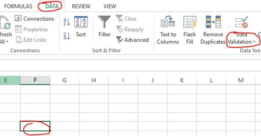
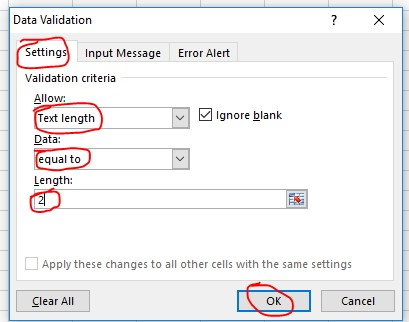
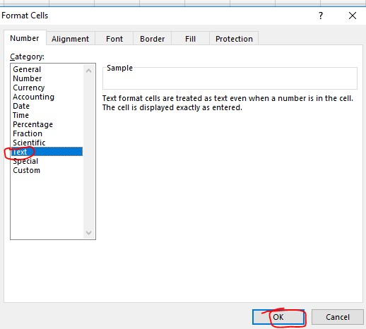

Data Validation solution,

1\.       Click on cell  and on Excel tab go to DATA and select Data Validation from the option (see below)

 

2\.       Select following options as circled below from drop down list in Data Validation window 

 

3\.       Once you have click OK on window above, right click on that cell and and select Format Cell then select Text from the list and click OK.

