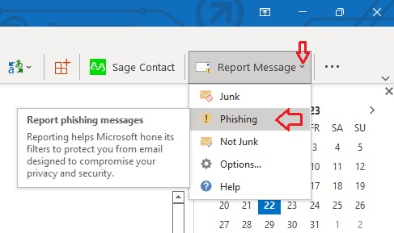

# **Phishing Emails**

## **What's a phishing email?**

A phishing email is usually defined as being "an attempt to acquire sensitive information such as usernames, passwords and credit card details by masquerading as a trustworthy entity, in an electronic communication". 

In other\-words, phishing is the modern version of the age old problem of fraudsters trying to scam unsuspecting people. Those carrying out the attempted scam will send malicious fake emails in an attempt to get you to reveal your sensitive information, usually with the end purpose of stealing money. 

## **How to spot a phishing email?**

Fraudsters will often use our emotions in an attempt to get us to respond to the message, and reveal the information they want to gain. Common themes that are used in scams can include: 

- You've won a lottery, prize or some other unexpected financial gain.
- Scare tactics such as an overdue invoice and the threat of turning off a service.
- Requests to donate to a charitable organisation, often following a humanitarian crisis such as an earthquake.
- Unusual email attachments and asking for personal information.

We'd recommend that you always take a moment to think **"Am I expecting this type of request?"** 

## **Dealing with phishing emails**

It's important for you to become familiar with identifying possible phishing emails, how to report them, and what to do if you think you've been a victim. 

### **Additional checks to carry out**

If you're unsure whether you've received a phishing email, there are some additional checks that you can carry out. 

- Check the website associated with the link matches the text in the email.
- **Note:** **To check the link in the email, roll your mouse pointer over it and see if what pops up matches the text in the email. If they don't match, don't click the link.**

- Check the sender's name matches the email address. If it doesn't, be suspicious of the email.
- **STOP** immediately if you get below Security Warning. Do not override the security warning to run the macro.

           

- Report any such e\-mails through MS\-Outlook by selecting that email in your Inbox and then click on the **Report Message** tab on the right hand side upper corner and then click on **Phishing** (as shown below).  

  
### **What to do if you think you have been a victim of a fraudster?**

If you suspect that you've responded to a phishing scam with personal or financial information, take these steps to minimise any damage: 

- Change the information you've revealed. For example, change any passwords or PINs on the account or service that you think might have been compromised.
- Contact your bank or the service provider directly.
- **Note:** **Don't follow the link in the fraudulent email message.**

- Routinely review your bank and credit card statements for unexplained charges or enquiries that you didn't initiate.
- Contact the authorities. [**Action Fraud**](http://www.actionfraud.police.uk/report_fraud) is the UK's national fraud and internet crime reporting centre.

# **Spam Emails**

## **What are spam emails?**

Spam emails are generally, but not always, marketing emails sent to you without consent. It is email that you don't want and didn't ask for, and its content can cause embarrassment and distress. However, it's worth remembering that the sender generally doesn't target recipients personally. The same spam email can be sent to millions of people at the same time and the addresses can often be guessed. 

Not all marketing emails sent without consent are spam emails. Marketing emails can be sent without prior consent by organisations who obtained your email address when you bought something from them and are advertising similar products or services. However, these marketing emails must abide by strict rules regarding their content and provide you with the opportunity to opt out. 

## **What does the law say?**

The Privacy and Electronic Communications Regulations 2003 cover the sending of email marketing. This legislation says that organisations must only send marketing emails to individuals if you have agreed to receive them, except where there is a clearly defined customer relationship. 

The ICO can only investigate concerns about marketing emails from identifiable UK senders. As a lot of spam emails come from outside the UK, the Information Commissioner has an agreement with a number of overseas bodies to cooperate and exchange information to try and stop spam emails that are sent from those places. 

## **What can I do if I'm getting unwanted marketing emails?**

If you receive marketing by email that you don't want from an identifiable and legitimate UK based organisation that you know and trust, you should first use the 'unsubscribe' link provided on the email. The organisation should then stop sending you marketing emails. Legitimate, well\-known companies will offer opt\-outs, and in many cases things can be resolved quickly without us getting involved. 

However, if you continue to receive marketing emails from the organisation despite using the 'unsubscribe' link you may wish to report this to the ICO: 

[**Report a concern**](https://ico.org.uk/concerns/marketing/spam-emails/) 

Alternatively you could email the organisation to tell the sender about the problem and ask them to stop sending you marketing emails (remembering to keep a copy of any correspondence). You should allow them time to put things right. However if you continue to receive marketing emails from the organisation despite asking them to stop you may wish to report your concerns to the ICO. 

If you are not sure whether the email is genuine, or if it comes from an organisation you don't recognize, you should avoid replying or clicking on any link as this might confirm your email is live. You can report receipt of these emails to the ICO:

[**Report a concern**](https://ico.org.uk/concerns/marketing/spam-emails/) 

## **What can I do to reduce the amount of spam emails I receive?**

- Be careful who you give your email address to.
- Consider having separate personal and business email addresses.
- Choose an email address which is difficult to guess. Don't advertise your email address, for example by making it available on the internet.
- Check privacy policies and marketing opt\-outs carefully. If you buy something online or subscribe to a service, check the company's privacy policy before giving your email address or any other personal information. Consider how the company uses your information and whether they might send it to other people within their organisation or to other organisations.
- Avoid responding to spam emails if you have any doubts about who has sent them. Replying indicates that your email address is live. You should not reply to emails unless you know and trust the sender, and are confident the email is genuine. However, many complaints received by the ICO are about well known, legitimate companies who offer opt\-outs. In most cases responding to the opt\-outs in these emails should stop the problem.
- Don't click on the adverts in spam emails. By clicking on spammers' web pages, it shows your email address is live and may make yourself a target for more emails. It can also reveal your computer's IP address.
- Use a spam email filter on your computer. These are programs which work with your email package to sift through new emails, separating spam emails from wanted emails and blocking them. Most packages are successful although sometimes block good email too. Also, they can't stop the spam emails being downloaded before being blocked. New spam email filters are being developed all the time; you can search the internet for one that is suitable for you. Many Internet Service Providers (ISPs) also offer filters which work by examining content and using blacklists to restrict spam emails. Again, these sometimes block good emails as well as spam emails and you might have to pay for them. For more information on the services that are available to you, please check with your ISP.
- Keep your systems well maintained. Hackers and spammers can exploit software problems, so most software companies issue product updates and patches that fix known problems. Updates are generally available through manufacturers' websites and are usually free to download and install. You should also consider using anti\-virus software to protect against virus programs that can destroy computer files and are increasingly being exploited by spammers.
