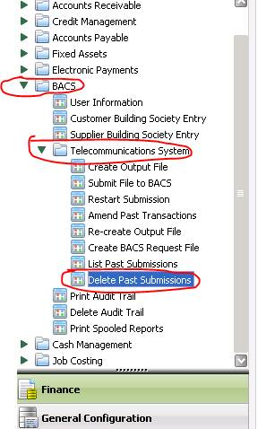

The BACS system can only store a maximum of 99 submissions. Submissions should be deleted as soon as they have been accepted by BACS and the reports returned.  Note that a submission can only be deleted from the Past Submission file when both of the following conditions apply:

- Each transaction within the submission has been either accepted by BACS or suspended by the user.
- An input report relating to the submission has been received from BACS.   
  
Please see screenshot below on how to delete past bacs submissions.  

