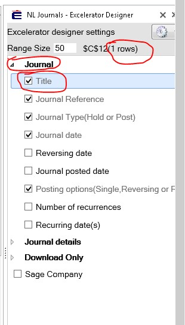
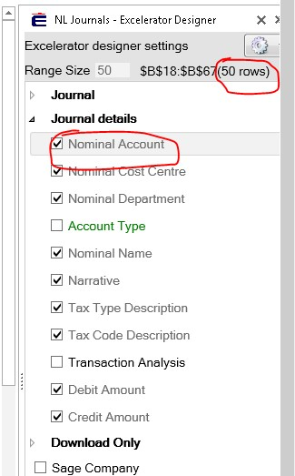
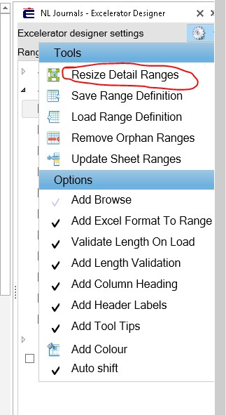

All the Header range size should be 1 and detail size more than 1 (i.e. if you have multiple headers set them to 1 size as show in screenshot 1, and all the detailed field to 50 (example) rows as shown in pic 2\). Please see screenshots to get rid of this error.

On Excelerator toolbar, if you select designer tab you will see options mentioned below.

1st screenshot is for header which should be set to 1 row as shown, in 2nd screenshot as shown detail ranges are set to multiple rows. 3rd screenshot shows how to resize the ranges.

**Header**

**** 

**Detail**

 

**Resizing ranges**

 

For more understanding click the link provided below:

Using the template for the first time on this installation of Excelerator.

[http://www.codis.co.uk/excelerator\-help/quick\-installation\-instructions/common\-installation\-issues/issue\-2\-\-\-templates\-not\-working](http://www.codis.co.uk/excelerator-help/quick-installation-instructions/common-installation-issues/issue-2---templates-not-working)

Using a Template after copying or renaming a worksheet in the template. 

[http://www.codis.co.uk/excelerator\-help/customise\-excelerator/copy\-sheet](http://www.codis.co.uk/excelerator-help/customise-excelerator/copy-sheet) or [http://www.codis.co.uk/excelerator\-help/customise\-excelerator/rename\-sheet](http://www.codis.co.uk/excelerator-help/customise-excelerator/rename-sheet)

When some ranges have been deleted within an existing Template. 

[http://www.codis.co.uk/excelerator\-help/customise\-excelerator/designer\-advanced\-\-\-tools\-options/resize\-detail\-ranges](http://www.codis.co.uk/excelerator-help/customise-excelerator/designer-advanced---tools-options/resize-detail-ranges) see also [http://www.codis.co.uk/excelerator\-help/UsingExcelerator/clear\-all](http://www.codis.co.uk/excelerator-help/UsingExcelerator/clear-all)
