## Adding a license/user

In Enterprise Licensing we do not add Licenses we add the option to add new Licenses. (For Example): 

**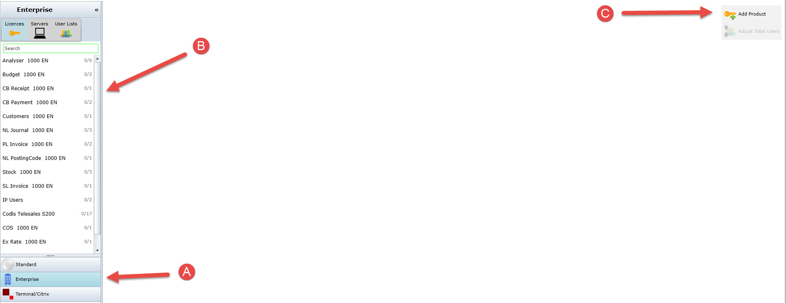** 

**A**: Click on the **Enterprise** tab which will open this screen for you. 

**B**: This is a list of the available modules that licenses can be added to. You can type in the search box at the top to find the relevant license you are looking for. 

**C**: Click on the **Add Product** button to add on a new module that a license can be assigned to. The following screen will appear. 

**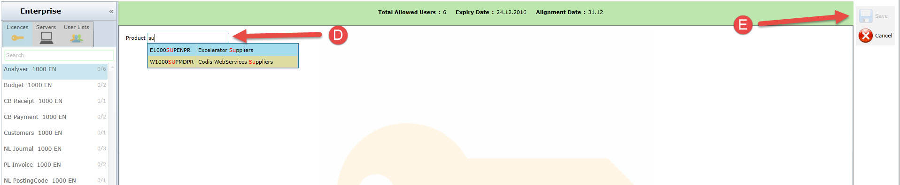** 

**D**: Enter the module you would like to add and a **drop down** menu will appear to help you find which one you need. 

**E**: Click on the **Save** button and now the module will be added into the search box on the left hand side of the screen. 

**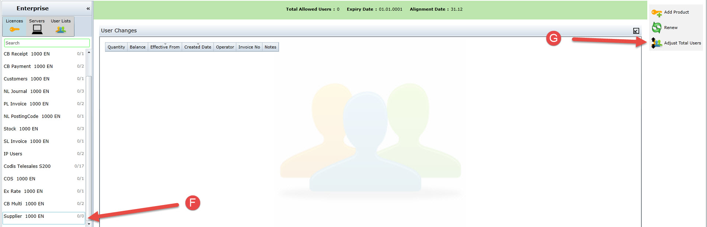** 

**F**: You can now see that the module we selected is available in the **search box menu.** 

**G**: On the right hand side if you select **Adjust total users** you can now add to the modules and give them licenses. 

**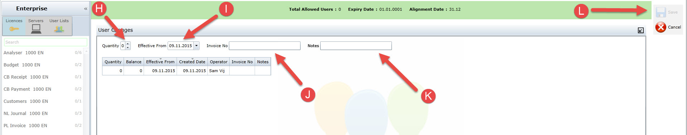** 

**H**: Here you get the option to choose how many **Licenses** you want to issue from a drop down menu. 

**I**: This is the date the Licenses will be **Active** from. Normally when they will start to use the Licenses. 

**J**: Here if where you would enter the **Invoice number**. 

**K**: If an Invoice number has not been entered you can enter a **Note** instead which will also give you the option to activate once entered. 

**L**: Now you can click on **Save** to add the users to a license. 

## Editing users

Along side adding users you can also **remove users**. 

**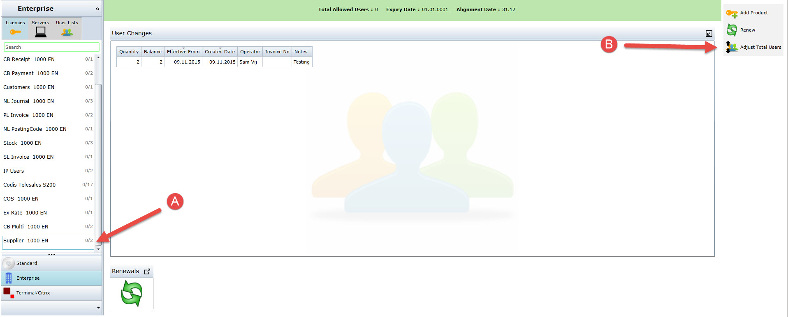** 

**A**: Select the module that you wish to **Edit**. 

**B**: Click onto **Adjust Total Users** and you may now edit users on the following screen. 

**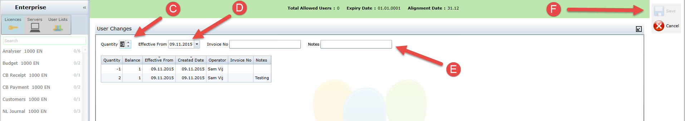** 

**C**: You can see here that a \-1 has been selected which allows you to choose to **add or remove** the amount of users. 

**D**: This is a very **important function**. Not only can remove a user and select the day you have edited this info you can also set a date a week, a month and ever a year from now to cancel a user. 

**E**: For this section you will only need to enter a **note** to enable the save option. 

**F**: Click the **save** button to complete the task. Even if you have set a date for the user to expire of a licence that user will be able to still use it up until that date comes. 

## Adding a new server

This is when the end user will call up to activate their **Enterprise Excelerator.** 

**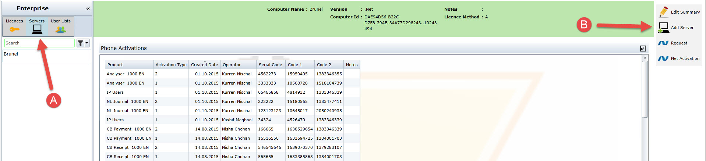** 

**A**: Click on the **server** tab. 

**B**: Click on to the **add server** option and the following screen will appear. 

**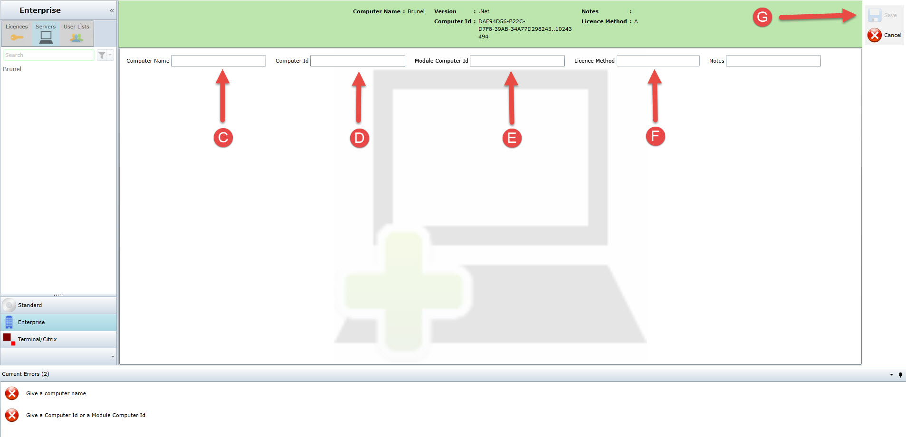** 

**C**: The end user will provide you with the PC name over the phone which you will enter into the **Computer name** box. 

**D**: Here you will enter the **Computer ID** provided by the end user. 

**E**: Here you enter the **Module computer ID** provided by the end user. 

( You can either enter the **Computer ID** or the **Module computer ID** in one of the boxes to activate the save option ) 

**F**: Select the relevant **Licence Method** from the dropdown, and ensure the Customer has the same Method selected. 

**G**: When all the required information from the customer has been entered Click **save**. 

## Activating IP users

This is one of the first things a customer will want to get updated. 

**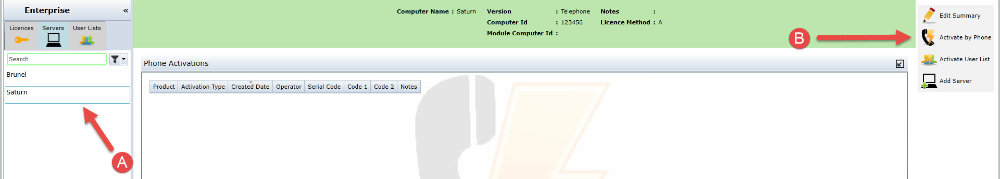** 

**A**: Click onto the **server** this is the first step you need to follow. 

**B**: Once you have selected the right server go to the right hand side of the screen and click on **Activate by phone** which will show the following screen. 

**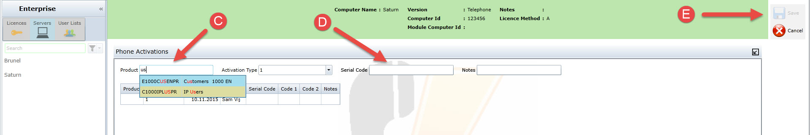** 

**C**: Type in **IP users** and select it from the drop down list. 

**D**: Ask the customer on the phone for their **Serial code** and enter it into the box. (If the code is too long a message at the bottom of screen will say so) 

**E**: Once all the information provided by the user has been entered you can now click **Save**.(The following screen will appear) 

**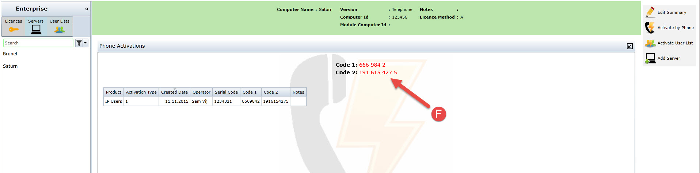** 

**F**: Read back these **Activation codes** to the customer and ask them to press ok when they have done so. 

## Licensing modules on Enterprise

For **Enterprise** each module would need to get licensed separately. Firstly we would need to enter a **Module computer ID** before we license any modules. Before we only activated the total allowed user which is usually what happens when a customer calls in the first time. 

**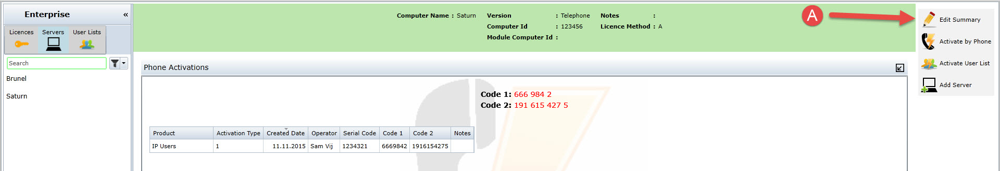** 

**A**: First we start by editing the information by clicking on **Edit summary** from here the following screen will appear. 

**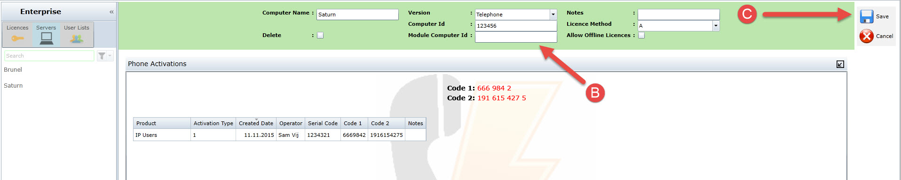** 

**B**: Enter the **Module computer ID** here. This is normally a longer number than the normal computer ID. 

**C**: Once you have entered the relevant information click on the **save** button to continue. 

**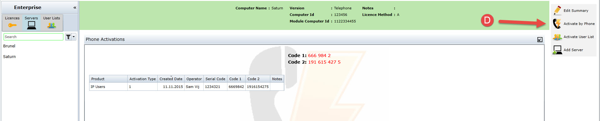** 

**D**: You will again have to click **Activate by phone** which will bring you to the following screen again. 

**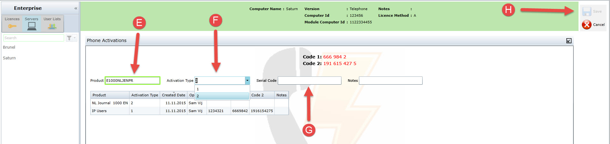** 

**E**: Select the required **module** the customer wishes to licence first from the drop down menu. 

**F**: When licencing modules for **Enterprise** there are 2 activation types start by selecting option 1\. Explain to the customer on the phone that you will need to activate this module 2 times. 

**G**: Enter the **Serial code** which the customer will provide. 

**H**: Check the correct module has been selected and activation 1 has been chosen then click **Save**. 

**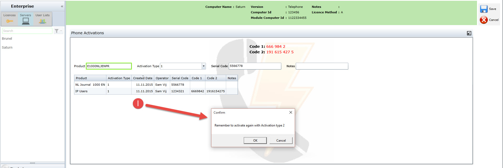** 

**I**: Automatically once you click save the following box will pop up on screen reminding you that you must now proceed with the **second activation.** 

**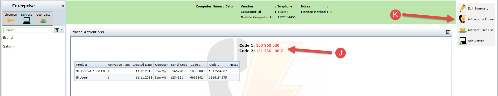** 

**J**: Give the following **first set** of activation codes to the customer. 

**K**: Click onto **Activate by phone** once again to begin the next steps of activation. 

**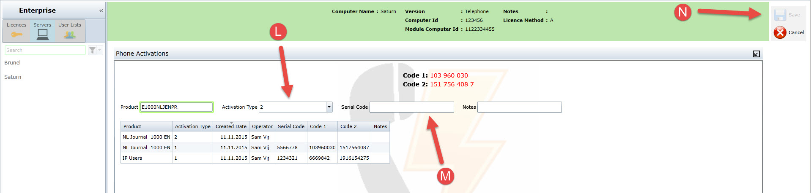** 

**L**: You can see that **activation type 2** has been selected automatically for you. (Double check before you move on that option 2 has been selected) 

**M**: Ask the customer for the second **serial code**. ( They will need to open the licence screen again as they did before ). 

**N**: Click **Save** once all the information has been entered and the next activation code will be generated. 

**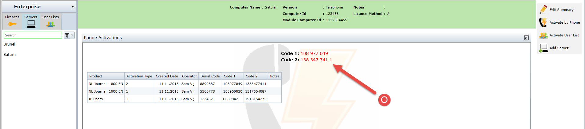** 

**O**: Read back the second set of **activation codes** to the customer. 

## Activating user list

Once the modules have been licensed the company will go and allocate certain users to each of the modules available making a user list. They will now need to get this user list authorised. 

**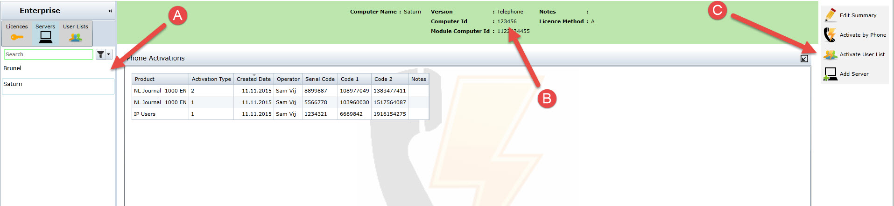** 

**A**: Begin by asking the customer the server which server they wish to use to activate their **user list** on. 

**B**: If the customer can not remember or does not know the name of the server they want the user list to be updated on you can ask them for their **computer ID**. 

**C**: Check that the correct server has been selected (Using computer ID) and click onto **Activate user list** which will show the following screen. 

**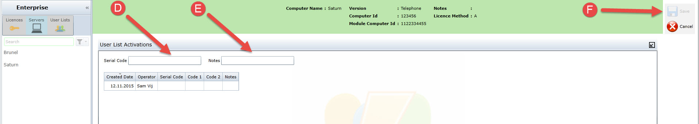** 

**D**: Ask the customer for the **serial code** and type it out into the relevant box. 

**E**: Enter any relevant notes in this box. 

**F**: Once all the information has been entered click on the **Save** button to confirm your entry. 

**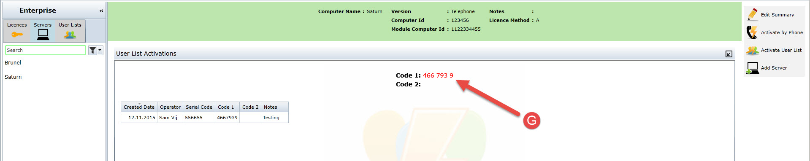** 

**G**: There will only be one **activation code** you will need to give to the customer. 

## Viewing check\-ins

A *check\-in* occurs when the licence is refreshed. To view a log of check\-ins for a particular server, click on: 

1. Enterprise
2. Servers
3. Click on the server you wish to view
4. Click on check\-ins

**Note:** that loading the check ins may take a few seconds.
