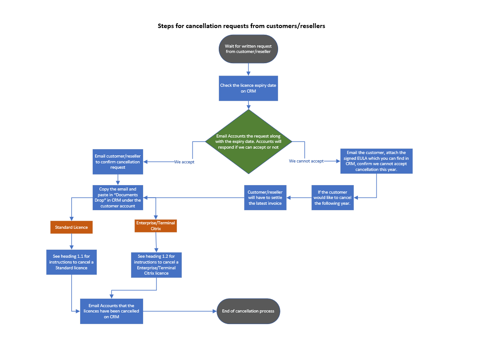

\
 

## Cancelling a Standard Licence in CRM

a) Select a licence

b) Edit summary

c) uncheck billable

d) check cancel and type a note (e.g. cancellation requested by customer/reseller, or see Documents in CRM)

e) Save

## Cancelling a Terminal Citrix licence in CRM

a) Select a licence.

b) Change active clients

c) Uncheck clients PC

d) Save

e) Adjust Total Allowed Clients

f) Reduce quantity of licences

g) Save