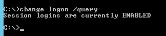
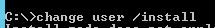
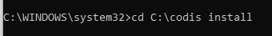
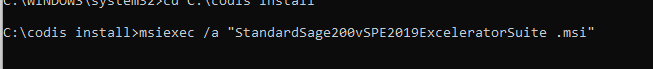
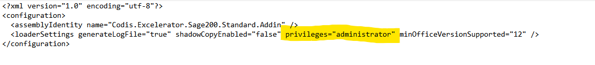
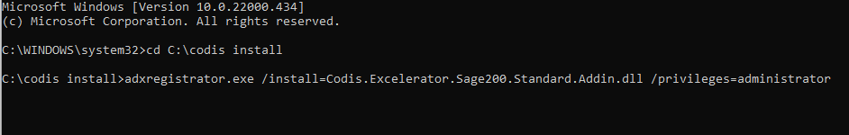
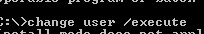

Download correct version of Excelerator from our website: <http://www.codis.co.uk/excelerator/download>

Save the setup to the folder C:\\Codis Install and follow step by step instructions (with screenshots) on how to install Excelerator on Citrix below.

- Need to have local admin privileges
- Run "CMD" as administrator
- Change Logon /Query (command can be used to find the current mode)

              

- Need to disable all users: (It is extremely important to check before running this command as this will log everyone out).
- Change Logon /Disable (turn off the logged client sessions)

            

- Put SERVER in Install Mode
- Change User/Install

          

- Install (while at Install Mode)  
Change directory in control panel to the location where setup (MSI) is copied \- cd \<location\>

          

       Type msiexec /a \<setup name\> and press enter to run the MSI  

  

           

       Install the MSI in a centralised location for eg \- C:\\Program Files (x86\)  

       Go to the install location from windows explorer, edit adxloader.dll.manifest and change the privileges to administrator and save the file  

           

           

  

       Open CMD as admin and navigate to the install location \- cd \<location\>  

          Run command in CMD \- adxregistrator.exe /install\=Codis.Excelerator.Sage200\.Standard.Addin.dll /privileges\=administrator     

          

- Then change back to Execution mode
- Change User/Execute

        

- Enable client logons
- Change Logon/Enable

           

- Check if each users have been licensed.
