# 1\. CashBook Payments

## Panel

 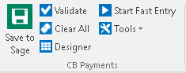

- Validate
- Clear All
- Designer
- Start Fast Entry
- Tools

# 2\. Cashbook Receipts

## Panel

 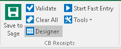

- Validate
- Clear All
- Designer
- Start Fast Entry
- Tools

# 3\. Customers

## Panel

 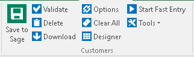

- Validate
- Delete
- Download
- Options
- Clear All
- Designer
- Start Fast Entry
- Tools

## Options

 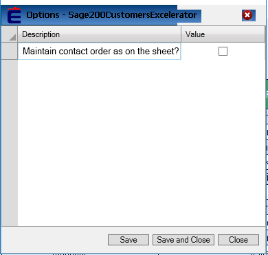

Maintain contact order as on the sheet? 

# 4\. Nominal Ledger Journals

## Panel

 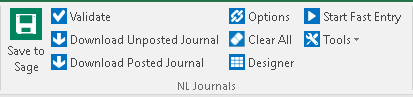

- Validate
- Download Unposted Journal
- Download Poster Journal
- Options
- Clear All
- Designer
- Start Fast Entry
- Tools

## Options

 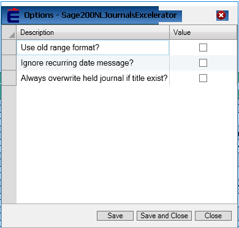

Use old range format?

Ignore recurring date message?

Always overwrite held journal if title exist 

# 5\. Puchase Ledger Invoice

## Panel

 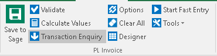

- Validate
- Calculate Values
- Transaction Enquiry
- Options
- Clear All
- Designer
- Start Fast Entry

## Options

 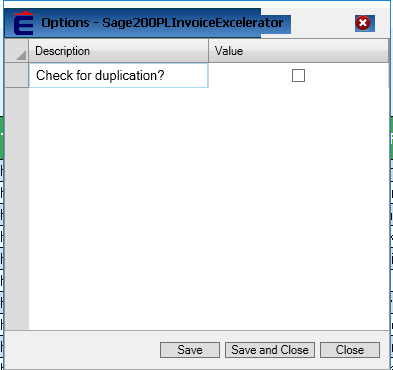

Check for duplication? 

# 6\. Purchase Ledger Pay Allocation

## Panel

 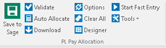

- Validate
- Auto Allocate
- Download
- Options
- Clear All
- Designer
- Start Fast Entry

## Options

 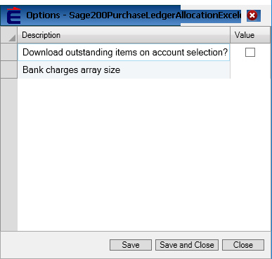

Download outstanding items on account selection?

Bank charges array size. 

# 7\. Purchase Order

## Panel

 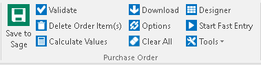

- Validate
- Delete Order Item (s)
- Calculate Values
- Download
- Options
- Clear All
- Designer
- Start Fast Entry

## Options

 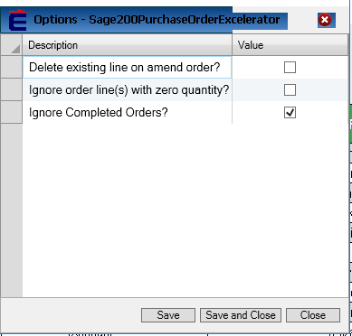

Delete existing line on amend order?

Ignore order line(s) with zero quantity?

Ignore completed orders? 

# 8\. Sales Invoice

## Panel

 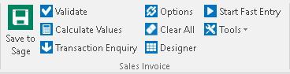

- Validate
- Calculate Values
- Transaction Enquiry
- Options
- Clear All
- Designer
- Start Fast Entry Tools

## Options

 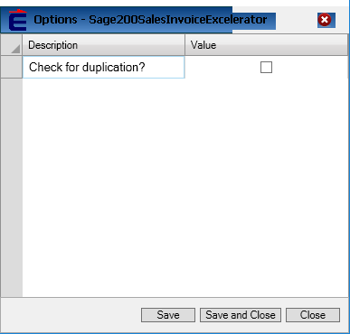

 Check for duplication?

# 9\. Sales Order

## Panel

 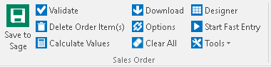

- Validate
- Delete Order Items(s)
- Download
- Options
- Clear All
- Designer
- Start Fast Entry

## Options

 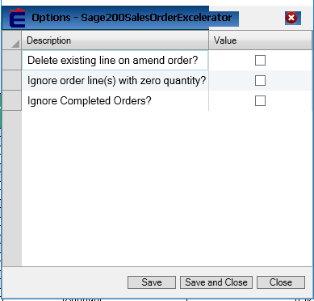

Delete existing line on amend order?

Ignore order line(s) with zero quantity?

Ignore completed orders?

# 10\. Sales Quotation

## Panel

 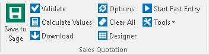

- Validate
- Calculate Values
- Download
- Options
- Clear All
- Designer
- Start Fast Entry
- Tools

## Options

 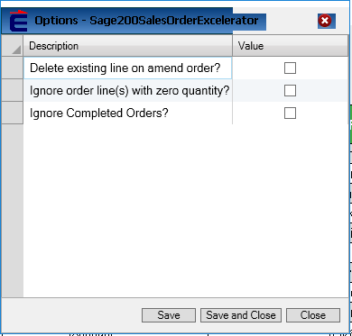

Delete existing line on amend order?

Ignore order line(s) with zero quantity?

Ignore completed orders? 

# 11\. Settlement Discount VAT Credit

## Panel

 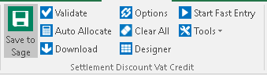

- Validate
- Auto Allocate
- Download
- Options
- Clear All
- Designer
- Start Fast Entry
- Tools

## Options

 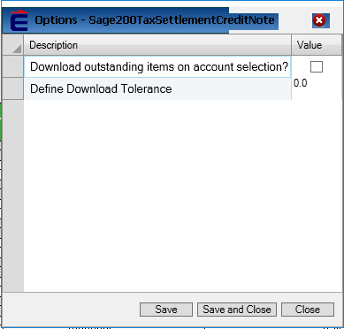

Download outstanding items on account selection?

Define download tolerance.

# 12\. Sales Ledger Receipt Allocation

## Panel

 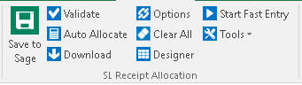

- Validate
- Auto Allocate
- Download
- Options
- Clear All
- Designer
- Start Fast Entry
- Tools

## Options

 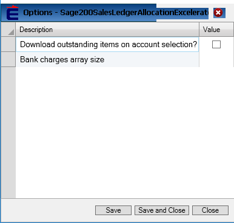

Download outstanding items on account selection?

Bank charges array size. 

# 13\. Stock

## Panel

 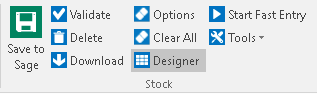

- Validate
- Delete
- Download
- Options
- Clear All
- Designer
- Start Fast Entry
- Tools

## Options

 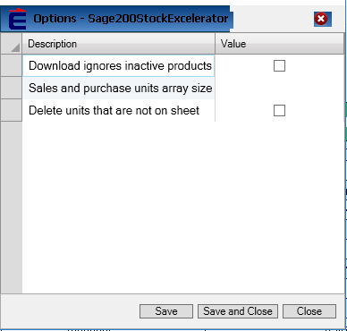

Download ignores inactive products.

Sales and purchase units array size.

Delete units that are not on sheet. 

# 14\. Stock Transfers

## Panel

 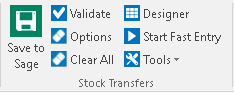

- Validate
- Options
- Clear All
- Designer
- Start Fast Entry
- Tools

## Options

 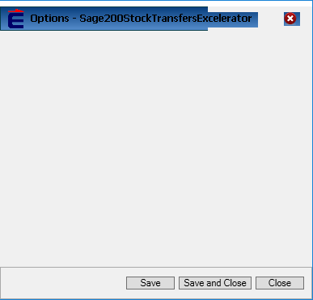

# 15\. Supplier Price List

## Panel

 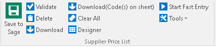

- Validate
- Delete
- Download
- Download (Code(s) on sheet)
- Clear All
- Designer
- Start Fast Entry
- Tools

# 16\. Suppliers

## Panel

 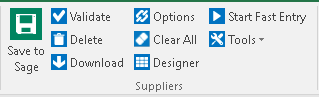

- Validate
- Delete
- Download
- Options
- Clear All
- Designer
- Start Fast Entry
- Tools

## Options

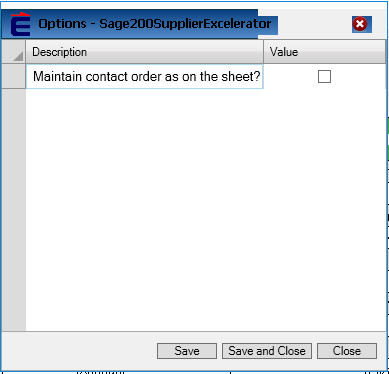 

Maintain contact order as on the sheet?
