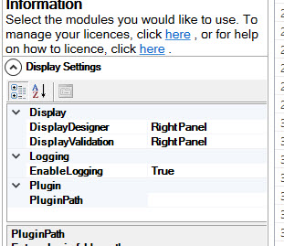
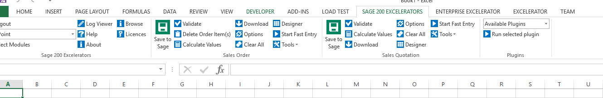

# Overview

There is a requirement to allow Excelerator functionality to be customised in a way that can only be done using coded modules.  For instance:

- Custom fields can require extra validation, default new values used on browse and saves to custom tables.
- Interfaces can be made by extending the download functionality to download from custom formats and sources.

To enable these customisations to take place, we have added a plugin architecture to the Excelerator framework.  

In software, a plugin "is a software component that adds a specific feature to an existing computer program. When a program supports plug\-ins, it enables customization."  (see [Wiki description of a plugin)](https://en.wikipedia.org/wiki/Plug-in_%28computing%29)

# Plugin Types

Excelerator is deployed in a number of different configurations.  See [Codis Software Deployment Configurations.aspx](Excelerator Deployment Configurations.md)

The plugin framework should endeavour to allow customisations to all these deployment configurations.

The Sage 200 replacement for the Sage 1000 Care Import program uses a plugin to provide extended import functionality to Excelerator.  The initial release of the plugin framework will only support this implementation, and will use a basic installation methodology.

# Installation

## Client Side

The plugins will supplied by development in a zip file.  In the future, there will be an Plugin Manager but in the meantime, these file have to be copied to the location enter in the PlugInPath option in the Display Settings under Select Modules.  If no value is entered here, \<user folder\>\\AppData\\Roaming\\Codis\\Plugins will be used.

 

After the files have been copied to this location, close Excel and open it again and the plug option should appear on the menu:

