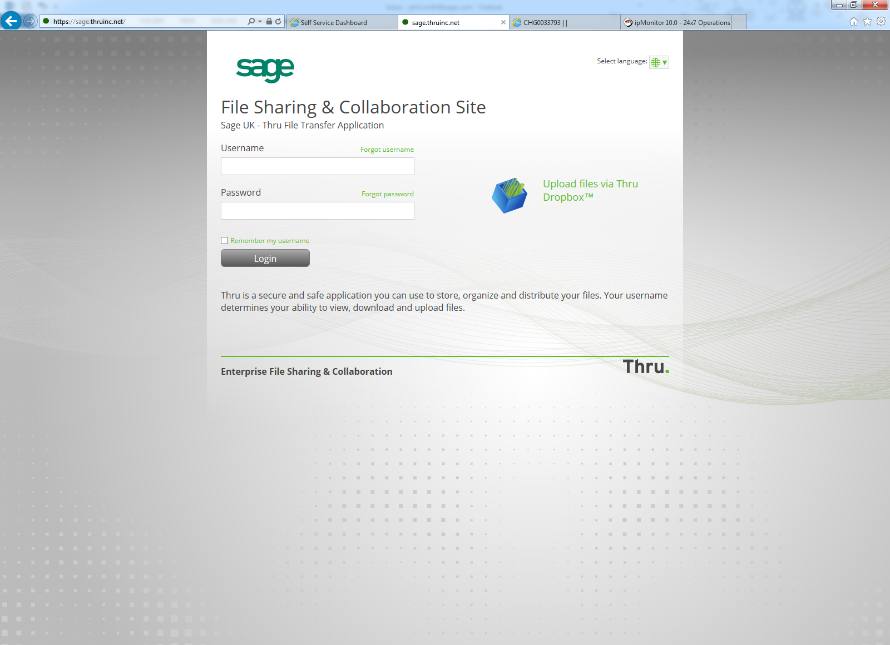
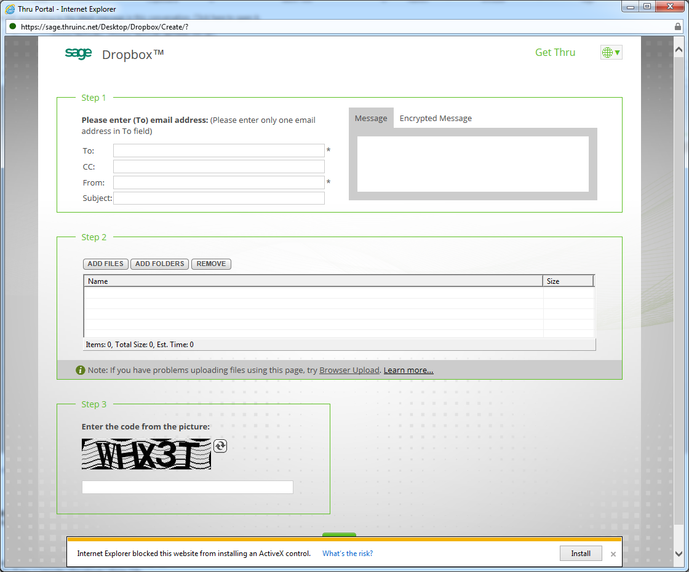
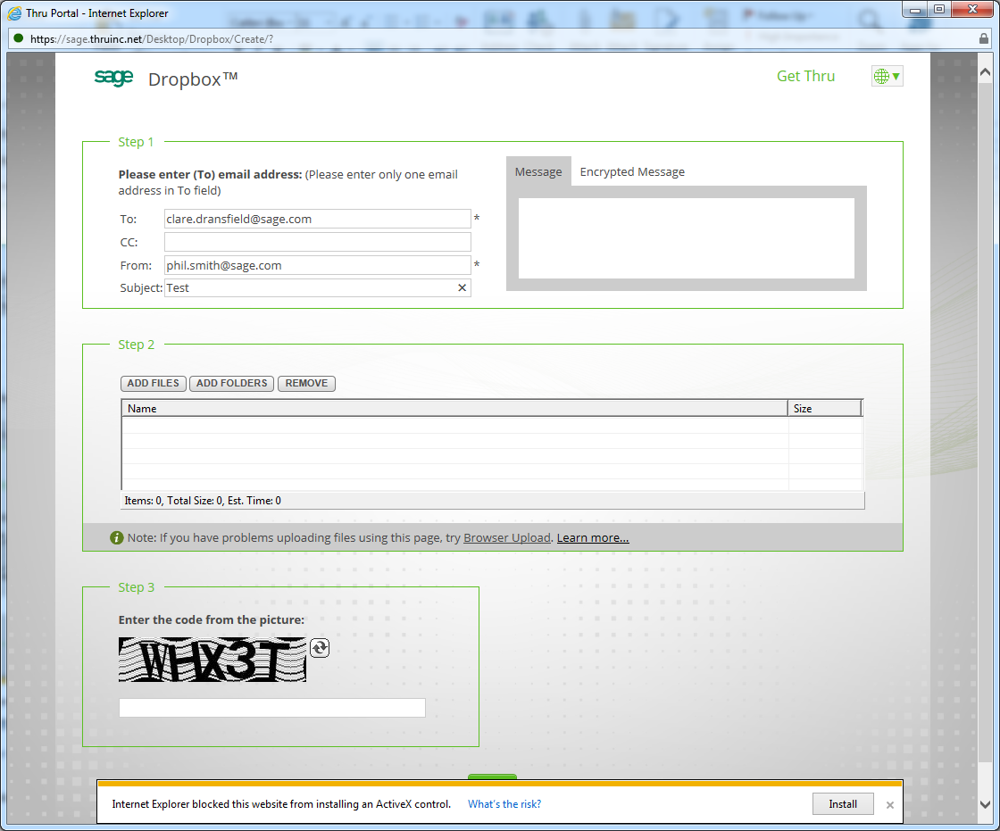

## Invoicing Sage with Thru

We need to send Sage an invoice and a fulfilled report(information of the End user who has been granted access to the Product) every month via secure portal. 

Codis don't require a Thru account to be able to send files to a Sage employee. Only Sage employees will have a Thru account, so the person at Sage you are sending the files should have a thru account. These are the steps you need to take to send the invoice \- 

Browse to [https://sage.thruinc.net](https://sage.thruinc.net/) 

 

Click on the Upload Files via Thru DropBox option. 

 

From here you will enter the email address of the Sage employee you are sending the files to along with your email address in the From Field… 

 

Click on Upload at the bottom at this will upload the files and send an email notification to the recipient. They will then get an email with a link on to download what you have sent them. You should also get an email notification to say the upload has been successfuland delivered. 

And that, is literally it ? 

The important part is making sure the person you are sending to has a Thru account otherwise the above process will just fail.
