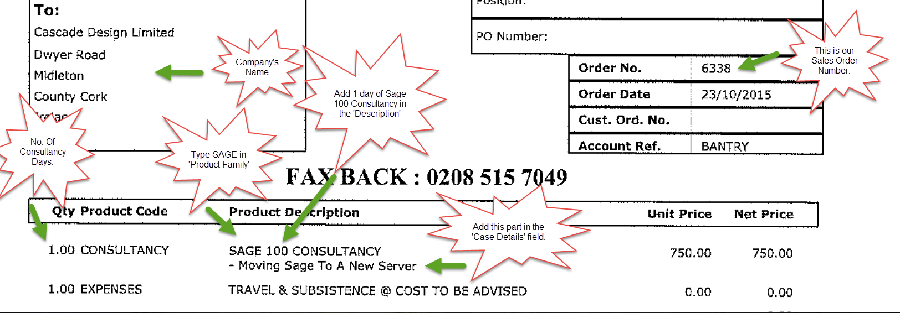
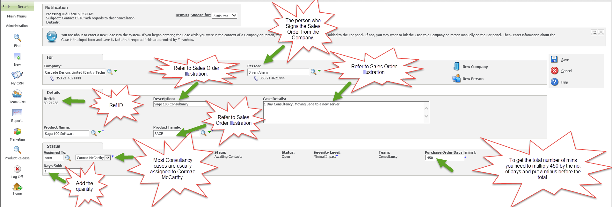
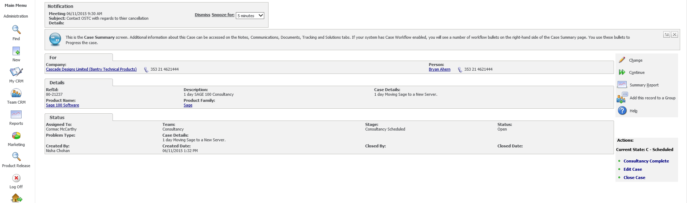
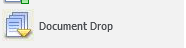

**1\)** Type the company name, which is on the Sales Order into CRM. 

**2\)** Click on the **' Cases'** Tab at the top. 

**3\)** Right Click on the **'New'** tab which is located on the left side of the screen. 

**4\)** Click **'Consultancy Case'**. 

**5\)** In the **'Person'** tab add the name of the person who signed the Consultancy Case Sales Order. 

**6\)** In the **'Description'** field \- Refer to the Sales Order Illustration, and fill in accordingly. 

**7\)** In the **'Case Details'** field add the number of consultancy days and also refer to the Sales Order Illustration, and fill accordingly. 

**8\)** In the **'Product Name' field** type **Sage 100** Software. (Note: This is just an example in the illustration provided). 

**9\)** In the **'Product Family'** field type SAGE. (Refer to the Sales Order Illustration as an example). 

**Please take a look at the Example of the sales Order below.** 

**** 

**** 

**10\)** Most Consultancy case are assigned to Cormac McCarthy. 

**11\)** In the **'Days Sold'** field put the quantity number which will be noted on the sales Order. 

**12\)** In the **'Purchase Order Days (Mins)'** field you will need to multiply the number of consultancy days done by 450\. You will then need to add a minus symbol before the number. For Example: If a Codis consultant carried out 2 days of consultancy. You would need to multiply 2 by 450 which is 900 and you will then need to input (\-900\). 

Please take a look at the illustration below for the completed case. This is how it looks once it has been saved on CRM. 

**** 

**13\)** Remember to make note of the **REF ID** number, and note this on the sales order for Accounts Purposes. 

**14\)** Remember to file the Signed Sales Order under the '**Documents'** tab using drag and drop down on the yellow small arrow as shown on the illustration below. 

 

Once you have done this fill in the relevant details under the 'Documents' tab on CRM and then click 'Save'.
