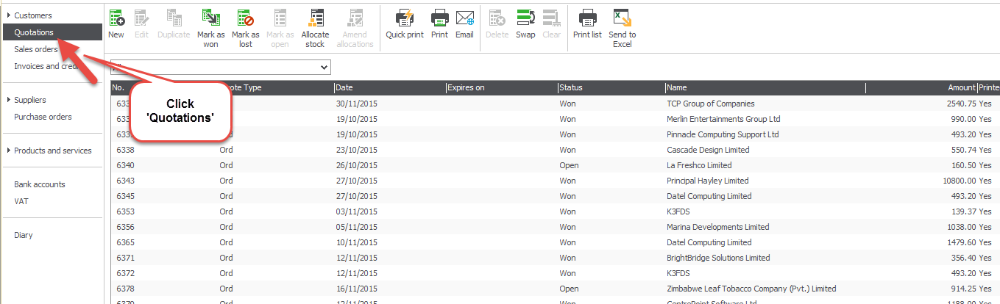
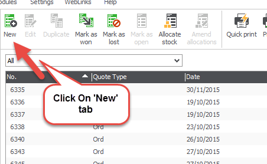
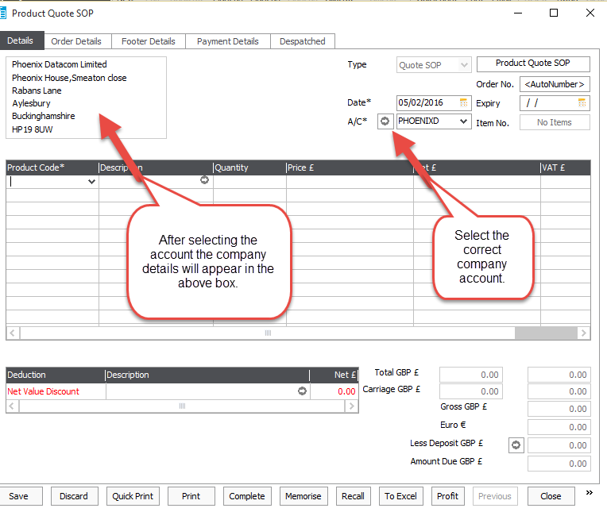
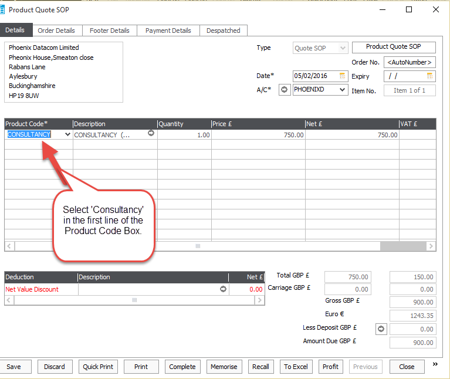
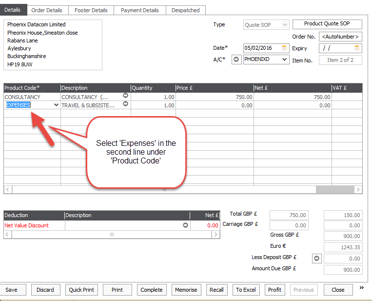
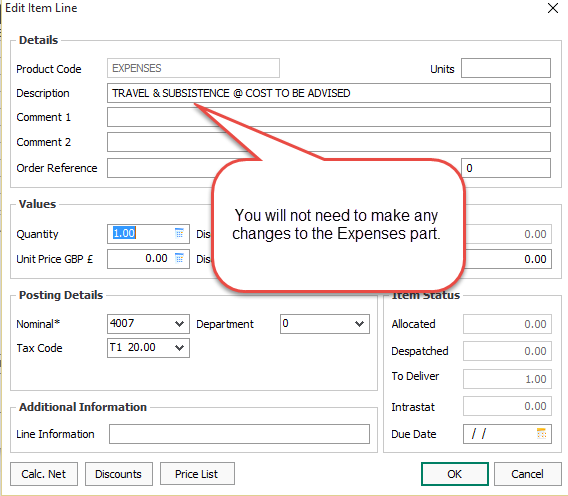
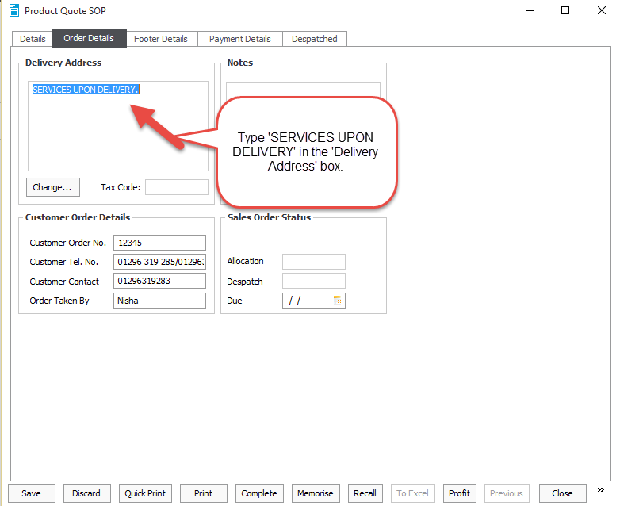
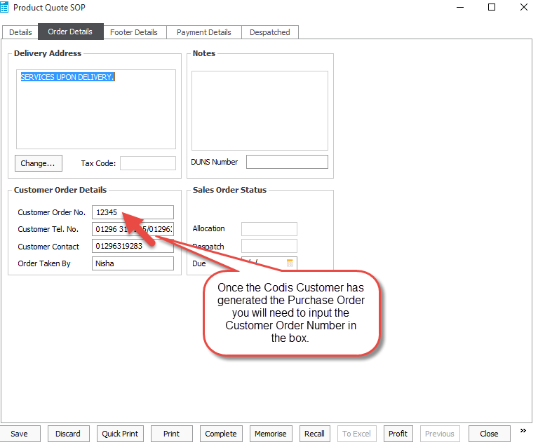
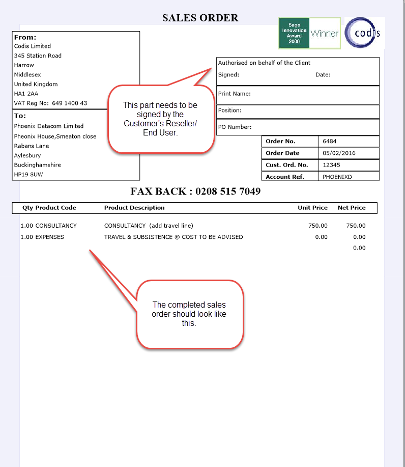

1\) Log in to Sage Accounts 50\. 

2\) Click on the 'Quotations' tab which is located on the left side. 

 

3\)Once you are in Quotations click on the 'New' tab. 

 

4\) Select the company's account from the 'A/C' drop down menu.

 

5\) In the first product code line select the 'Consultancy' option in the drop down menu.

 

6\) In the second Product Code line select the 'Expenses' option in the drop down menu. 

 

7\) Click on the first product code line which will then take you to the 'Edit Item Line' box. You will need to delete the consultancy details in the 'Description' box and add the correct details according to the email you have received. 

8\) Add the number of consultancy days in the 'Quantity' box. 

9\) Generally you will need to add the figure 750\.00 in the 'Unit Price GBP' box for 1 day consultancy cases, however you will need to clarify this with the consultancy team beforehand. 

10\) Click on the second Product Code Line which will take you to the 'Edit Item Line' box. You will need to leave the Expenses part the way it is. 

 

11\) Select the 'Order Details' tab at the top and put 'SERVICES ARE UPON DELIVERY' in the 'Delivery Address' box. 

 

12\) In the 'Customer Order No' field put the Purchase Order Number once the Codis Customer has generated this. 

 

13\) Click 'Save' 

14\) Please see below image of how the Sales Order should look once it has been completed. 

