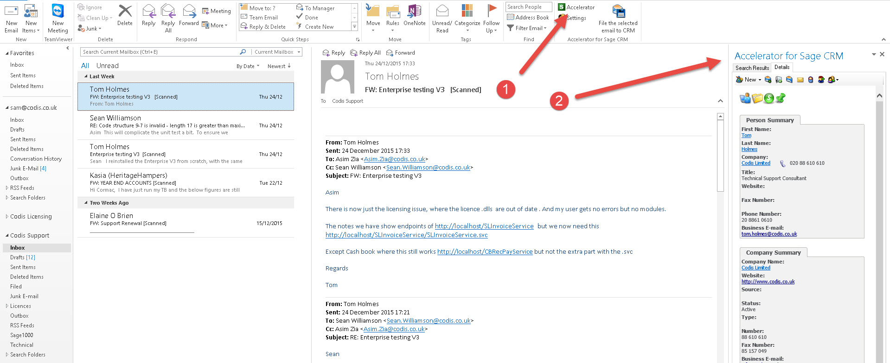
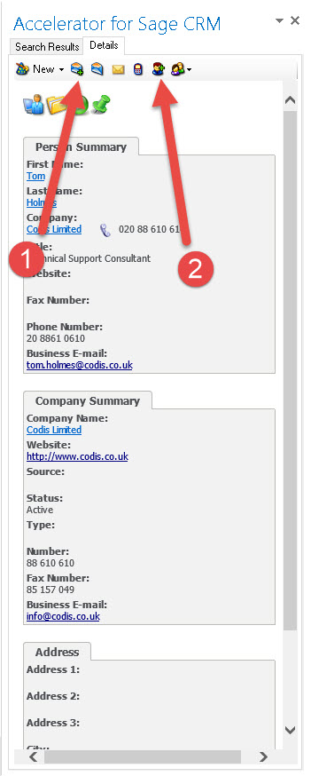
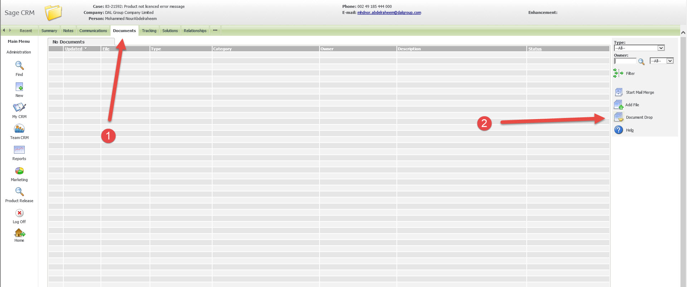
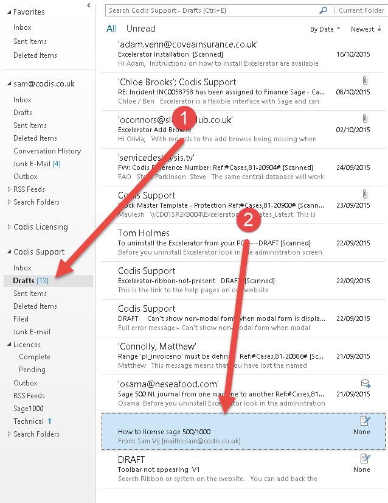

**This page will discuss how to process E\-mails that come into the support box and how they are handled in regards to being attached to case and images/documents being added to each case. Certain E\-mails will need to be dragged and stored into folders and this page will explain what this means.** 

## Support Emails

These are the majority of E\-mails that would come into the inbox and would need to be filled correctly. 

### New Email for a new case

When a new E\-mail comes into the support inbox and has to do with support the first thing that needs to checked if there is a case against it. If not create a case,then by using Accelerator save and add the email to the case. Once this is done click on the E\-mail and drag it over to the filled folder. 

 

1\. Select Accelerator 

2\. Use Accelerator to create a new case and to save and attached E\-mails. 

### New Email for a Existing case

When a New Email comes in and there is already an Existing case (Check in CRM) then all you need to do is use Accelerator to pick up the case then save and attached the email to it. 

### Tagging an E\-mail

Tagging an E\-mail is very important because it will show all the communication that has gone back and fourth with the customer. The way to tag an E\-mail is through Accelerator which you will find in Microsoft outlook. 

Look below for instructions: 

 

1\. First save the E\-mail 

2\. Then select the tag option to attach the E\-mail to the case. 

Here is a link to using Accelerator: How to use Accelerator 

### Adding an image/attachment to the case

When a E\-mail comes in with an Image or attachment it will not appear on CRM just by being attached to the case. The way to attach an image/attachment is to open the case on CRM click on the documents tab and on the side it says document drop/Add a file . Go back to the E\-mail click on the file attachment and drag it over to the CRM screen over to document drop for an image save it and then select add a file. See image below showing document drop screen: 

 

1\. Select documents 

2\. Drag and drop the E\-mail in document drop 

## Sage Licensing Emails

The E\-mails that come in for sage licenses will have attachments labelled so they will be easy to identify. You will start by creating a case for the email and attaching/saving it to the case opened. Save the Sage Licence and attach it to the case as a document file. 

Once this has been done you will now have to select and drag the E\-mail into the pending folder. 

### Pending

Now that the E\-mail is in the pending folder the next step would be to contact the customer via email and send out the prepared template of how to license their sage software. To access this E\-mail you will need to go to the draft section and it will be stored in there. See below for guidance: 

 

1\. Select the draft folder 

2\. Select the Email template needed. 

### Completed

When the customer has been send this information a follow up call in a few hours would be advised if they have not got back to you. As long as they are happy that the instructions giving to them have helped the Email can now be picked from pending and put into Complete 

## List of Folders

### Inbox

This is where all the E\-mails will come to and will have to get sorted into which folder they go into. 

### Drafts

This folder holds the templates for installation guidance and other help which are used to send to customers when needed. 

### Filed

This folder will contain all the New E\-mails that have come in which have been saved and tagged against a case. Also any E\-mails that have been sent back and fourth during communication for a case will be stored in here by the case handler. 

### Junk E\-mail

### Licences

This is two part folder and only the two sub folders will be used. 

#### Complete

Once a licence file has been sent out with a template of how to license and the customers is happy with their product working the E\-mail will get moved from pending to complete. 

#### Pending

When a new sage license comes in for a customer once a case has been created and the email tagged/saved it is then moved in the pending folder. 

### Sage 1000

Any sage licences been sent in for internal use those E\-mails will get stored in here. 

### Technical

Technical Email's will come in from and labelled as SQL OR Database weekly. Click on these Email's and drag them into the technical folder.
