Page created and edited as a guide and basis for new online Licencing. Page created with a view of using this for our online help as well as the Training Manual. Please note that a separate page has been created for the benefits of using a Google / Microsoft Account. 

## Enterprise Licencing

- Start off by opening Codis System Configuration.
- The following window will open. Select Licenses.

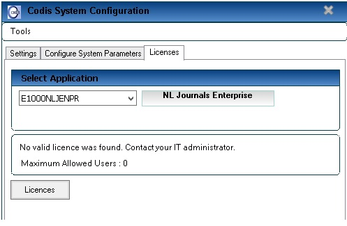 

• Select the Excelerator module you wish to license from the drop down menu. 

• Click on the Licenses button and the following screen will appear: 

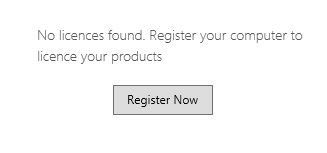 

• Select the Register now button (First time licensing). 

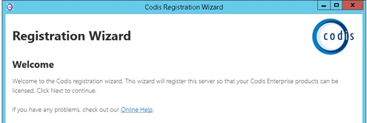 

• The registration Wizard will open up with the option to log in with a Google or Microsoft account. 

• Select the option you wish to log in with. 

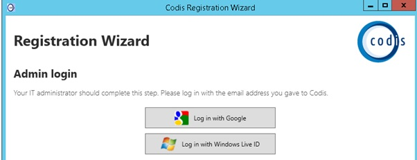 

• If you have not got a Google account you will have to create one. 

• This email address must then be given to Codis. It will put onto CRM and against the licence administrator. 

• Here are the steps of creating a google account below. 

• First search 'Create a new Google account on Internet Explorer and the following window will appear: 

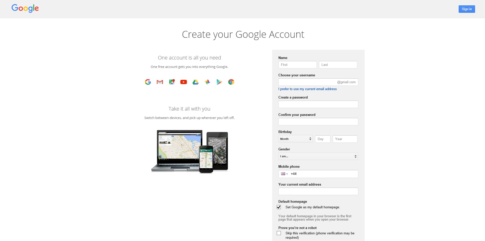 

• Begin by filling out the empty fields. 

- If you choose not to create a new Gmail address you can use a work email address to create a google account. Follow the images below.

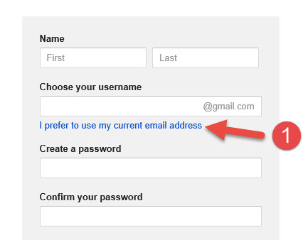 

- Select the option highlighted in blue 'I prefer to use my current email address'.

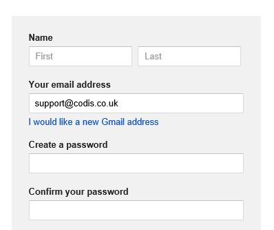 

- You can now enter an E\-mail address that you already use.
- Fill out the remaining empty field when they are accepted the following screen will appear:

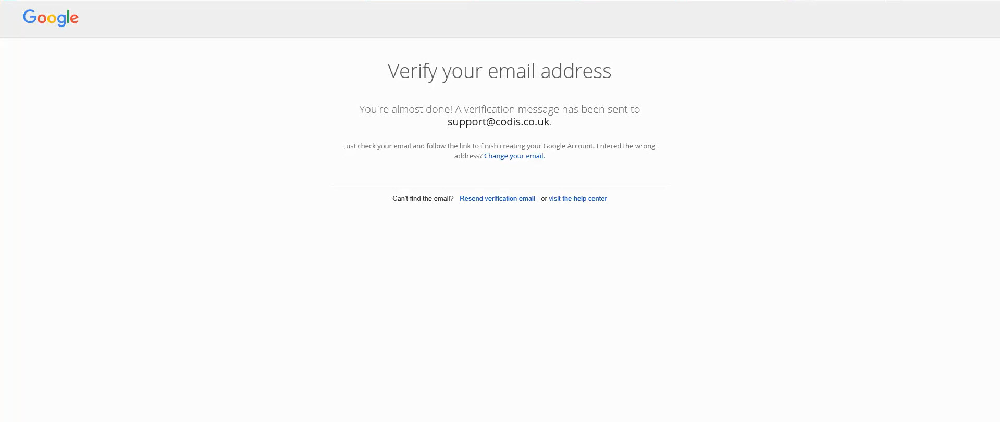 

- The next steps would be to check the Inbox of the Email address that was used when setting up your google account.

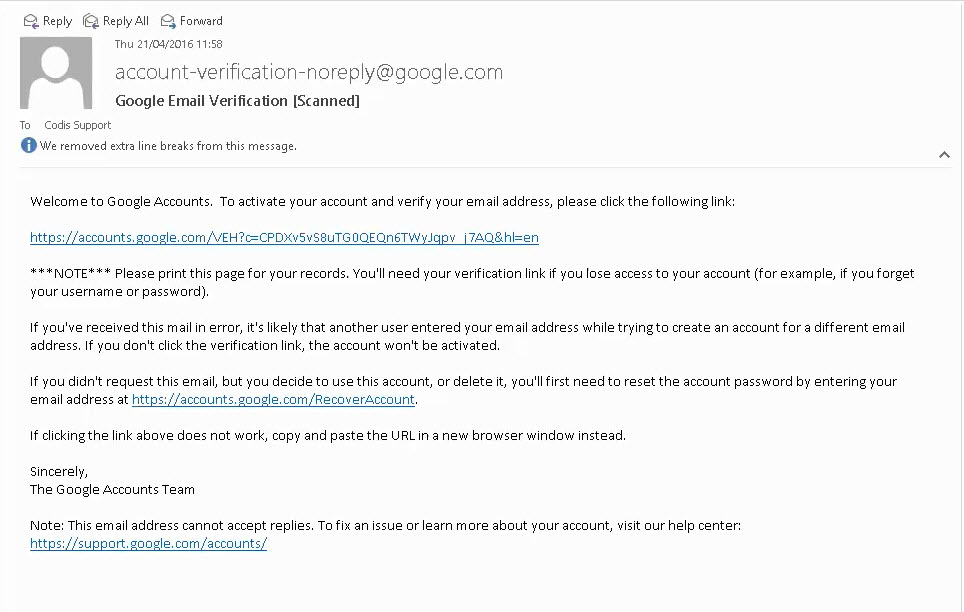 

- After clicking on the link in your inbox it will verify that this is a valid E\-mail address and it will take you to the following screen:

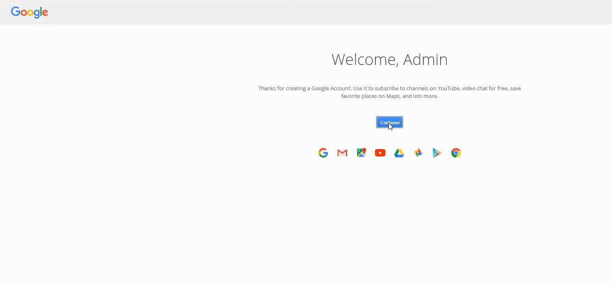 

- Once you have reached this point click on continue and you may now view your google account in full detail.

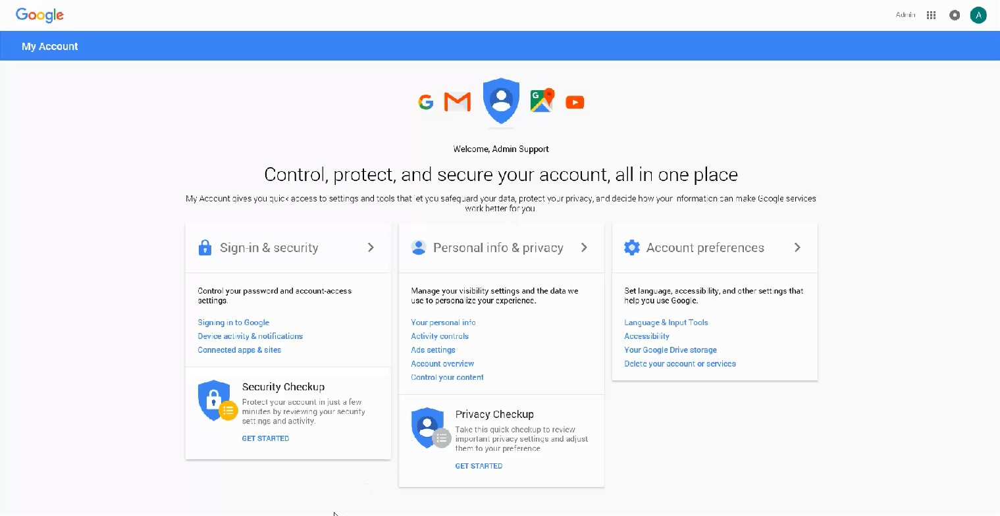 

- Now that your google account is set up this email address must then be given to Codis. It will be added onto CRM and against the licence administrator.
- The next step is to return back to the registration wizard screen.

 

- Select log in with google and the following screen will appear:

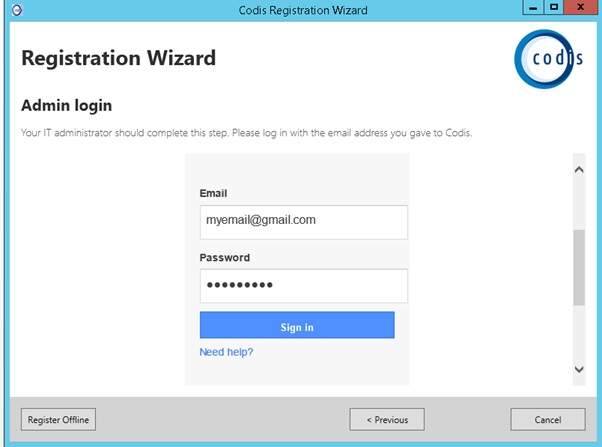 

- Once you enter your details in the required fields registration is now complete.

## Benefits of Using External log in

Page created and edited as a guide and basis for new online Licencing. Page created with a view of using this for our online help as well as the Training Manual. Please note that a separate page has been created for the benefits of using a Google / Microsoft Account.
