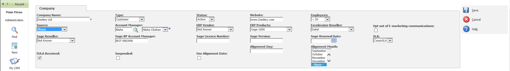
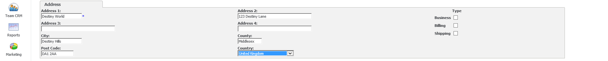
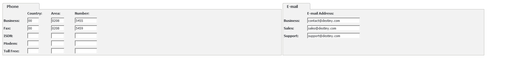
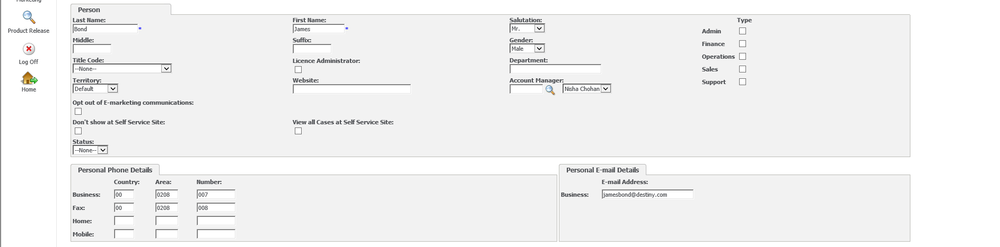
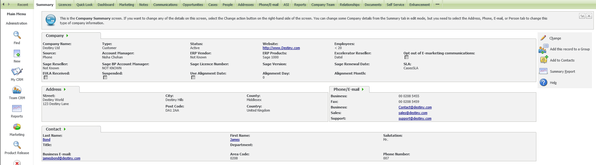

**1\)** Right click on '**New**' tab which is located on the left side of the screen. 

**2\)** Click on '**Company**' in the drop down list. 

**3\)** Enter the new company's name into the **'Company Name'** field. 

**4\)**Click **'Enter Company Details'** which is located on the right side of the screen. 

**5\)** You will then be directed to a summary of information that you will be required to fill in accordingly. 

**6\)** In the **'Company'** section you will see the **'Type'** field. Click on this field and select *Customer* in the drop down list. 

**7\)** In the '**Status'** field select *Active* in the drop down list. 

**8\)** Type the company's website address in the **'Website'** field. 

**9\)** In the **'Source'** field select the type of communication the customer had with Codis. For example, if they called with regards to a quote or query prior to becoming a customer, you will need to select *Phone* If the customer contacted Codis through Web Chat via the Codis website/Zopim you will need to select *Web* If the customer sent an email to Codis with an enquiry about Excelerator or Sage, you will need to select *Email* 

**10\)** Select the Account Manager's name in the **'Account Manager's'** field. 

**11\)** Under the **'ERP Products'** field select the Sage type the company is using in the drop down list. For example Sage Line 200, Sage 500 or Sage 1000\. 

**12\)** In the **'Excelerator Reseller's'** field you will need to select the company's reseller. If however the company is a direct customer of Codis, you will need to select *Codis* in the **'Excelerator reseller's'** field. 

**13\)** If an EULA has been received and signed, you will need to tick the **'EULA'** box. 

 

**14\)** In the **'Address'** section type in the company's full address accordingly. EXAMPLE: **Address 1:** Destiny World **Address 2:** 123 Destiny Lane **City:** Destiny Hills **County**: Middlesex **Postcode:** DA1 2AA **Country:** United Kingdom 

 

**15\)** In the **'Phone'** section type the business number in the **'Business'** field 

**16\)** Type the fax number in the **'Fax'** field. 

NOTE: Remember to include the area code in the **'Area Code'** field, as this will enable the Codis staff to dial out to the relevant point of contact automatically once they have clicked on the number provided in CRM. 

**17\)** In the **'Email'** section type the company's email address in the **'Business'**, '**Sales'**, and '**Support'** fields. 

If you have been provided with email address, make sure they have been typed accordingly. If you have been provided with a business email for the company then type the business email address in the '**Business'** field under the **'Email'** section. The same applies for Sales and Support emails. in the '**Sales**' and '**Support'** fields. 

 

**18\)** In the **'Persons'** section type the primary contact of the Company accordingly. REMEMBER the **'Last Name'** field comes before the **'First Name'** field. 

**19\)** Add the phone number for the primary contact in the **'Business'** field and under the **'Persons'** section. If they have provided their mobile number then add their mobile number in the **'Mobile'** field. 

 

**20\)** Once you have added all the details required for the company click **'Save'** which will be located on the right side of the screen. 

**21\)** Once you have saved the information the details will appear on CRM as shown below. 

