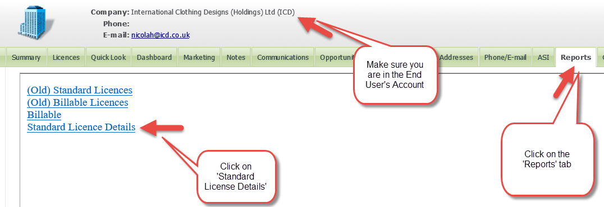
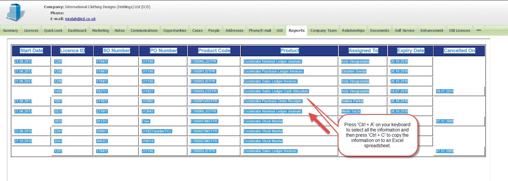
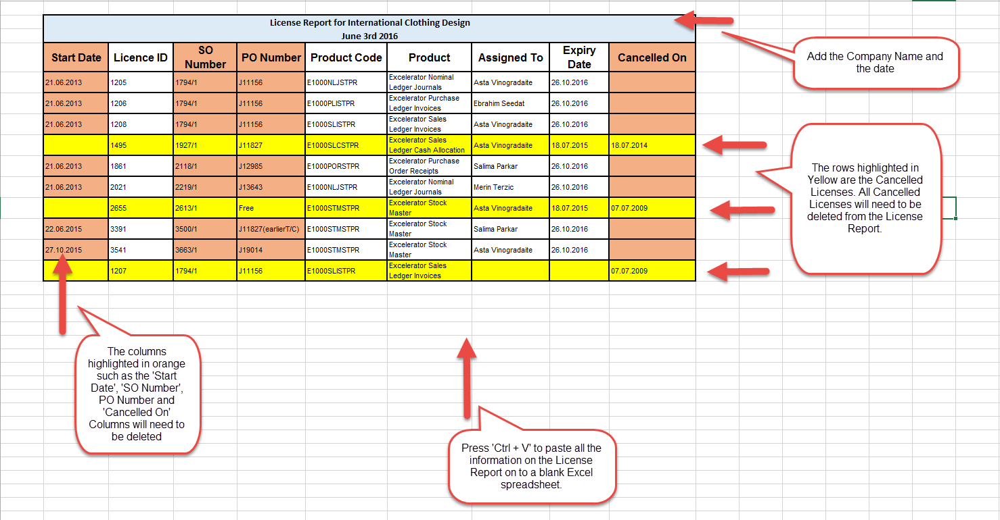
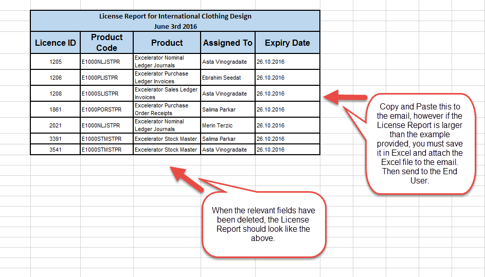

**This Page explains how we can generate a License Report of all the Excelerator Licences assigned to a company.** 

## Reasons

1. The Company may request a list of Excelerator Licences
2. The BP may request a list of Excelerator Licences
3. A competing BP may request a list of licences
1. This can only be released when the new BP produces written permission from the end user

## Generating the Report

To generate the License Report, you will need to go into the End User's Account, and select the **'Reports'** tab. You need to click on **'Standard License Details'** 

 

When you have clicked on **'Standard License Details'** you will be directed to the full License Report. 

## Sending to Excel

You then need to select all the information on the License Report, and copy and paste the information onto a blank Excel spreadsheet. 

 

## Formatting the Report

Once you have copied and pasted it on to the Excel spreadsheet, you then need to delete the **'Start Date'**, **'SO Number'**, **'PO Number'** and **'Cancelled'** columns from the Report. 

You will also need to delete **ALL** cancelled licenses from the Report. 

You may keep the **'Expiry Date'** column on the Report if you wish, however this is an optional field. 

 

When you have removed the relevant rows and columns, the License Report will look very similar to the Example image below. 

## Sharing the Report

We would recommend that we always email the Excel sheet as an attachment, to anyone requesting the information. The Excel report gives the impression of professionalism.

