The support department receives calls from customers requiring software support. These calls are logged in CRM and monitored to ensure that the call is responded to within the guidelines of the SLA.

## Logging a Support call direct to CRM

### Finding the customer

The first step in logging a support call is to ensure that we have the correct customer and the full contact details of the individual logging the call. 

#### CTI

Where possible we will use the CTI functionality with CRM which recognises the Telephone number and present a list of possible companies.   
Please see in the information that is provided in the Screenshot Below:\- 

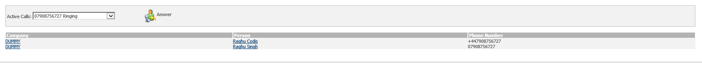 

#### CRM find Company

Right Click on Find in the context area of CRM and select find customer.   
Please see in the information that is provided in the Screenshot Below:\- 

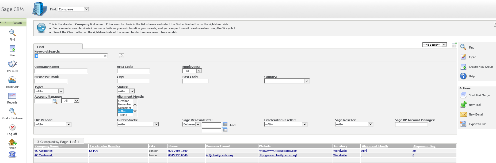 

The customer can be searched for in many criteria but most commonly we use the Company Name.   
Wild card characters "%" help greatly with selecting the customer. 

### Before logging the case

Before logging the case we need to check if the customer is suspended.   
Please see in the information that is provided in the Screenshot Below:\- 

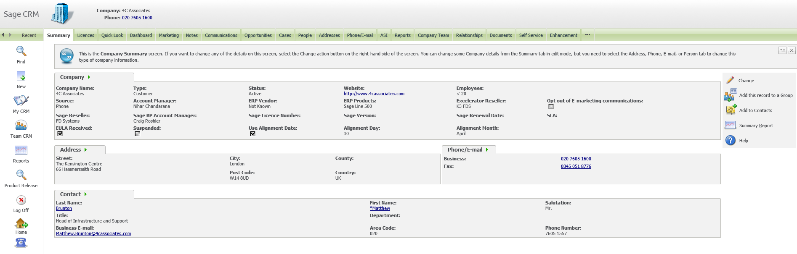  
Where a customer is suspended check the customer notes to see if you can determine the reason for suspension.   
If the reason for suspension cannot be confirmed then the Accounts team will have to be contacted. 

### Logging the case

Once we have found the customer we can select the Case Tab and from there select a new Support Case button.   
Please see in the information that is provided in the Screenshot Below:\- 

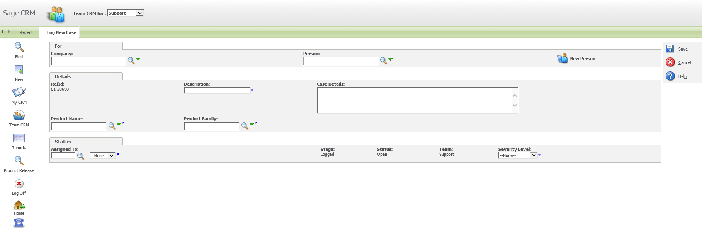  
Since we have already select the customer we will be taken directly to the Person. 

#### Attaching the person detail to CRM

Once We have found the customer we need to select Person by typing the Person details and Press Enter. 

You can also search Person name by typing Person name and Click Zoom Option that is being shown in the Screenshot below. 

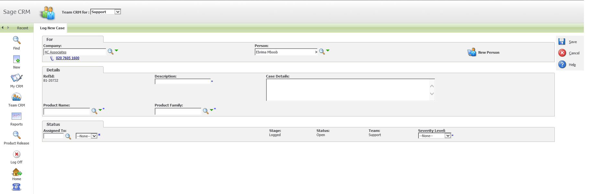 

Note:\- In case if you can not be able to find Person Details. You can add their details by Click on the Add Person Button. 

#### Add the person detail to CRM

Once you click on Support Case, you can find New Person Button as you can see in the screenshot. 

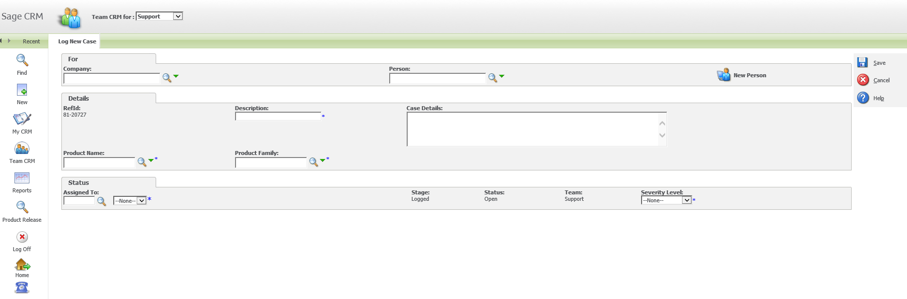 

After click on Person Detail, it will ask for Last name and First name.( Can shown in the screenshot below) 

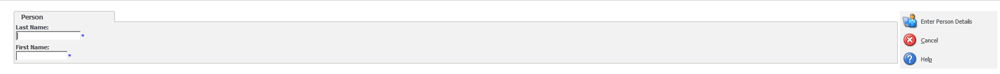 

Provide those details and click on Enter Person Details to Save person details. 

#### Questions to Ask

Once You receive the Call for Support We need to get at least following details from Customer.   
1\) From the Company they are calling from   
2\) Caller Contact details namely his/ her name   
3\) Error that they are facing   
4\) Which Sage and Excelerator Product/ Module they are using that cause that issue. 

#### Description and Details

Description Field contains brief description about the Error that the user is facing.   
Details Field contains details description about the Error that the user is facing. 

#### Selecting the product

You can Select the product by click on Zoom option and select Product. 

You can also type some initial of the Product code e.g. type %NL will bring product that include "NL" character.   
You can also check Excelerator Product by clicking on the following link. 

[Excelerator Product Codes](https://codislimited.sharepoint.com/sites/Wiki/Sales/Sales%20Wiki/Documents/Licences%20Database/2013%20new%20version/Testing%20-%20before%20release/Product%20Codes/Product%20Codev1.8.xlsx)

#### Assign Case to Consultant

After filling all the details like Company Name, Person, Description and Details. 

You can assign the case to the consultant, by clicking on Assign To option of the Status Tab,as you can see in below screen shot. 

#### 

#### Severity level

In order to provide a timely and appropriate service for all our customers, you will be asked to work with us in assigning a severity level to each problem or question raised with Customer Services Support. 

There are basically 4 severity level that is being listed below:\- 

You can also see in the below screenshot. 

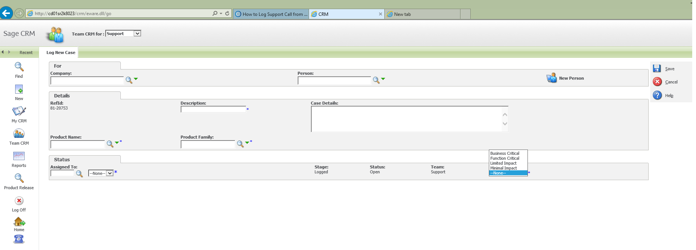 

1\) Business Critical 

It might effect any of the following part in the application:\- 

1\.1\) It impact all the user who are operating on it.   
1\.2\) It effect any particular process that is using modules   
1\.3\) It might effect the whole application inoperable   
1\.4\) Very High Commercial Impact 

2\) Function Critical 

It might effect any of the following part in the application:\- 

1\.1\) It might affect certain modules or components of the business   
1\.2\) One section or component of the module is inoperable   
1\.3\) It might have impact on certain commercial components   
1\.4\) It does impact high Commercial Impact 

3\) Limited Impact 

1\.1\) It might impact limited number of user   
1\.2\) It does not cause any business critical impact   
1\.3\) It might effect minor operability of the application   
1\.4\) It does impact medium commercial impact 

4\) Minimal Impact 

1\.1\) It might impact minimal number of user   
1\.2\) Minimal Impact   
1\.3\) Minimal Impact on operability of the application   
1\.4\) It does influence lower commercial impact 

## Logging Support Call via Outlook (Accelerator)

You can able to Log a case from Outlook by enabling Accelerator Add ins. 

### Checking /Creating the company

You can search the company by Clicking on the Search Tab in the Accelerator for SAGE CRM.   
You can see the Search Result that have been shown in the screen shot below. 

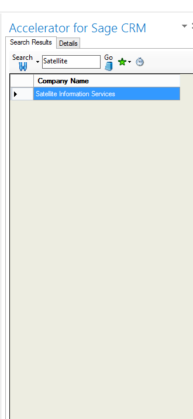 

If you cant find company details you can add the company details.   
By clicking on Details Tab and Right Click on New option\-\> Click on Company. 

You need provide mandatory details that is being shown in the Screenshot, that is being marked with \*. 

You can see in the Screen Shot given below:\- 

### 

### 

### Checking /Creating the contact

You can search the contact by Clicking on the Search Tab and click Search by Person in the Accelerator for SAGE CRM.   
You can see the Search Result that have been shown in the screen shot below. 

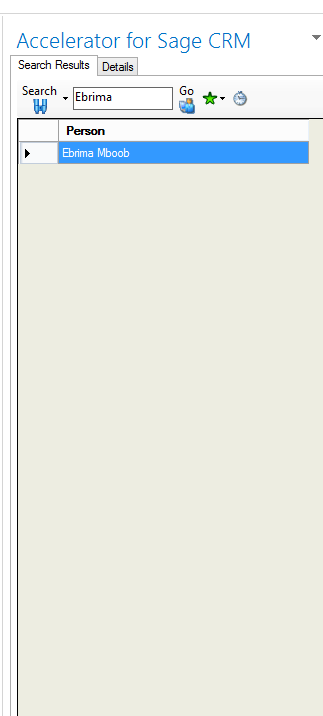 

If you cant find contact details you can add the contact details. 

You need provide mandatory details that is being shown in the Screenshot, that is being marked with \*. 

You can see in the Screen Shot given below:\- 

### 

### 

### Logging the case

By clicking on Details Tab and Right Click on New option\-\> Click on Cases   
Please see in the information that is provided in the Screenshot Below:\- 

#### 

#### Description and details

Description Field contains brief description about the Error that the user is facing.   
Details Field contains details description about the Error that the user is facing. 

#### Selecting the product

You can Select the product by click on Zoom option and select Product. 

You can also type some initial of the Product code e.g. type %NL will bring product that include "NL" character.   
You can also check Excelerator Product by clicking on the following link. 

[Excelerator Product Codes](https://codislimited.sharepoint.com/sites/Wiki/Sales/Sales%20Wiki/Documents/Licences%20Database/2013%20new%20version/Testing%20-%20before%20release/Product%20Codes/Product%20Codev1.8.xlsx)

#### Severity level

In order to provide a timely and appropriate service for all our customers, you will be asked to work with us in assigning a severity level to each problem or question raised with Customer Services Support. 

There are basically 4 severity level that is being listed below:\- 

You can also see in the below screenshot. 

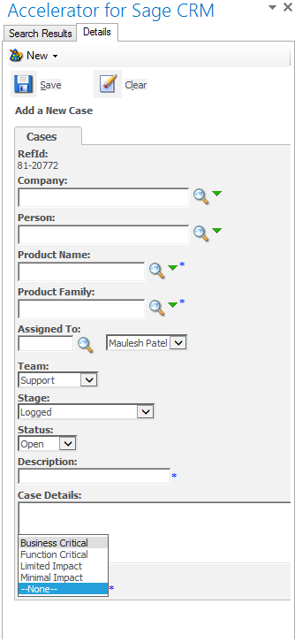 

1\) Business Critical 

It might effect any of the following part in the application:\- 

1\.1\) It impact all the user who are operating on it.   
1\.2\) It effect any particular process that is using modules   
1\.3\) It might effect the whole application inoperable   
1\.4\) Very High Commercial Impact 

2\) Function Critical 

It might effect any of the following part in the application:\- 

1\.1\) It might affect certain modules or components of the business   
1\.2\) One section or component of the module is inoperable   
1\.3\) It might have impact on certain commercial components   
1\.4\) It does impact high Commercial Impact 

3\) Limited Impact 

1\.1\) It might impact limited number of user   
1\.2\) It does not cause any business critical impact   
1\.3\) It might effect minor operability of the application   
1\.4\) It does impact medium commercial impact 

4\) Minimal Impact 

1\.1\) It might impact minimal number of user   
1\.2\) Minimal Impact   
1\.3\) Minimal Impact on operability of the application   
1\.4\) It does influence lower commercial impact 

## What CRM Does

1\.1\) Once the Case is logged in CRM emails the customer – sample of email sent   
1\.2\) Emails the consultant   
1\.3\) Moves the case to Status Logged Below screenshot shows the sample of the email send to client.

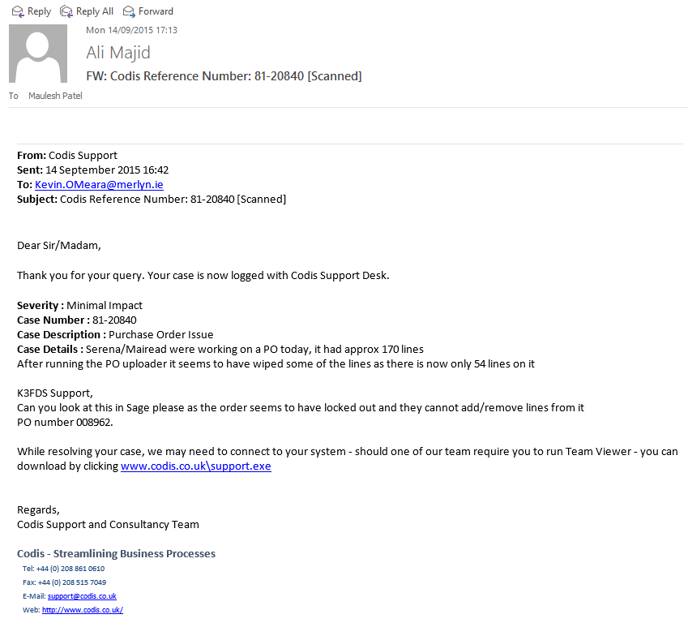
