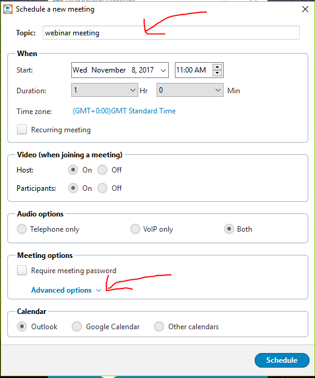
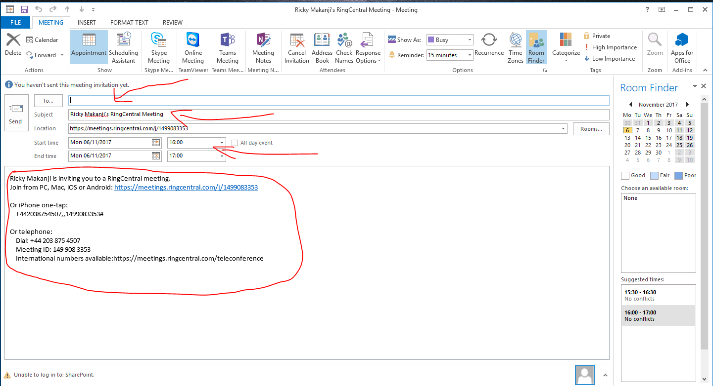
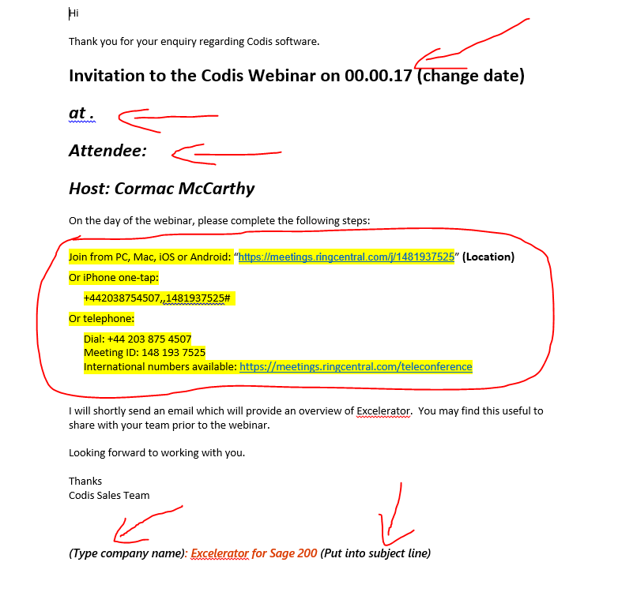
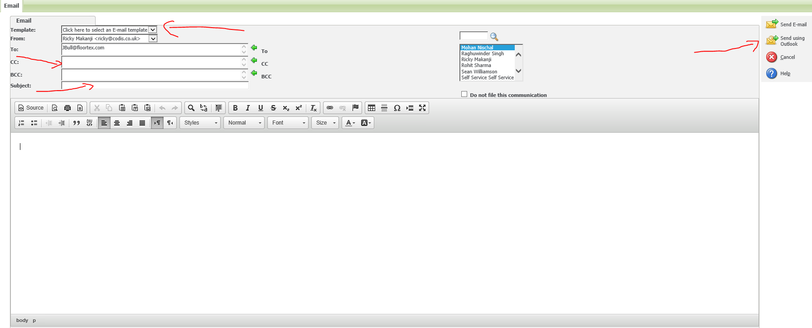
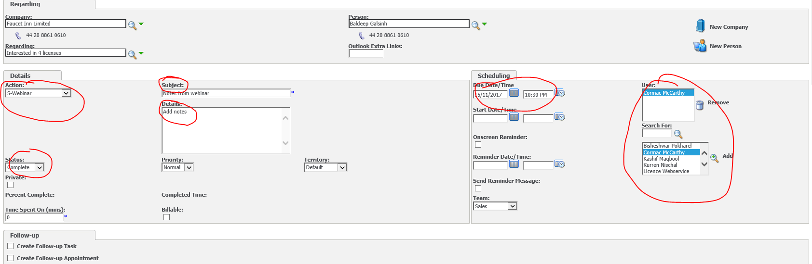
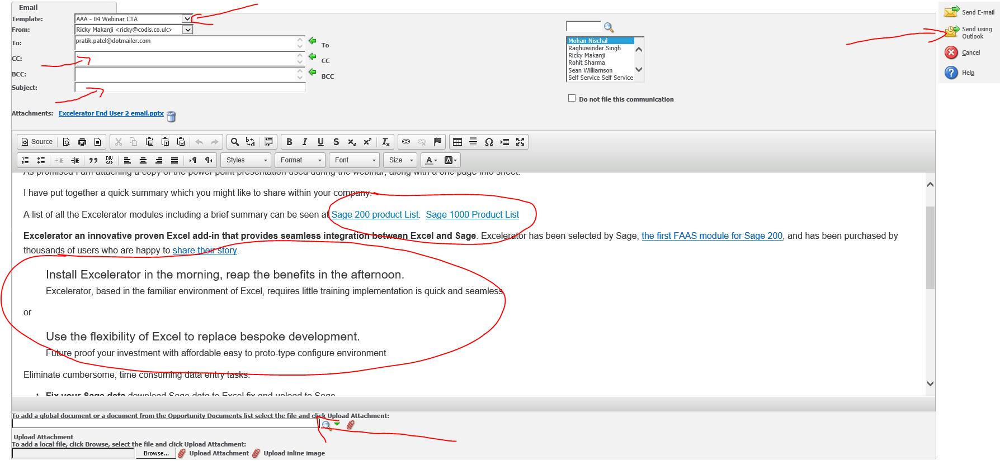

# 1\. Ring Central Meeting

## 1\.2\. Schedule

 

**Topic:**  In the topic box, enter the company name and the product name.

**When:** Enter the webinar date \+ time. Duration is usually 1 hour.

**Meeting Options:** Select 'Advanced Options' as show by the red arrow in the screenshot above. Tick the box that is next to 'Schedule For', select Meeting Room 02, and once you are happy with the details, select 'schedule'.

# 2\. Outlook

Once you have selected 'schedule', you will be transfered to the Outlook email draft as shown in the screenshot below.

 

Type the senders email address in the box. Including Mohans email ID and Meeting Room 02 email ID.

In the subject line, enter the product name.

Ensure the start time and date in correct.

Copy the message that is circled in red and paste in onto the template which is shown below. The message which is highlighted in yellow in the screenshot below will be replaced the new message show in the above screenshot. 

## 2\.2 Template

 

The red arrows within the template instructs you to change the date, the second arrow is for the time of the webinar. 

Next to the third arrow you will type in the name of the person(s) attending the webinar.

At the bottom on the template, ensure you have put the company name.

## 2\.3 Back to Outlook

Once you are done completing the template. Copy and past the whole message onto the email page, excluding the words in brackets.  

Add Cormac's email ID in the CC or in the senders email info.

Just before you send the email off, check if everything in correct, if it does, then send the email.

Close the template Word document without saving so that you can use the template for future webinar invitations.

# 3\. Webinar Reminder

The **day before the webinar** you must send an email to remind the recipient to attend the webinar.

Firstly, go to the customer's CRM account. 

Go to the 'Opportunities' tab and select the right opportunity and open it up.

Go to the 'communication' tab at the top.

Go to 'New email' locted on the right hand side.

 

**Template:** Select either 'AAA.03 for customer' or 'BBB.03 for reseller'. **(Ensure you have chosen the right code)**

**CC:** Copy the relevant account manager from Codis if required.

**Subject:** In the subject line type in webinar reminder.

**Email Body:** In the body on the email, copy and paste the 'following steps' from the original email invitation. End with adding in the greetings and kind regards.

Finally, select 'Send using Outlook', which is located on the right side.

# 4\. After the Webinar

## 4\.1 Updating CRM

After Cormac or Mohan has provided you with notes, go to the customer's CRM, go to 'communications' and select 'new task' on the right hand side. 

 

**Action:** Select 'S\-Webinar'.

**Status:** Select 'Complete'.

**Subject:** Type in 'Notes from Webinar'

**Details:** The details should be copy and pasted from the notes that Cormac or Mohan has provided.

**Scheduling:** Select the date and time of the webinar.

**User:** Select the person who conducted the webinar. Either Cormac or Mohan.

Press 'Save' once you are done.

## 4\.2 Sending Email to Webinar participants

Go to the customers's CRM account. Click on the opportunities tab at the top and open up the opportunity.

Then to communications and select 'New email' on the right hand side of your screen.

Select the **template** 'AAA\-04 Webinar CTA'.

 

In the **Subject Line** type in 'Excelerator Webinar'. 

As shown in the screenshot you will see 'Sage 200 Product List, Sage 1000 Product List' circled in red. Erase the irrelevant Sage product.

In the screenshot there is another set of writing circled in red. Select the relevant text and erase the other.

In the 'To add a global document' box select either 'Excelerator for Sage 200 or Sage 1000'. Ensure the document is uploaded by clicking the **red paperclip** next to the box.

Select 'Send using outlook' on the right hand side.

Ensure you 'CC' Cormac. Add the greetings and finish off with kind regards

Finally press **send**.
