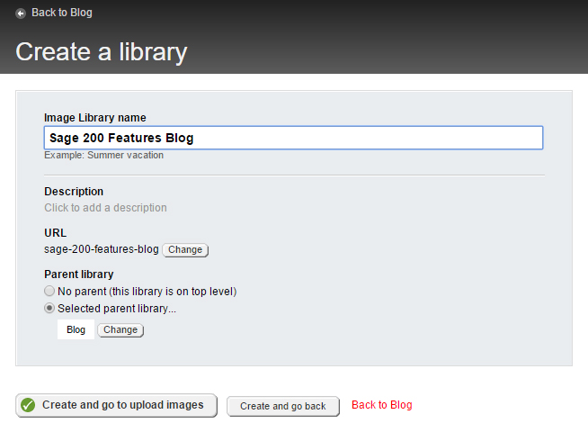
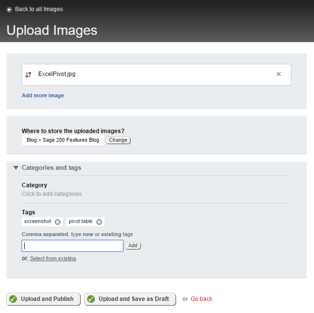

**This page explains the process of posting a new blog on Codis website.** 

## Log into Site Finity

Log in to the content management system, Sitefinity, here: [www.codis.co.uk/sitefinity](http://www.codis.co.uk/Sitefinity). If you do not have login credentials, please contact your Network Administrator. 

## Uploading images

The first step would be to upload the images that will be included in your blog. First ensure the images are appropriately named. For example, a screenshot image of a pivot table in Excel should be named "PivotTable.jpg". 

Navigate to: Content \> Images \> Blog 

Click "Create a library". Give your library an appropriate name (the name of your blog) and click "Create and go to upload images". 

 

Begin to upload your images. Each image needs to be tagged with keywords to make them easily searchable within Site Finity. After the image has uploaded, open the Categories and Tags menu and add appropriate tags. For example, a screenshot showing a pivot table in Excel could be tagged with "pivot table." 

 

If your image is a screenshot, make sure you add "screenshot" as one of the tags.

After uploading all images, go back to the library that contain them and click on each image to add more information to them. Add the following: 

- Alternative text \- a short description of the image, e.g. "Pivot Table in Excel"

## Writing the blog

Navigate to: 

Content \> Blogs \> Codis Provider 

Select the category in which you are posting your blog Sage 1000, Sage 200 or Tutorials. Once in the category click "Create a post" to start a new blog. Give it a title. The title will appear as the heading for your blog. 

Now you can begin to write your blog. If you are copying and pasting text from another source, first paste the text into Notepad, then copy from Notepad and paste into the blog. This is to maintain plain text formatting. Text does not need to be formatted in the blog, it will automatically appear in the Ubuntu font on the website. 

To add an image within your content, click the "Image Manager" icon and browse for the image. To allow the image to be made larger by the viewer, check the box "Clicking the resized image opens the image in its original size". This is only recommended for images that need to be viewed in a larger size for clarity. 

To hyperlink text, click the "Hyperlink Manager" icon. If linking to another page on the website, select "Page from this site". Locate the page and click "Insert the link." 

You can preview how your blog will look on the website at any time by clicking the "Preview" button.

## Saving the blog

If you want to save your blog without publishing it live on the website, click "Save as Draft." 

If you are ready to publish your blog, click "Publish."
