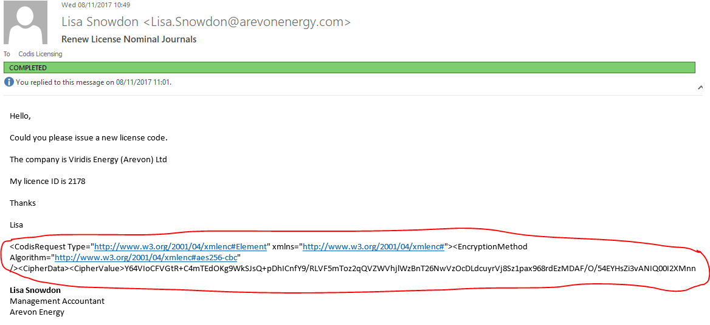
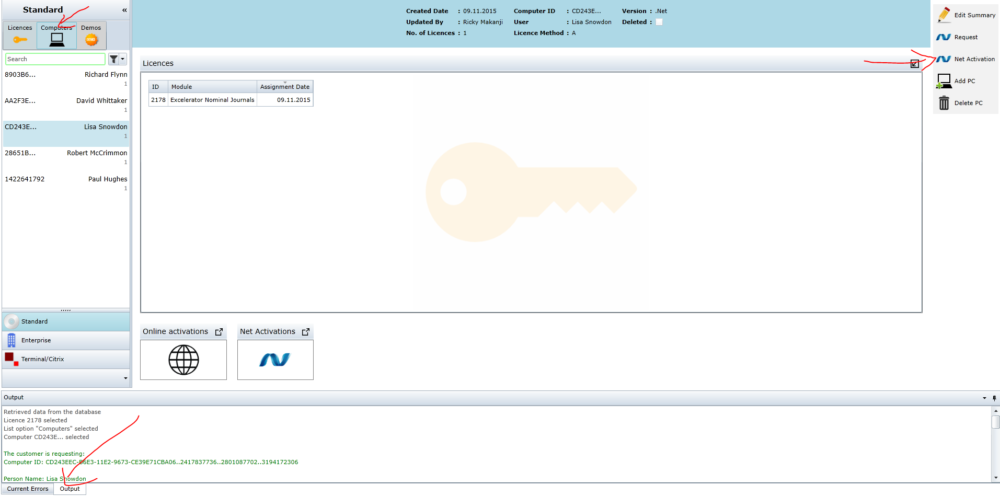

# 1\. Receiving the email code.

## 1\.2 What to do with the activation request.

 

This is the email example you should receive from the customer or reseller. As you can see in the above screenshot the code request is circled in red. 

With your mouse cursor **TRIPLE** click to **copy** **ALL of the code**.

# 2\. CRM

## 2\.1 Licenses

Go to the CRM, and type in the customer's company name. Then go onto the licenses tab at the top. 

