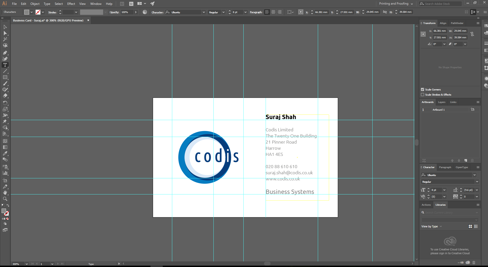

- Firstly to create/amend a business card you will need to download a template from the Codis Sales Wiki \- [Business Cards](https://codislimited.sharepoint.com/sites/Wiki/Sales/Sales%20Wiki/Documents/Business%20Cards) folder.
- Pick a file and donwload this onto your desktop. This will be a AI file so this will open up in the Adobe Creative Cloud Illustrator program as shown below.

 

- You will be able to amend the text and the logo if required. Save this copy in the Sales Wiki folder.
