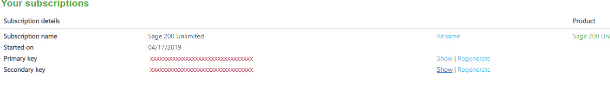
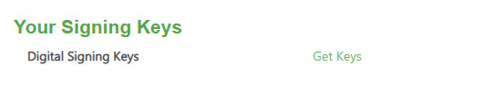

Guidance notes here: [https://developer.columbus.sage.com/docs\#/uk/sage200extra/accounts/gs\-welcome](https://developer.columbus.sage.com/docs#/uk/sage200extra/accounts/gs-welcome)

Agams sample [CustAPISamples.zip](https://codislimited.sharepoint.com/sites/Wiki/Development/Development%20Wiki/Documents/Samples/CustAPISamples.zip)

Sage Training Notes etc [Sage 200 API TrainingCleanedUp.zip](https://codislimited.sharepoint.com/sites/Wiki/Development/Development%20Wiki/Documents/Samples/Sage%20200%20API%20TrainingCleanedUp.zip)

Four important configuration settings, which are in the App.Config in Agam's sample:

### The Subcription Key.

This is the subscription key for the developer (normally this is Codis).  Use a Sage ID for the developer and subscribe to the API in question.  There are then two subscription keys.  Either will do.

 

### The Signing Key

This is alongside the subscription key and is associated with the developer.

Click on the "Get Keys"...

  
 

### Client ID and Scope

See the Authentication section in the guidance notes linked to above.

  
 

## Sage 200 Extra On\-Premise

To change Agam's sample to work with Sage 200 Extra (On\-Premise)

Use the Client ID and Scope as per the guidance.

Use this BaseUrl : <https://api.columbus.sage.com/uk/sage200extra/accounts/v1>

  
 Codis Sage 200 Extra Cloud Details [Sage ERP Online Services Details.aspx](Sage ERP Online Services Details.md)
