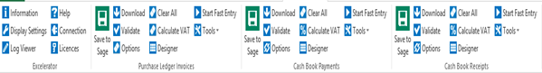
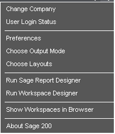
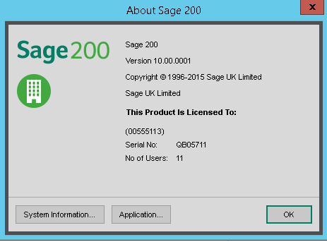
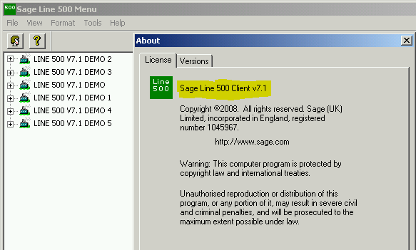
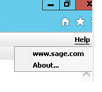
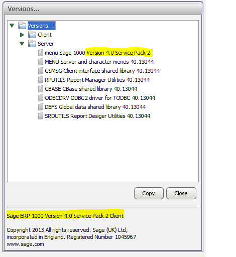

**This is a list of popular Sage Versions for the support department.** 

## Sage 200

Below Screenshot is the login screen for Sage 200 Excelerator shown below. 

## 

## Sage 500 Standard

Below Screenshot shown information regarding login to Sage 500 Standard Excelerator V1\. 

## 

## Sage 1000 Standard

For this version you do not have to login, you can see the toolbar as displayed below on the tab . 

 

Below Screenshot shown information after login into Sage 500/1000 Enterprise V3 

## 

## Sage 1000 Enterprise

Below Screenshot shown information regarding login to Sage 1000 Standard Excelerator V1\. 

 

## Sage 200 Help/About

To find what version you are on, click Help \\ About Then you see the screen shown below 

 

Details have been have been shown below 

 

## Sage 500 Enterprise Help/About

To find what version you are on, click Help \\ About Then you see the screen shown below

 

## Sage 1000 Enterprise Help/About

To find what version you are on, click Help \\ About (top right) 

 

Details have been have been shown below 

