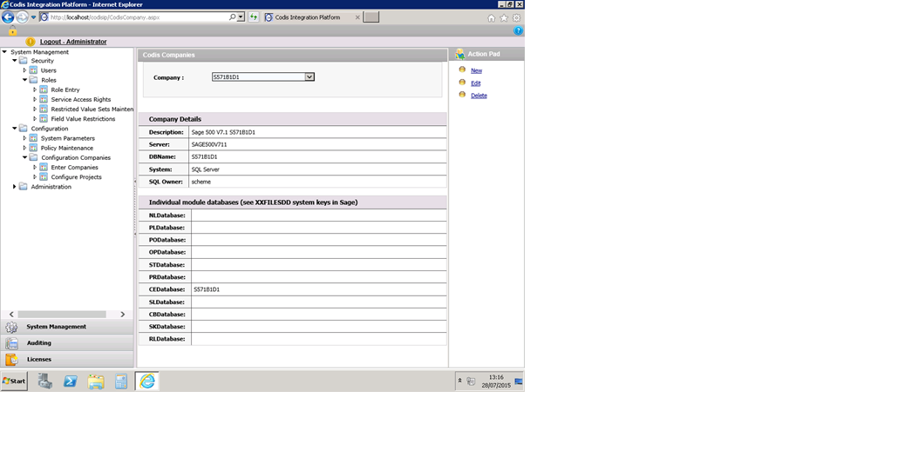

This page discusses how a support consultant could upgrade Codis Integrated Platform from V1 to V3 and place it on a new server. 

## Before going on site

1. Send out Prerequisite document to Customer
2. Ensure you have the correct version of all setups. (place in folder in Pre\-release) and on FTP site for download to client)
1. Server Setups
2. Client Setups
3. SQL Script file (Update)

4. Double check with Licensing that all orders are in place and that the software is ready for licensing.
1. Orders are in place
2. CRM licensing is updated
3. EULA is signed

6. Ensure that the Client has filled out the PreRequisite documents and we have the necessary access to User names and passwords –
1. Windows Administrator,
2. SQL SA
3. SQL scheme
4. Sage User with access to System keys.

## Implementation process

If upgrading or migrating, backup the CodisMaster SQL database (On old server)

If upgrading from EE V1 – Check the size of Key field dbo.PolicyMaster should be (varchar50\). To fix Run SQL Script for Policy Master key length update then backup again.

If upgrading, remove all Codis Programs using Add/Remove programs in Control Panel.

Install System Settings \- Codis.System.Setup.msi .  This program is now installed per\-user meaning that it will only be available to the user that installs it.  The program will update resources outside of the user scope so that user will probably have to be an administrator. Goto Run command in windows then type %localappdata%., then goto Codis Limited\\Codis IP System Settings Release folder and create Desktop shortcut for Codis.System

### Create the CodisMaster database

1. Run Codis.Settings shortcut.
2. Enter the details for the CodisMaster database you want to use/create.
3. Click "Create".  This will attempt to create the CodisMaster database and will then offer to create the tables.  If the database already exists it will just offer to create the tables, so if you wish to create a CodisMaster database using settings other than the default you can do this in SQL management, then use this option to create the tables.
4. Then on License tab it will display a list of Products added in Licensing System in a dropdown. And in case of V3 there should be a button 'Licences'.

Install Codis IP – IPWebSiteSetup (Control Panel \- IntegrationPlatformSetup) \- Run as Administrator customised install second option Install and Update database Or just install and enter details as a new installation.

Important: Use of hashpassword in Codis IP website : [Codis IP Password Hash](Codis IP Password Hash.md)

Install Authorisation WebServices \- AuthorizationWebserviceSetup (Control Panel AuthorisationService). Run as Administrator and do a Install.

Install each of the modules required.

Licence the Codis IP and the modules

1. License Modules –
1. Generate License
1. . Net Licenses
2. Generate
3. Tick modules to users
4. Copy and E\-mail to Licensing.

3. Activate License\*\*\*\*
1. . Net Licenses
2. Activate
3. Paste Key emailed from Codis

Log into Codis IP – System Management

1. check users and associated Roles
2. Check the Companies – Configuration \- Configuration Companies – Enter Companies
3. On this screen \- when Configuring Multi Company Exchange Rates you need to set the individual Module database CEDataBase to be the same as the DbName. See screen shot at the bottom of the document.
 

5. Check the Roles
1. Role Entry \- Each Role has the correct Companies ticked
2. Service Access Rights \- Each Role for each company should have **full access** for each module

7. Configuration \- System Parameters \-\> Enter Sage Version as **4\.0**, Default DBUser as **sa**, DBPassword as **\<sa password in SQL Server\>**
8. 
9. Policies – Administration – system – Default values
1. NL Journals EndPoint address \- [http://localhost/NLJournalService](/NLJournalService)
2. CB payments EndPoint address \- [http://localhost/CBRecPayService](/CBRecPayService)
3. CB Receipts EndPoint address \- [http://localhost/CBRecPayService](/CBRecPayService) Replace local host with server name.

ReCycle IIS (iisreset) 

Load MS Excel Select Enterprise Excelerator Ribbon – Enterprise Excelerator Group – options EndPoint Address \- [http://localhost/AuthorizationService/Authentication.svc](/AuthorizationService/Authentication.svc)

Projects to check ticked in Codis IP

Install new Enterprise clients on the user PCs.

Assist with setup and UAT. 

## Setups and EndPoints

| **Setup Name** | **Control Panel** |  | **Endpoint** |
| --- | --- | --- | --- |
| System Settings | IPSystemSettings | Logo |  |
| AuthorizationWebServiceSetup | AuthorizationService |  | [http://localhost/AuthorizationService/Authentication.svc](/AuthorizationService/Authentication.svc) |
| IPWebsiteSetup | IntegrationPlatformSetup |  |  |
| NLJournals2ServiceSetup | NL Journal Service Setup |  | [http://localhost/NLJournalService](/NLJournalService) |
| CBReciptsPaymentsServiceSetup | Codis CB Receipts \& Payments Enterprise Service |  | [http://localhost/CBRecPayService](/CBRecPayService) |
| PLInvoice2ServiceSetup | PLInvoice2ServiceSetup |  | [http://localhost/PLInvoicesService](/PLInvoicesService) |
| SLInvoiceServiceSetup | SL Invoice Service |  | [http://localhost/SLInvoiceService](/SLInvoiceService) |
| ExchangeRatesServiceSetup | Exchange Rate Service Setup |  | [http://localhost/ExchangeRatesService](/ExchangeRatesService) |
| CostOfSalesCodesServiceSetup | CostOfSalesCodesServiceSetup |  | [http://localhost/CostOfSaleCodesService](/CostOfSaleCodesService) |
| EnterpriseClientSuite | Codis Enterprise Client Suite | Logo |  |

  
 

## How to do Online Licensing of Sage 1000 Enterprise Excelerator

[https://codislimited.sharepoint.com/sites/Wiki/Pages/Enterprise%20Online%20Licensing.aspx](Enterprise Online Licensing.md "https://codislimited.sharepoint.com/sites/wiki/pages/enterprise%20online%20licensing.aspx")  
## Changes to be made in Database for Webservices License

[S1000 Enterprise Web Services Installation (sharepoint.com)](S1000 Enterprise Web Services Installation.md)  

  
  
## 

## Online Licensing Enterprise \- Developer's Notes

[https://codislimited.sharepoint.com/sites/Wiki/Pages/Online%20Licensing%20Enterprise%20\-%20Developer's%20Notes.aspx](Online Licensing Enterprise - Developer's Notes.md "https://codislimited.sharepoint.com/sites/wiki/pages/online%20licensing%20enterprise%20-%20developer%27s%20notes.aspx")  
 

## Upgrade user list for licensing

[User List Extractor Zip file](https://codislimited.sharepoint.com/sites/Wiki/Licensing/Licensing%20Wiki/Data/User_List_Extractor.zip)

1. Unzip the file into a folder on the desktop of the server
2. Run the file called (Codis.Licence.V1Upgrader.exe)click on the blank window and enter the connection details in the pop up screen
3. The user list should show in the dialog box and also be copied to the clipboard. Email this to licensing and check they get the new server name to enter into CRM
4. They should add the user list to the company in CRM
5. Afterwards delete the folder on the desktop
6. When they get their first licence from over the internet the user list should be there.
