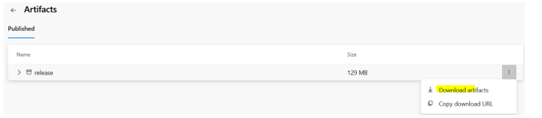
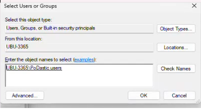
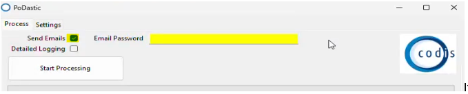

Installation Process for PoDastic application

1\.        [https://codislimited.visualstudio.com/CodisDevelopment/\_build/results?buildId\=25591\&view\=results](https://codislimited.visualstudio.com/CodisDevelopment/_build/results?buildId=25591&view=results)

In Published\>Download artifacts  

  

  

2\.        Release.zip will be downloaded.   
  
Copy this file to customer end, create a folder in Program files\> Codis\>PoDastic and transfer extracted files here.   
  
  

3\.        Create a shortcut of PodCast.exe on shared desktop for all users (for fresh installation on server)  
  
  
 **C:\\Users\\Public\\Desktop**  
  
 

4\.        Grant Access for Settings.json to group PoDastic Users, it will be available when you search   
  
**UBU\-3365\\PoDastic** **users**   
  
(If a new user is there sharing the same Server, user need to be added to PoDastic users group)  
  
  
  
  

5\.        Login to user profile now, Launch PoDastic from shortcut and perform test after unchecking send emails. 

                 

If user has some PDFs to test or Test PDFs are available on below:\-[https://codislimited.visualstudio.com/CodisDevelopment/\_git/UBU\-Invoice\-Merge?path\=/Tests/PDFs](https://codislimited.visualstudio.com/CodisDevelopment/_git/UBU-Invoice-Merge?path=/Tests/PDFs)

GreenLight Contact Details  
   

| Tel: 0161 883 1685 | | [www.greenlightcomputers.co.uk](http://www.greenlightcomputers.co.uk/) | | --- | |
| --- | --- | --- |
