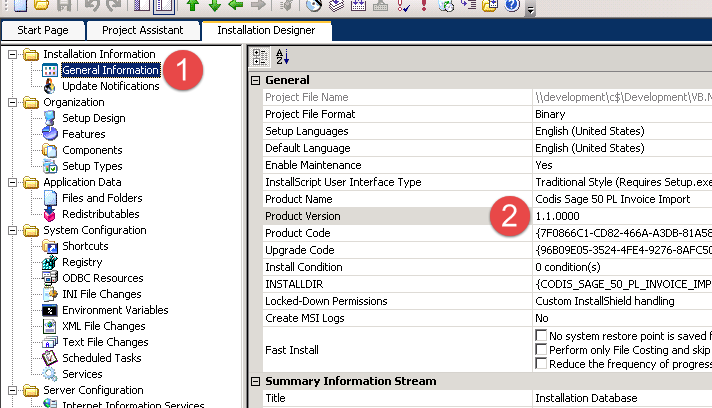
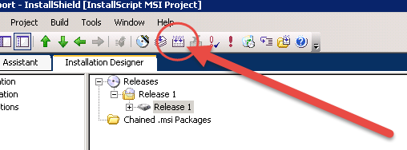

A **software installer** (*setup file*) is a program that an end user runs to install Codis software into their computer. Currently, [InstallShield](http://helpnet.flexerasoftware.com/installshield20helplib/installshield20helplib.htm) is used by developers to create an installer when a software project is ready for deployment. 

## Creation

### Logging in

Set up a remote desktop connection to the development server using the installshield credentials. 

### Without SourceSafe

An installer still can be created when the project has not been checked\-in to SourceSafe. 

1. Instead of InstallShield using a build script to build and obtain the dlls from SourceSafe, you will need to copy the dlls from your local pc's assembly folder to the [development pc assembly folder](file://///development/Development/VB.NET/Assemblies).
2. Any static files (which do not change with builds) such as sql scripts can be copied to the [supporting file](file://///development/Development/Supporting%20file) folder on the development pc. You should create your own folder within this one first, and then copy your supporting files into it.
3. If your project relies on third party dlls (such as entity framework), and it requires a different version than the one in the development pc's assemblies folder, do not replace the existing dlls. Instead:
1. Make your own folder in the assemblies folder of your local pc containing the third party dlls
2. Edit your project's references to the dlls to have them point to the ones in the new folder
3. Copy the folder from your local pc's assembly folder to the development pc assembly folder

Once you have the dlls ready, follow the example given in this video: 

## 

## Building

To build, first make sure the version number has been incremented. This is usually done automatically by the build script or visual build pro, but can also be done manually through installshield. To do this, first click general settings, and then edit the product version. 

 

Increment the version number

Next click the build button. 

 

Build button
