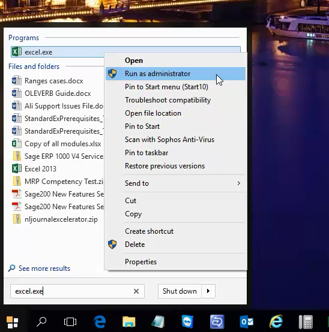

# This message is because you have not got permission to add the licence.to get round this follow the steps below:\-

- Type excel.exe in the search programs and files box which appears when you click on the windows start button at the bottom left of the screen.
- An excel icon should appear above. Please highlight this (mouse over to it) and then right click and then select run as administrator. See the attached screen shot.

                            

- Now excel should be open. Go to the licence option as you did before, this time you should get the licensing window.
- Close excel and then re\-open again as you would do normally.
